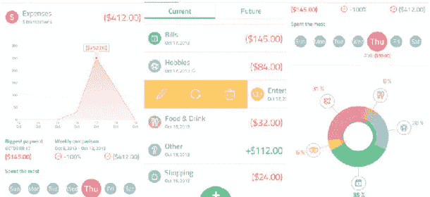

# 4 款免费的预算和个人理财应用，简化您的生活

> 原文：<https://medium.datadriveninvestor.com/4-free-budget-personal-finance-apps-to-simplify-your-life-f72f0078577?source=collection_archive---------2----------------------->

我们都知道生活中有一件事太容易做到了:花钱。

尤其是那些我们没有意识到自己正在消费的钱。我们出去吃饭、购物或看电影。我们只是递给收银员/服务员/等等。钱或者刷卡就花掉了。此外，我们现在可以在网上点击一个简单的按钮，用我们的信用卡买东西。iTunes 和亚马逊的出现让我们也可以直接从智能手机上购买应用、游戏和音乐。由于花钱的方式越来越多，不用说，有时我们会花得太多。通常，比我们的薪水还要多。

然而，随着消费的到来，你会发现自己的消费习惯。这可以帮助你确定你存了多少钱，挣了多少钱。它可以帮助你确定在每一类中你必须花费的和你实际花费的。它可以帮助你在某些方面减少支出，在其他方面增加支出，或者帮助提高整体储蓄。以下是一些帮助你追踪你的花费的最佳方法:

# 沃利 iOS

Wally 最出名的是其快捷的界面和用户友好的功能。它标榜自己是帮助预算、费用跟踪、目标储蓄和收入的最简单的方法之一。Wally 将繁琐的账面平衡从等式中剔除，并提供了一个 GPS 跟踪器来帮助你确定你最常去的地方和你花最多钱的地方。你只需要让你的应用程序可以访问你的“位置”,这样它就可以确定你在哪里，你经常去哪里。

Wally 还把东西存储在你的移动设备上，而不是互联网上，这样黑客就无法通过进入你的互联网历史来获取信息。除非你丢失了安全存储你信息的手机。Wally 还可以发送大额购物提醒，并通知你是否有任何与你的一般消费习惯不同步的购买行为。Wally 唯一的缺点是，你不能与其他人分享数据，比如你的父母、配偶、家人或其他拥有智能手机的人。

# toshl Finance——iOS、Android

Toshl 应用程序前面奇怪的小卡通人物提供了财务提示和省钱的激励性谚语/语录，以帮助确保你朝着你的支出、储蓄和预算目标前进。每当你登录该应用程序查看你的支出、储蓄和账户状态时，它都会提醒你这些目标。

除了迷恋应用程序上的奇怪字符，Toshl 还可以跟踪收入和支出，并提醒你跟踪的支出，如果你经常设置重复事件，以确保你按时支付所有支出，以避免迟到或因迟到而产生的维护费。你必须在 Toshl.com 创建一个账户，然后你可以把你的数据存储在他们的云中。唯一的问题是，如果你觉得他们的云不安全，这个应用可能并不适合所有人，因为用户必须信任云，他们的信息是受保护的！

就向客户提供的预算功能和工具而言，就 Toshl 而言，这是一条中庸之道。它也是一个基于云的应用程序，所以有时如果你担心东西被黑客攻击，那么你可能不想在公司的云中存储个人银行/金融信息，否则可能不会像你希望的那样完全安全。托什有它的好处也有它的缺点。

# mint——iOS、Android

因纽特人的 Mint 在全球拥有超过 1000 万用户，是当今移动设备上领先的预算工具。Mint 将收入记录到你的银行账户中(如工资、版税、利息、礼物等)。)通过合计存入指定账户的所有存款。它显示你每次提取现金或使用借记卡购物时的花费。它记录了你一个月的收入和每月的支出。它显示了收入和支出的对比图表，以查看你的支出是少于、等于还是多于收入。它显示你每个月的盈余或赤字。这让你可以确定你的收入和支出是否在正轨上，或者你是否需要调整你的支出以保持在预算内。

该应用程序的唯一问题是，要彻底跟踪银行账户、信用卡、借记卡和所有支出，该应用程序需要您的银行账户和信用卡/借记卡号码，这不是所有人都愿意放入应用程序的。如果 Mint 被黑客攻击，输入的信息不能保证在一个安全的空间。这些因素可能会让你在使用 Mint 这样的应用程序时三思，因为任何应用程序都可能在某个时候被黑客攻击。在将个人信息泄露给存储在智能手机等任何电子设备上的应用程序之前，这是需要考虑的事情。

# 苹果手机、安卓手机

斯彭迪标榜自己简单而中肯。该应用程序跟踪进出你口袋的钱！就是这样！不多也不少。Spendee 有一个简单易用的界面，该应用程序非常适合首次预算者，因为它消除了似乎让首次预算者迷失的额外内容。它允许你做基本的事情，完成它，然后继续做其他的事情。

Spendee 允许你将你的预算分成不同的类别，这样你就知道你在哪个类别上花了多少钱。输入你在各种类别中的花费，如账单、住房、食品杂货、旅游和爱好，以及你的储蓄。这样做的缺点是，这些类别是不可定制的，所以你可能会忘记添加其他类别或费用，或者有些东西可能不太适合特定的生活方式，你会在这些类别中不包括的东西上花特定的钱。

Spendee 不需要第三方账户，因此所有信息都安全地存储在你手机的硬盘上，而不是更容易受到黑客攻击的云端或互联网上。

你如何选择跟踪你的钱完全取决于你自己。现在，你的手机为你提供了比以往更多的选择，让你可以跟踪、预算、储蓄和消费你的钱。选择最适合你生活方式的应用程序，如果这些都不适合，你可以研究其他的应用程序来确定它们是否更适合你。一切都取决于你。然而，这些是最受欢迎的，也是我们认为最有用的。至于你认为什么最有效，这取决于你的生活方式和个人喜好。

获得最好的期权交易策略，月复一月地产生稳定的收入，而不需要去做第二份工作:OptionStrategiesInsider.com