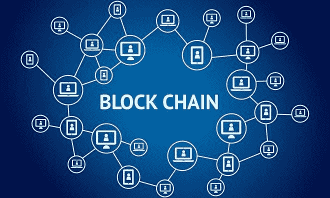
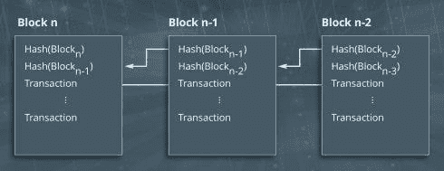
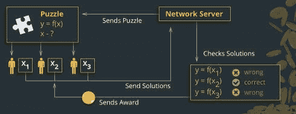
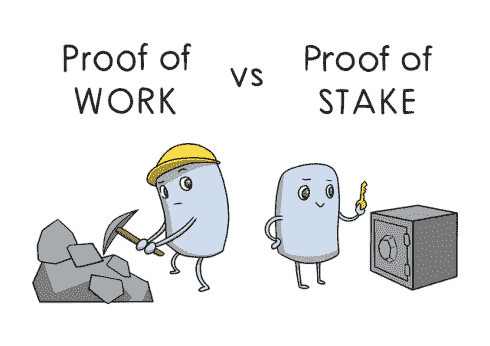

# 4.区块链是如何工作的？

> 原文：<https://medium.datadriveninvestor.com/4-how-blockchain-works-947dc8124e35?source=collection_archive---------32----------------------->

读: [1。为什么是区块链？](https://medium.com/@arvindvairavan/1-why-blockchain-a00012d328a7)

[2。什么是区块链？](https://medium.com/@arvindvairavan/2-what-is-blockchain-87e7a8932394)

[3。钱是什么？](https://medium.com/@arvindvairavan/3-what-is-mone-923ade1f41e8)

如果我们去掉围绕加密货币的所有噪音和技术术语，将其简化为一个简单的定义，它只是数据库中一组有限的条目，没有人可以在不满足特定条件的情况下改变。区块链系统被设计成不需要信任，通过特殊的数学函数和代码获得安全性和可靠性。

这个原则也适用于你银行账户里的钱。让我们假设你以纸币和硬币的形式取回一些钱。这些只是公共数据库中的有限条目，只有当你实际拥有硬币和纸币时才能更改。

**加密货币的数据库是如何工作的？**
每种加密货币都有一个对等网络。每个对等体都有每笔交易的完整历史记录，因此在任何给定时间都有余额记录。

**什么是加密货币领域的交易？如果你给我 X 数量的货币，然后你签字，这就叫做交易，基本上就是公钥加密。并且该交易将通过所谓的对等技术广播到整个网络。**

**什么是账本？**
记录所有加密交易的数字文件。

**台账文件是如何维护和更新的？**它通过一个既存储数据又执行计算的计算机网络分布在全球各地。这些计算机中的每一台都代表区块链网络的一个“节点”,并有一份分类账文件的副本。你要送我，就说 10 个比特币吧。你向整个网络广播了一条消息，称你账户中的比特币数量应该减少 10 BTC，而我账户中的数量应该增加相同的数量。网络中的每个节点将接收该消息，并将所请求的交易应用于它们的分类帐副本，从而更新账户余额。换句话说，区块链是一个系统，它允许一组相连的计算机维护一个更新的、安全的账本。你以后不能改变这一点。

**什么是交换？**
一个可以让你兑换，换句话说，交易加密货币的数字平台。例如:币安、比特币基地、Coindelta、Cryptopia 等。

什么是钱包？
一个允许你存储加密货币的程序。存储数字货币的实体钱包的数字版本。每个钱包都受到一种特殊的加密方法的保护，这种加密方法使用一对不同但相连的密钥:一个私钥和一个公钥。

快速回顾一下这些密钥是什么:
两个密钥——一个公钥和一个私钥。你将持有这两把锁(加密)和打开(解密)你的保险箱的私人钥匙来访问你的贵重物品(数据)。你可以把公钥给我或任何人，但这将只允许我锁定(加密)或解锁(解密)保险箱，而不是两者。例如，如果我解锁(解密)掉一个文档/另一个有价值的项目(数据)，只有你将能够锁定它(加密)，反之亦然。你也会知道是我，而不是别人，把文件/贵重物品放进了你的保险箱。这被称为数字签名。区块链节点使用数字签名来双重检查交易的来源和真实性。数字签名专用于特定的交易，不能重复使用

当你想给我发送比特币时，你会广播一条用你钱包的私钥加密的消息(你不必透露)，这样只有你才能花掉你拥有的比特币，因为只有你有自己的私钥来解锁你的钱包。网络中的每个节点都可以通过用您的钱包的公钥解密交易请求消息来交叉检查交易请求是否来自您。

**安全与验证:**
由于所有交易都在总账上维护，网络中的节点每次都会验证交易的总金额，即当前余额是否与之前的交易相关联。正是由于这种安全检查，不可能重复花费收到的比特币。

**但是**

事务在网络中从一个节点传递到另一个节点，因此两个事务到达每个节点的顺序可以不同。你可以通过交易发送比特币，等我发货，然后将反向交易发送回你自己的账户。在这种情况下，一些节点可能在第一笔交易之前收到第二笔交易，因此认为第一笔支付交易无效，因为该节点认为比特币已经被花掉了。因此，没有办法判断一个交易是否发生在另一个交易之前，这为欺诈性攻击或黑客窃取比特币提供了可能性。

为了解决上述情况，区块链使用节点协议来订购交易。这是通过将事务分组到一个块中来实现的。

**什么是区块？**
一个块包含一定数量的事务和到前一个块的链接，在时间上一个块接一个块。因此，数据块被组织成一个与时间相关的链，这也是网络“区块链”的术语。特定块中的所有事务被认为是同时发生的。对于由节点添加到区块链的新块，它需要向该块提供使用不可逆加密散列函数创建的复杂数学问题的答案。换句话说，这叫工作证明。任何提供计算能力充当网络中节点的人都被称为矿工。

解决这种数学问题的唯一方法是猜测随机数，该随机数与先前的块内容结合生成定义的结果(通常是低于某个值的数字)。这消耗了大量的计算能力。

[**【PoW】**](https://www.investinblockchain.com/proof-of-work-explained/)
一种算法，用于确认区块链上的交易，这是由试图解决复杂数学问题(能量、时间和 GPU/CPU 消耗)的竞争节点/矿工完成的，以获得奖励。

工作证明有以下挑战:
1。高能耗方法——需要更多计算资源，因此非常昂贵
2。进行的计算或解决的数学难题本身没有任何有用的应用。51%攻击
51%攻击是指矿工对区块链的攻击，他们控制了超过 50%的网络计算资源，能够阻止新交易获得确认，从而允许他们停止用户之间的支付。他们还能够撤销在控制网络时完成的交易，这意味着他们可以双倍花费硬币。这是 PoW 的主要缺点。

[**【PoS】**](https://www.investopedia.com/terms/p/proof-stake-pos.asp)
没有矿工像战俘一样在 PoS 中获得奖励。相反，区块创建者是以确定性的方式选择的，取决于他或她拥有的财富或加密硬币的数量(赌注)。这些创造者被称为伪造者。这样，不是利用能量来回答能量难题，而是 PoS 伪造者被限制于挖掘反映他或她的所有权股份的交易百分比。

利害关系证明、工作证明以及算法证明、消耗证明、容量证明、分配证明被称为一致算法。

**一致性算法**
一致性算法是设计用于在涉及多个不可靠节点的网络中实现可靠性的算法。

[5。区块链面临的挑战是什么？](https://medium.com/@arvindvairavan/5-what-are-the-challenges-with-blockchain-6b9e51cec4a4)

【earn.com/dnivrav 号

*ImageCredits* : [地理空间世界](https://www.geospatialworld.net/blogs/blockchain-can-make-major-difference-in-geospatial-systems/)，[美国消费者新闻与商业频道](https://www.cnbc.com)， [Techbullion](https://www.techbullion.com/cryptocurrency-exchange/) ， [Medium](https://www.investopedia.com/terms/p/proof-stake-pos.asp)