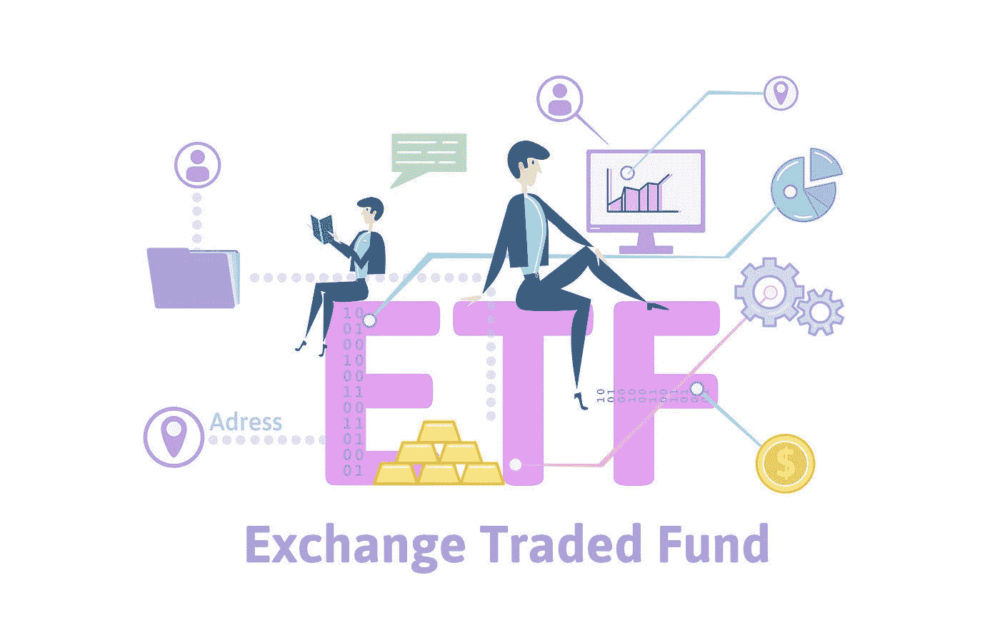
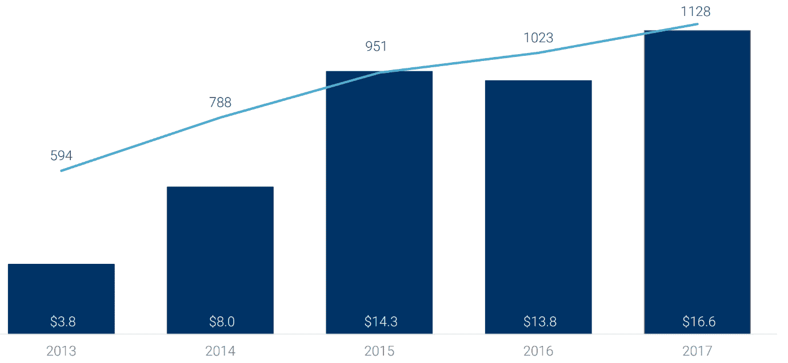

# 从金融科技中获利的 4 条投资路线

> 原文：<https://medium.datadriveninvestor.com/4-investing-routes-to-profit-from-fintech-f3c25bc44d9b?source=collection_archive---------3----------------------->

技术不断颠覆、更新，在某些情况下，还会取代全球范围内的一系列产业。我们想到了被夺走的工作，我们过度依赖科技的生活方式，以及[天网](http://www.datadriveninvestor.com/2018/05/16/could-blockchain-stop-skynet/)！

然而，带着对未来的所有这些想法，我们几乎肯定会同意，巨大的财富再分配将来自这些发展。如果一个人能在这些大趋势的影响被理解和感受到之前就驾驭它们，那岂不是太棒了？

尽早发现黄金机会*需要广泛的领域专业知识以及投资者的想象力。*

*不仅如此，投资重大但相对不为人知的开发项目需要一定的心态和长期视角，这是很少有人具备的，即使他们有意识地认同“巨大机遇”的存在。社会对技术采用的固有限制确保了世界上只有少数人能够在任何创新中获得最大收益。*

*因此，面对科技的大肆宣传和承诺以及快速变化的世界，投资者如何更方便地从最有前途的方向中获利，即使没有知识、信心和资源来随时更新所有发展？忘掉天网吧，伟大的投资机会应该还是人人都可以获得的，至少理论上是这样。*

*在本文中，我们将介绍一些方法，投资者可以通过这些方法对金融科技(以及一般的科技)进行持续而可行的投资，并从大多数科技发展中获利。*

**

# *交易所交易基金*

*在过去 10 年左右的时间里，ETF 的受欢迎程度激增。大多数是被动投资(尽管有些也是主动管理的)，它们提供了一种便捷的方式来广泛投资于某个特定领域——在这里指的是金融科技——而且通常只收取适度的费用。*

*例如，Global X FinTech ETF 跟踪[全球金融科技主题指数](https://www.indxx.com/indices.php?id=241)的表现，这是一个由 31 家提供金融科技产品和服务的公司组成的市值加权指数，具体来说:*

*   *P2P 和市场借贷*
*   *移动支付*
*   *众筹*
*   *区块链和替代货币*
*   *个人财务软件、自动化财富管理和交易*
*   *企业解决方案*

*每家公司必须至少有 1 亿美元的市值，加上前六个月平均每天超过 200 万美元的交易量。因此，ETF 代表了对该领域更成熟公司的投资。*

*其他可以考虑的金融科技 ETF 包括跟踪 49 家在美国公开交易的金融科技公司的 [KBW 纳斯达克金融科技指数(KFTX)](https://indexes.nasdaqomx.com/Index/Overview/KFTX) ，以及跟踪发达经济体和新兴经济体科技公司的 [iShares 指数科技 ETF](https://www.blackrock.com/investing/products/272532/ishares-exponential-technologies-etf) 。*

*区块链 ETF 也在 2018 年起飞，迄今已推出四只主要基金。到目前为止，两个最有前途的似乎是积极管理的[Amplify transformation Data Sharing ETF](https://www.amplifyetfs.com/blok)(BLOK)和[Reality Shares Nasdaq NexGen Economy ETF](https://www.realityshares.com/app/BLCN)(BLCN)，后者跟踪一个纳斯达克指数，“旨在衡量那些投入大量资源开发、研究、支持、创新或利用区块链技术供自己或他人使用的公司的回报”。*

*但值得注意的是，在这个非常早期的阶段，区块链 ETF 没有为区块链市场的新公司提供大量投资机会。相反，这些控股公司主要是老牌大盘股公司，在这些公司中，区块链发展仅代表整体商业战略的一小部分。*

**

# *加密货币*

*尽管区块链 ETF 仍在发展中，但加密货币提供了一种更纯粹的直接投资区块链的方式。随着超过 [1600 个项目](https://coinmarketcap.com/all/views/all/)已经发行了加密货币代币，有大量的潜在机会可供选择。*

*当然，在市场成熟的早期阶段，crypto 仍然是众所周知的不稳定的。尽管如此，它确实为你提供了赚取惊人收益的机会，正如我们在过去几年中目睹的比特币、以太坊和许多其他项目一样。*

*随着区块链计划在未来几年内颠覆众多行业的传统商业模式，毫无疑问将会有越来越多的基于加密的项目可供选择。*

*也就是说，由于对该领域的监管显然仍是一个持续的过程，因此在投资于 crypto 之前进行详细的研究是值得的。这里有一些让你开始的问题。*

*与此同时，首次公开募股(ico)为投资区块链初创企业提供了一种革命性的方式。在此类活动中，代币可获得大幅折扣，大幅提高您回报的机会是可以想象的。*

*但同样，由于大多数司法管辖区尚未实施足够的监管，欺诈 ico 出现的可能性仍然非常真实。我再次强调，如果你走这条路，尽可能彻底地研究。*

**

# *金融科技股票*

*你可以随时回到更传统的路线，投资金融科技生态系统内的单个公司。这包括专注于区块链、移动支付、P2P 贷款、云计算、人工智能和 RegTech 的公司，仅举几例。*

*这个领域中一些最有前途的公司是新的、未上市的初创公司，这意味着通过风险投资公司投资可能是一个有利可图的选择。*

**

**2013 年至 2017 年全球风险投资支持的金融科技交易和融资(10 亿美元)(* [*来源:CBInsights*](https://www.cbinsights.com/reports/CB-Insights_Fintech-Trends-2018.pdf?utm_campaign=fintech-trends_2018-01&utm_medium=email&_hsenc=p2ANqtz-83egy6EYyYxm-NcLcpU6eVAyO6DnkbIXzwa6dGkBEP4uKJTgNQjjsoCbAPoO9QLYZ-8sJWOfX3IIzOC69c6eYVK0KMoZbOKiSQUQwAadxTiwpKVww&_hsmi=60205492&utm_content=60205492&utm_source=hs_automation&hsCtaTracking=8a06e7dc-ed7d-4266-ae6a-d35d1b3a1d14%7Cc46556a3-b660-4e05-8adf-63c1eaf948c7) *)**

*风险投资公司可以识别最有前途的公司，帮助它们实现盈利，并允许投资者在早期、中期或晚期参与。尽管这种方法提供了很高的增长潜力，但它伴随着相当大的风险，因为小型初创企业存在大量未知因素。*

*然而，吸引眼球的不仅仅是新兴企业。大公司也大举进入这一领域。随着智能手机和平板电脑的使用，支付在人们的生活中扮演着越来越重要的角色，PayPal 正在大步走在这一增长领域的前沿。*

*除了 PayPal 的移动支付应用 Venmo，该公司最近收购了总部位于斯德哥尔摩的支付提供商 iZettle，该公司为小型企业提供便携式销售点解决方案。它还收购了 Jetlore，这是一个人工智能预测平台，使一些顶级在线零售商能够提供个性化的客户体验，以提高销售额和忠诚度。*

*寻找具有坚实投资潜力的金融科技公司的另一种方法是探索那些在金融科技 ETF 中被列为持股的公司。如果你更喜欢投资股票而不是基金，那么深入研究 ETF 的成份股是一个很好的方法，可以在你对它们进行额外研究之前，识别出已经受到好评的公司。*

**

# *管理基金*

*如果你更喜欢投资一种涵盖更广泛金融科技领域的产品，积极管理型基金可能是最好的解决方案。*

*选择这个选项的好处主要在于你可以从有经验的投资专家那里获得专业知识。这些基金经理在组建投资组合之前，对整个行业进行了广泛的研究。积极管理还确保基金的投资组合得到定期监测和适当的再平衡。*

*另一个重要的优势是，管理基金可以灵活地投资于不同的资产类别。我们上面提到的所有工具——股票、ETF、cryptos 甚至项目——都可以包含在该基金的投资组合中，以获得不同发展的最佳敞口和更高的风险回报。像 [Atlanta](http://www.altanawealth.com/adcf/) 、 [Crypto Asset Fund](https://www.cryptoassets.fund/) 和我们自己的 [OC Horizon Fintech](http://ochorizon.com/) 这样的基金就是例子。*

**原载于 2018 年 9 月 1 日*[*www.datadriveninvestor.com*](http://www.datadriveninvestor.com/2018/09/01/4-investing-routes-to-profit-from-fintech/)*。**