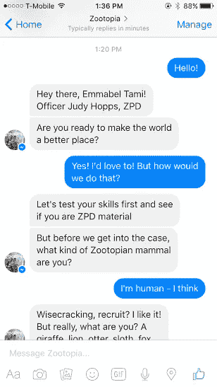
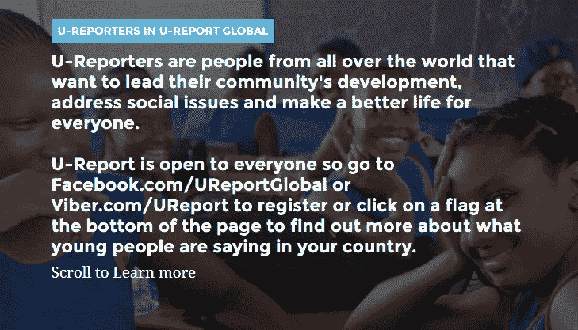

# 你必须知道的 4 个令人兴奋的聊天机器人

> 原文：<https://medium.datadriveninvestor.com/4-mind-blowing-chatbots-you-have-to-know-about-a66345b0bff4?source=collection_archive---------8----------------------->

Image by Daniel Borker

“聊天机器人”已经成为 2018 年的流行语。不仅是科技巨头，中小型企业也在投资聊天机器人，事实证明，聊天机器人会一直存在下去。

虽然我们听说并熟悉聊天机器人目前的一般使用情况，但有一些真正创新的聊天机器人引起了我们的注意。以下是我们认为最好的前 4 名！

# 智能机器人-3000

不，这个机器人不会唱歌哄你睡觉(虽然，那也很酷！).任何患有失眠症的人都知道，熬夜漫无目的地浏览你的脸书新闻，却没有人可以交谈是多么无聊和寂寞。

A glimpse into the type of conversation with Insomnobot.

Casper 的聊天机器人 Insomnobot 3000 在世界其他地方沉睡的时候与失眠症患者交谈。Insonmobot 3000 吸引了我们的注意力，因为它所代表的用例非常有创意和令人兴奋。虽然仍处于初级阶段，但它的对话充满了半开玩笑的幽默，你不会希望对话结束。

# 耐力痴呆机器人

谷歌对痴呆症的定义或多或少将这种疾病定义为一组导致记忆力和判断力丧失的病症。患有痴呆症的人在日常工作和对话中面临挑战。

Endurance launched a chatbot to assist Dementia patients

鉴于大量的人受到痴呆症的影响，俄罗斯公司 Endurance 启动了一个开源项目，为阿尔茨海默氏症患者开发聊天机器人。聊天机器人主要和病人谈论一般话题——天气、爱好、新闻、电影、音乐等。这种虚拟伴侣旨在补充许多痴呆症患者缺乏的真实交流。社交有助于延缓痴呆症的发展，而这款高贵的聊天机器人正是为了做到这一点。

# 迪士尼侦探机器人——疯狂动物城

甚至媒体行业也在试验聊天机器人。2016 年，媒体和娱乐巨头迪士尼决定推出一款围绕热门动画电影《疯狂动物城》主角朱迪·霍普斯的聊天机器人。

Source: [https://bit.ly/2Uzr5f3](https://bit.ly/2Uzr5f3)

使用聊天机器人，迪士尼爱好者可以帮助朱迪·霍普斯警官像电影中那样解决《疯狂动物城》中的犯罪。机器人会谈论案件，并根据用户输入给出各种线索，帮助您解决案件。总的来说，这个机器人在它的反应上是相当初级的，但是它所代表的用例是独一无二的，是推广营销机器人的终极例子。

# 联合国儿童基金会的 U-Report 机器人

认为聊天机器人可以被用作解决社会问题的工具是一个遥不可及的梦想。或者是？不再是了。国际儿童福利组织 UNICEF 正在使用聊天机器人来帮助发展中国家的人们谈论他们在社区中的迫切需求。

Users of U-Report are called ‘U-Reporters’

bot U-Report 通过进行民意调查来大规模收集数据。联合国儿童基金会通过 U-Report 发出关于紧迫社会问题的民意调查，用户可以用他们的答案来回应。联合国儿童基金会通过 U-Report 收集答案，并用于提出有效的政策建议。这是技术用于社会公益的最好例子。

聊天机器人领域正在发生令人兴奋的事情，而这仅仅是开始。许多行业正在意识到聊天机器人的重要性，并正在采用这项技术。话虽如此，我们仍然处于聊天机器人的实验阶段。为了超越新生阶段，我们将需要[开发聊天机器人，清楚地了解用例](https://wotnot.io/templates/)，并致力于聊天机器人的不断发展，以适应业务需求。

> **光有聊天机器人是不够的；您需要跟踪聊天机器人的性能，使其更好地为您服务。**

WotNot 的 Chatbot Analytics 可以让您深入了解最终用户的想法，从而深入了解增长和持续改进的机会。跟踪不同的**KPI**(关键绩效指标)，如**目标跟踪、平均会话时间、总用户交互、热门查询**等等！