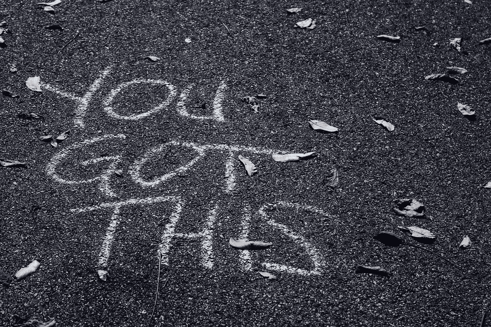
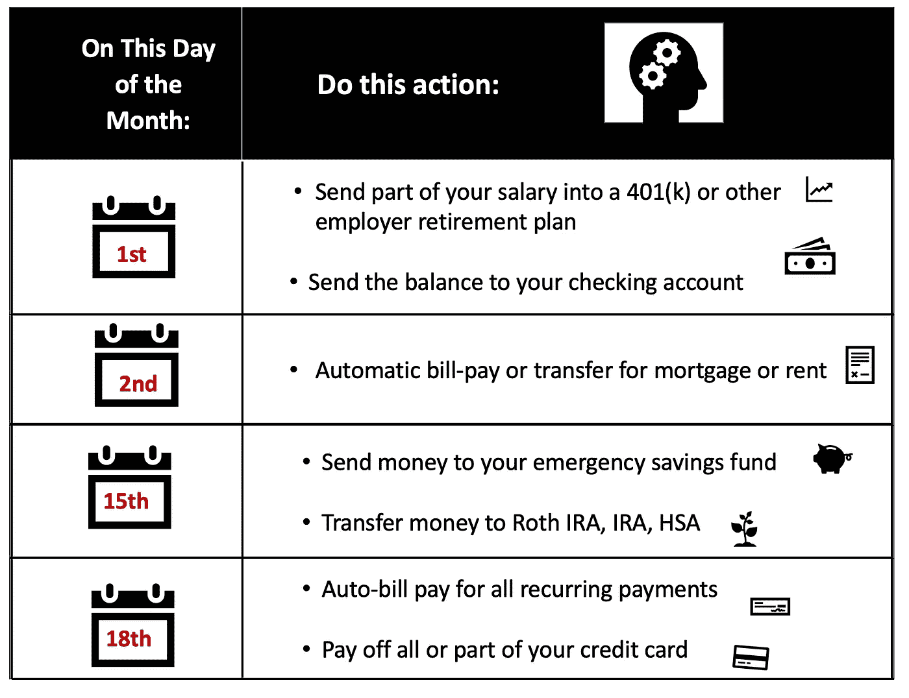
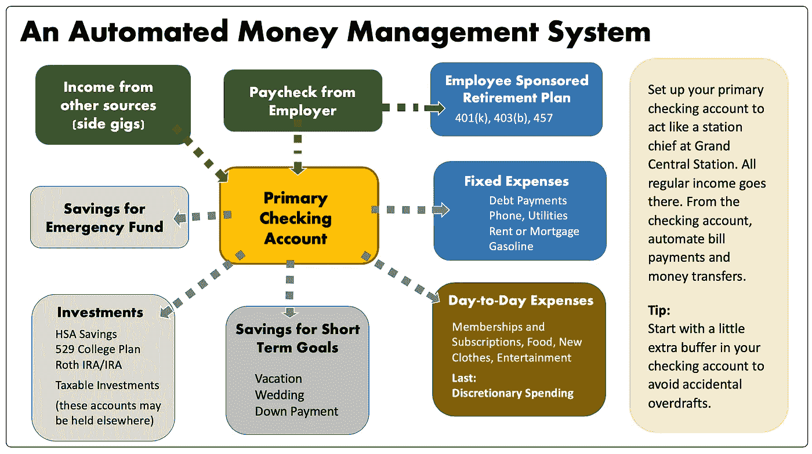
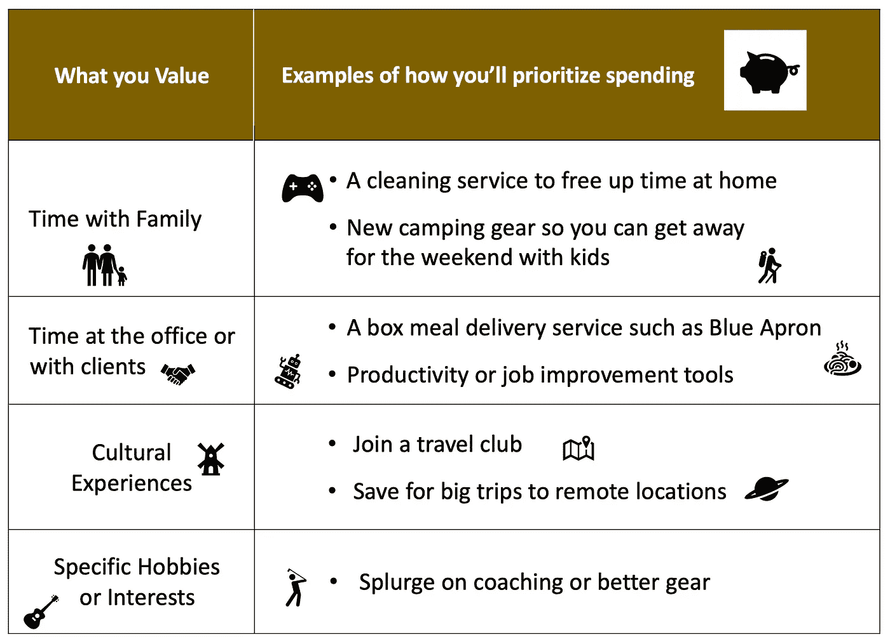
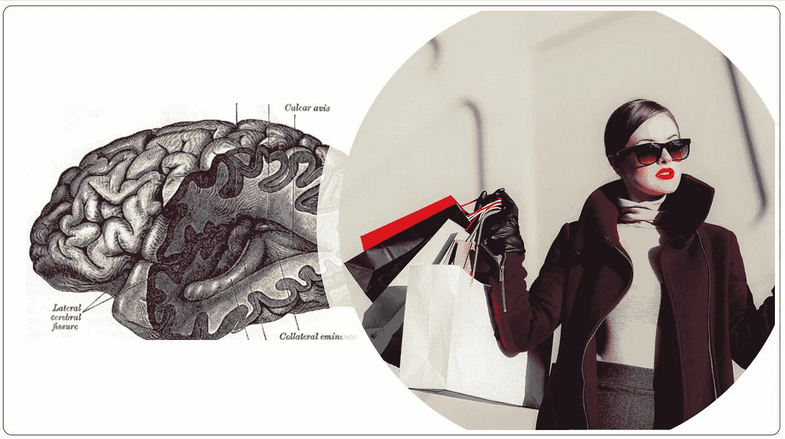
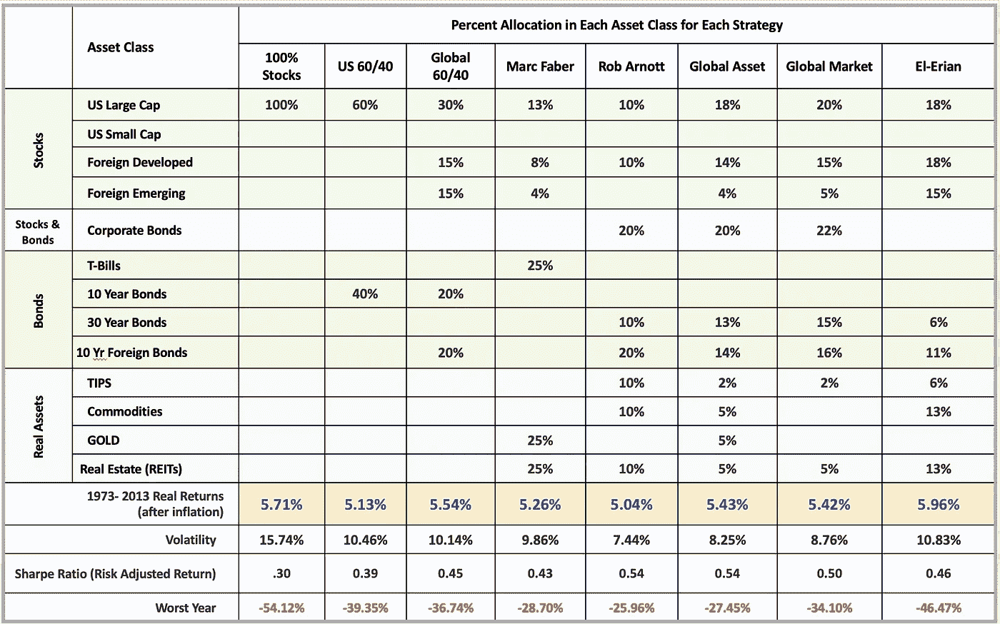

# 99%的人忽视的 4 个简单的理财习惯

> 原文：<https://medium.datadriveninvestor.com/4-money-habits-to-live-well-that-99-9-of-people-ignore-29cff133fabf?source=collection_archive---------15----------------------->

这可能是个难题。

过于随和，你可能无法实现你为自己设定的目标。工作过度，尽管你有贫穷的优点，你还是有过早精疲力竭的危险。

你真正想要的是一种舒适的平衡。现在把钱花在让你开心的事情上，*同时*在这些目标上取得可衡量的进展:

*   在你的职业生涯中变得更有价值，这样你就能挣得更多，
*   足够明智地投资，快速积累真正的财富
*   花时间在你在乎的事情上。

应该没那么难搞清楚。

除此之外，金融或职业专家通常会提供狭隘的建议，而这些建议在现实世界中是行不通的。这可能会让广告商高兴，让他们看起来更好(T4)，但它不会让你明显受益。

> 如果你要接受专家的建议，它应该是完美的、可行的，并且是为了让你成功而设计的，而不是他们。

这正是这个列表的全部内容。这不是一个狭隘的计划或一套指令，这只是四个简单的习惯，当它们结合在一起时，将帮助你现在更快乐地生活 ***同时*** 在你的目标上取得进展。

让这些习惯成为你自己的习惯，你将告别大量的浪费努力。

然而，99%的人忽略了它们。

或者，他们适应一两个习惯，但不是全部四个。当他们没有很快看到结果时，他们会责怪建议。

别做那种人。相反，做那百分之一的人…

我会告诉你怎么做。

# 习惯 1:靠自动驾驶积累财富

随着你承担更多的责任和义务，财务会变得越来越复杂，而你可用于财务的时间却在减少。在你意识到之前，几个月已经过去了，你还没有建立一个应急基金或者为大件物品存钱。你甚至可能会错过一些账单，并产生滞纳金和费用。

***为什么要这样对自己？？***

相反，自动化日常资金管理活动。每天早上醒来，你都会知道你的钱花到了该花的地方。

*   你的账单和日常支付是准时的
*   你将投资于税收优惠账户，如个人退休账户、401(k)账户和 HSA 账户
*   你会在其他储蓄和投资上取得进展
*   你会知道你每个月能花多少钱
*   你会腾出时间和精神空间去做其他事情

自动化让你保持理智，以最少的努力步入正轨。

设置系统只需要大约一个小时。大多数人指定主要的支票账户就像中央车站一样。所有固定收入都在这里。如果您还没有从计算机或移动设备上设置网上银行访问权限，请进行设置。

接下来，写下一份预算和一份书面计划，当账单被支付时，当钱被转移到其他账户时。下面是一个可能的例子:

接下来，上网设置支付和转账。每个银行的在线账户页面都有一点不同，所以如果需要的话，请拨打银行的帮助热线(他们会帮助你的。银行喜欢你使用更多的服务；只是一定要问清楚是否涉及费用)。

最终的系统将像一台润滑良好的机器一样运转，由你控制，并可以随时改变。看看这个:

如果你不确定是否相信你的银行会在正确的时间支付正确的款项，试着先支付一两张账单或转账，然后监控你的账户。一旦你感到舒适，你可以添加额外的交易。

# 习惯 2:只在你喜欢的东西上花钱

如果你不能管理好支出的轻重缓急，你永远也不会积累财富。但是如果你像大多数人一样，预算是乏味的，并且很难长期坚持。一旦系统崩溃，通常一切都完了。

作为一种选择，直接自由支配的花费*只花在你喜欢的和你长期看重的东西上。*这些东西是什么只有你自己知道，所以提前想好。

## **对于其他事情，做一个无情的小气鬼。**

这里有一个例子来说明这是如何工作的:

如果你还在挥霍你的每月预算，试试这个:

## 放慢脚步，让购买大件商品成为一个有意识的决定。

为可能会破坏你预算的高价商品插入一个 24 小时或更长的*冷却期*。这迫使你有意识地做出决定。

> 当你做出有意识的购买决定，而不是冲动或地位购买时，你将开始积累可持续的财富。不要少花，要花对。

We buy things we don’t need out of fear, love, the need to conform, stand out, or connect.

# 习惯 3: **定期增加多样化的低费用投资组合**

投资就像节食——有很多方式可以奏效。旧石器时代，南海滩，阿特金斯，饼干饮食(是的，这确实存在)都有助于你减肥，如果你坚持和卡路里赤字。

类似的逻辑也适用于投资。继续投资股票、债券和房地产，并投资一些海外市场，然后不要为任何一个类别的 5%左右而烦恼。

在 Mebane Faber 所著的《全球资产配置》(The Idea Farm LP，2015 年)一书中，作者回顾了沃伦巴菲特(Warren Buffet)、大卫斯文森(David Swenson)(耶鲁投资组合的成员)、威廉伯恩斯坦(William Bernstein)和《犹太法典》(the Talmud)等名人的 20 种投资策略(考虑到这本书是在 15 个世纪前写的，它写得出奇地好)。

在 1973 年至 2013 年期间，除了一个例外，所有扣除通胀的回报率都在 1%以内。

***WTIHIN 百分之一！！！！
……这比许多财务顾问费都低，也比低成本交易所交易基金和昂贵的共同基金的差价低。***

> 换句话说，如果加上费用，最好的策略表现不如最差的策略。

这意味着， ***不再担心资金的完美组合，而是关注费用。*** 想想这些典型的[费用结构](https://www.ici.org/pdf/per24-03.pdf)，许多投资者毫无疑问地接受了它们:

*   财务顾问费:0.99%至 2.5%
*   共同基金(不包括销售负载):0.4%至 2.5%

而指数基金手续费从 0.06%到 1.05%左右。

当你回顾你的选择时，保持所有费用的平均值在 0.5%或以下(除非你的账户很小或者你正在接受额外的服务)。

## 多元化是值得的

以下是从费伯的书中选择的投资组合的结果。(显示 100%股票和 60/40 美元投资组合的列作为基准包括在内。)

如果你注意到，通过从 ***100%的美国股票*** 转移到更多样化的模型，如 ***全球资产组合*** ，你将最大损失从 54.12%减少到 27.45%，但平均实际回报仅下降 0.28%。(实际回报是年同比增长率减去通货膨胀率。)

1973 年至 2013 年期间:

**100%美股:** 平均实际回报率:5.71%
单年最大亏损:54.12%

**全球资产组合:**
平均实际回报率:5.43%
单年最大亏损:27.45%

当投资组合下跌 54%时，大多数人都认输了！

**NOTE: Returns are AFTER inflation and appear lower than returns on other charts. The complete book is available free on Mebane Faber’s** [**website**](https://mebfaber.com)**.**

## 获得帮助，建立你的完美投资计划。

有一些低成本的金融咨询服务可以帮助你根据你的时间框架和对偶然损失的容忍度来选择完美的投资组合。

这些服务也可以为你分配你每月的贡献。(假设你希望每月向你的投资账户转账 500 美元。您的服务将根据您的投资计划购买每只基金的适当份额。这就像拥有个人的“基金中的基金”)

针对初始余额为 25，000 美元及以下的投资者的常见服务包括:

*   [M1 金融](https://www.m1finance.com/free-automated-investing/?utm_source=adwords&utm_medium=paid-search&utm_campaign=AR-Search-Brand&gclid=EAIaIQobChMIm8Dkx9O-4AIVrLSzCh326ggaEAAYASAAEgLwmPD_BwE)(免费和低价选项)
*   [改善](https://www.betterment.com)
*   [先锋私人顾问](https://investor.vanguard.com/advice/personal-advisor)
*   [财富前线](https://www.wealthfront.com/?gclid=EAIaIQobChMIo7a56oa94AIVWFgNCh1yrgIHEAAYASAAEgKuePD_BwE)
*   [资产建造商](https://assetbuilder.com)

# 习惯 4:让自己置身于一个基石社区

不管你喜不喜欢，联想很重要。批评你的朋友听起来很武断，但是这些关系会影响你的观点、你的抱负、你的工作习惯和你的目标。通常，你的上升或下降取决于你的同龄人的期望。

**“你朝着与你交往的人的方向前进”**

***——巴菲特***

如果你想在生活中获得新的成功，寻找与那些已经知道如何获得你所寻求的成功的人建立关系的方法。你可以向他们学习，然后开始拼凑你自己的行动计划。

另一方面，这些人对你的成功至关重要。他们打开大门，提供指导，并帮助你找到只有内部人士知道的机会。在某些领域，没有他们的支持你是不可能成功的。

You might achieve success on your own, but it may take longer and require more effort.

《原子习惯(Atomic Habits)**:建立好习惯的简单&行之有效的方法&改掉坏习惯*(企鹅兰登书屋，2018) 的作者 James Clear 称这些协会为基石社区。社区是由帮助你前进的人组成的。幸运的是，使用 MeetUp、LinkedIn 和脸书等工具，比以往任何时候都更容易找到一个为你的个人目标“工作”的 Keystone 社区。*

*尝试几个小组，或者形成你自己的有影响力的人和有地位的支持者的圈子。如果你加入了一个既定的团体，不要只是出现。寻找一个委员会主席或领导职位。随着影响者了解你，他们会看到你展示你的技能和专业知识。*

*你认为这需要努力吗？确实如此，这也是很多人不这么做的原因。建立关系和信任不会在一夜之间发生，所以选择一个与你的个性和现有技能相匹配的领域和努力，这样你就会坚持下去。*

# *你的生活设计隐藏在日常习惯中*

*当你设计你的生活和习惯时，你可以享受这个过程，因为你拥有它。你如何花费你的时间和金钱将与你的需求和愿望相一致。*

*你会敏锐地意识到什么让你快乐。你会和能帮助你成功的人建立关系。账单、常规交易等繁琐的任务会替你完成。*

*不再只是阅读如何赚钱的书籍，你会有时间、精神带宽和动力去采取行动。*

*这四个习惯一起帮助你做到这一点，甚至更多。但是跳过一两个，你可能得不到你希望的成功。*

> **坚持这四个习惯，你会比你想象的更快看到结果。**

*你会建立自信。你会获得动力，想要做更多。很快，这将成为你的*新常态*，在最佳水平运行会感觉很自然。*

*在你知道之前，你无法想象其他的生活方式。*