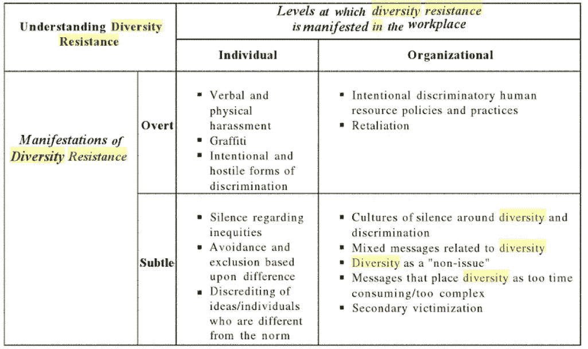

# 组织多样性阻力的 4 种路径

> 原文：<https://medium.datadriveninvestor.com/4-paths-of-organizational-diversity-resistance-e2358a642c3e?source=collection_archive---------5----------------------->

毫不奇怪，组织对多元化政策和实践的抵制可能涵盖不同的方面，并出现在组织和个人层面。重要的问题是谁在抵制什么类型的做法。例如，对多样性的抵制，即所谓的对实施“自上而下”的组织多样性计划的抵制，可以被视为员工不愿改变现状。其他学者认为，对多样性的抵制可以在占主导地位的“和“从属的”雇员群体的信念中观察到，例如，平等的晋升机会。

以下研究揭示了抵制多元化的四种主要形式，跨国公司，特别是实施多元化和包容性战略的领先公司，应该考虑这些形式。

多样性抵制可以表现在显性和公开的实践和行为中，也可以表现在更含蓄、微妙的方式中。托马斯和普劳特(2008)提出了一个组织中多样性阻力的分类法(图 1)。

Source: Thomas & Plaut (2008)

**路径 1:个人/公开**

在个人层面，公开的抵制可能会转化为有意的歧视行为、刻板印象和骚扰，或者通过员工因各种差异而被群体边缘化、回避特定民族血统的人或压制组织环境中的不平等问题等间接方式表现出来。与此同时，对有害行为负有责任的员工和团队往往对多元化政策和实践表现出不情愿。

**路径二:个人/微妙**

另一方面，压制与不平等、歧视、偏见和骚扰有关的重要问题的做法可能被认为是一种文化上接受的规范，是一种隐藏的多样性抵制形式。其中一个主要问题是诋毁与工作场所主导群体不同的其他员工及其想法。

**路径二:组织/公开**

考虑到组织层面，多样性抵制的公开表现可能发生在人力资源实践和政策层面。例如，这些政策可以被故意设计来吸引男性候选人担任领导职位，或者为做同样工作的女性提供较低的工资。抵制工作场所歧视的另一个例子是报复，它可以表现为多种形式。

**路径 3:组织/微妙**

最后，研究的启示呼吁关注微妙的组织多样性阻力。抵制的一种形式是对工作场所的多样性和歧视问题保持沉默的文化，这意味着歧视据称得到承认，但没有采取任何行动来克服它，也没有人谈论它。此外，歧视一词可能不在组织的词汇表中。这涉及到主导民族和少数民族之间的权力关系问题。

另一个例子，多样性的混合信息可以有意地解决其他不相关的话题，以转移对实际问题的注意力，例如，将注意力从公开的歧视转移到工作场所的福利，这甚至不是员工抱怨的话题。根据定义，当组织公开支持多样性和平等，同时实施矛盾和不明确的沟通做法，从 DM 的角度突出不相关的主题时，就会出现混合多样性信息。对于不同管理层和不同职能部门的员工来说，多样性也可以被视为“非问题”。

此外，多元化领导者可能会发现多元化计划过于昂贵、耗时且过于复杂，难以实施。在这种情况下,“多元化倡导者”的辅助作用可能会被证明是肤浅且无法实现的解决方案。最后，另一种形式的抵制，即所谓的“第二次受害”，包括对歧视受害者的指责态度、行为和做法，可能是工作场所歧视报复的一部分。

资料来源:*托马斯，K. M .，&普劳特，V. C. (2008)。工作场所多元化阻力的多面性。在 K. M .托马斯(编辑。)，应用心理学系列。组织中的多样性阻力(第 1-22 页)。纽约州纽约市:泰勒&弗朗西斯集团/劳伦斯·厄勒鲍姆联合公司。*