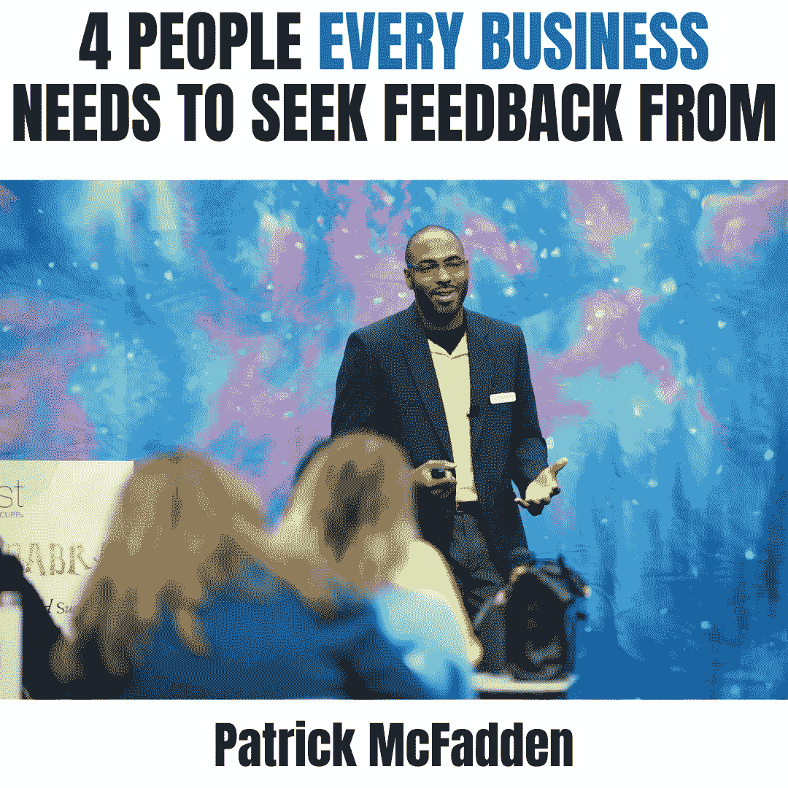

# 你应该向 4 个人寻求反馈

> 原文：<https://medium.datadriveninvestor.com/4-people-you-should-seek-feedback-from-19383abe315d?source=collection_archive---------15----------------------->

不断寻求这四个人的反馈是学习如何更有效地营销你的企业的好方法。

为了建立有效的营销策略，每个企业都需要向以下四个人寻求反馈:

1.“理想”客户(你最适合服务的客户)

2.“服务交付”团队成员(处理日常客户需求的团队成员)

3.“销售”人员(销售人员围绕客户的异议和信息需求进行真正的对话)

4.“战略”合作伙伴(对交付您的解决方案至关重要或允许您进入其他市场的合作伙伴)

 [## 一个企业在肚子上移动:如何照顾直觉|数据驱动的投资者

### 事实证明，直觉不仅仅是一种感觉。科学很清楚:你的直觉比你知道的更多…

www.datadriveninvestor.com](https://www.datadriveninvestor.com/2018/11/09/a-business-moves-on-its-stomach-how-to-make-allowances-for-gut-feelings/) 

如果您以前从未这样做过，请立即这样做，因为这是发现您所做的实际上使您从竞争中脱颖而出的最佳方式之一，可以更好地吸引重视您的解决方案的战略合作伙伴，创建满足真正客户需求的内容，并自信地知道做什么和不做什么。

#业务#营销技巧#策略#营销#营销策略#营销研究