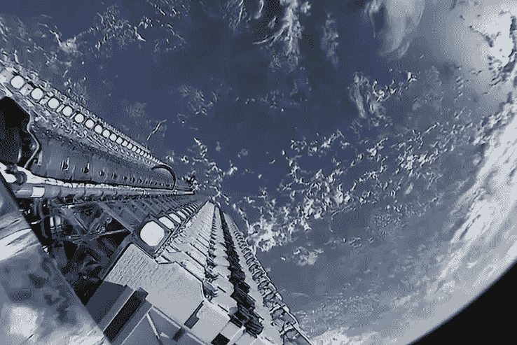

# Starlink 是一项糟糕投资的 4 个理由

> 原文：<https://medium.datadriveninvestor.com/4-reasons-why-starlink-is-a-terrible-investment-4b6c008c21bb?source=collection_archive---------8----------------------->

*“不记得过去的人注定要重蹈覆辙”*

乔治·桑塔亚纳

2015 年，埃隆·马斯克提出 Starlink 是全球互联网卫星通信的下一次革命。这个由 12000 颗小卫星组成的星座已经在建设中，在过去的六个月中，已经有 120 个航天器搭载猎鹰 9 号火箭发射升空。该网络有望在未来两年内实现初步运营。然而，Starlink constellation 是一个有 30 年历史的商业模式的混搭，这个商业模式原本是一个巨大的失败。

**幸灾乐祸的铱星**

《T4》的故事开始于 1988 年亚利桑那州钱德勒市。虽然铱的历史是有争议的，可能是虚构的，但据说它的想法是由巴哈马的巴里·贝尔蒂格构想出来的。当他们在一个偏远的岛上度假时，巴里的妻子很难与一位房地产经纪人沟通。当巴里后来怒气冲冲地回到亚利桑那州时，他的妻子要求他想出一个解决办法。Bertiger 与 Ken Peterson 和 Ray Leopold 一起头脑风暴，发明了空中蜂窝塔，后来成为铱。

又过了十年，第一颗卫星才搭载德尔塔 2 火箭从范登堡空军基地发射升空。又花了两年时间和二十一次发射才完成这个星座。

如果对其服务的需求存在，这个星座将会是一个巨大的成就，但它没有。到上世纪末，该公司已经破产。天空中的蜂窝塔铱星在几个小时内坠落到地面，就像是邦德电影的结局。

所有这些都是管理层的错。例如，1999 年 CNN 作家大卫·罗德抱怨说，几乎不可能与销售顾问联系购买这种手机服务。其他人抱怨服务太糟糕了。

只有美国政府提供了 7200 万美元的现金援助和一份两年的合同，星座才得以存在。2000 年 12 月，政府还同意以 2500 万美元低价出售该公司，并免除 40 亿美元债务。

铱星公司今天仍然在营业。

SpaceX 是否有必要获得军事合同才能蓬勃发展？

**全球 3G 的可用性和速度**

Hexagon 博士最近在 Reddit 上评论说，他可以连接 3G 网络，从几乎任何地方观看网飞电影。他的陈述令人难忘，因为 Hexagon 博士说他住在泰国的偏远岛屿上，每月 30 美元就可以完成这项壮举。Hexagon 博士还表示担心 Starlink 对天线的需求会限制台式电脑的服务。这对 Starlink 来说可能是毁灭性的，因为许多人使用他们的手机进行交流。Hexagon 博士还说，他已经探索了许多发展中国家，可以连接到脸书和信息。

来自 [Opensignal](https://www.opensignal.com/reports/2016/08/global-state-of-the-mobile-network) 的研究证实了 Hexagon 的说法。在他们的报告中，他们说在调查的 95 个国家中，有 93 个国家超过一半的时间可以获得像样的 3G 信号。在接受调查的 95 个国家中，75%的情况下可以获得 3G。23 个国家在 90%的时间里提供可靠的 3G 服务。韩国提供世界上最好的服务，日本位居第二。

手机信号的质量也有很多种。在韩国，3G 网络的速度可以低至每秒 1 兆，而高级 4G 网络的速度可以高达每秒 41.4 兆。美国的可用性排名第 19 位，整体速度排名第 39 位，因为我们的网络速度范围很广。阿富汗表现最差。所有国家的平均速度为每秒 8.5 兆比特，20 个国家的平均速度低于每秒 5 兆比特。

随着未来十年 5G 在最发达国家上线，这种情况只会有所改善。

**市场竞争与饱和**

在下一个十年，天空将会布满小型卫星网络。Starlink 只是一系列即将到来的卫星平台中的第一波。Oneweb 也在争夺客户和空间，他们在 2 月份发射了前 9 艘飞船，随后还有 641 艘飞船。柯伊伯项目预计将由分布在三个轨道外壳上的 3000 多颗卫星组成。如果这些网络中的任何一个或两个都获得商业市场份额，那么经济学理论认为 Starlink 应该会遇到进一步的价格下跌。

摩根士丹利目前对 SpaceX 的估值为 333 亿美元。当 SpaceX 获得超过 10%的全球宽带市场份额时，他们的分析师可能会将价值提高到 1200 亿美元。他们对 SpaceX 运营 Starlink 星座的基本估值为 520 亿美元。这一估价取决于伊隆在未来十年部署更多的航天器，比目前在轨的所有航天器加起来还要多，这就产生了问题。

**凯斯勒综合症和太空竞赛的终结**

在 2013 年的[电影](https://www.imdb.com/title/tt1454468/) **重力**中，一股失控的碎片洪流粉碎了航天飞机*探索者*，当时它正在轨道上升级哈勃望远镜。由桑德拉·布洛克扮演的我们的英雄瑞安·斯通不得不使出浑身解数在毁灭中生存下来，并最终回到地球。残骸的泛滥最初是由俄罗斯导弹试验引发的。

虽然这场灾难是虚构的，但描述的凯斯勒综合症是真实的。1978 年，美国国家航空航天局的罗纳德·凯斯勒预言，一次碰撞可能会在太空中引发一系列自持的连锁反应。这种摩擦反应会将轨道卫星吞噬成碎片，然后继续破坏。在现实生活中，这场灾难会终结太空竞赛。

随着更多航天器进入轨道，凯斯勒综合症的风险只会增加。Starlink、Oneweb 和 Kuiper 正计划再增加近 1.6 万个。

**最后的想法**

Starlink 的创建是对一个三十年前的想法的重新尝试，这个想法在引人注目地失败之前发展成了铱星。只有通过政府合同和紧急救助，这个网络今天仍然存在。Starlink constellation 停滞不前的风险，只是因为世界上大多数地方都有廉价的 3G 蜂窝网络。SpaceX 还面临着来自竞争对手 Oneweb 和 Kuiper 的阻力。假设 SpaceX 可以部署一个多产的星座，低地球轨道上航天器的拥挤增加了凯斯勒综合症的风险。

SpaceX 将需要构建一种独特的宽带服务来取得成功。即使有独特的产品，没有政府的支持也不能保证他们的成功。