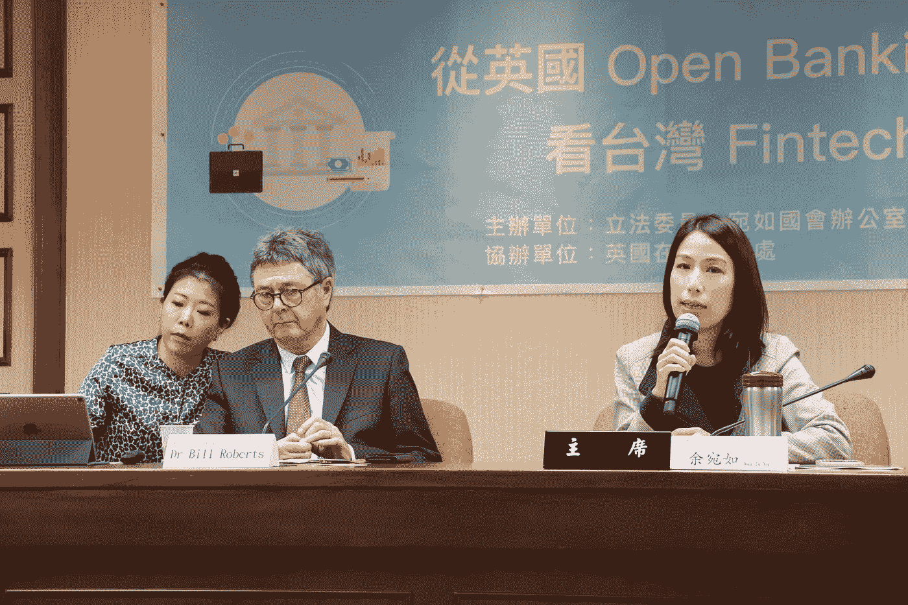

# 台湾应该推行强制性“开放银行”的 4 个理由

> 原文：<https://medium.datadriveninvestor.com/4-reasons-why-taiwan-should-pursue-compulsory-open-banking-b9528ae9cf0a?source=collection_archive---------11----------------------->

As a legislator who follows the development of Fintech worldwide, I am glad to hear that the Financial Supervisory Commission (金管會，FSC) is finally catching up on the global trend and start envisaging the development of “open banking” in Taiwan. Regarding the key question on whether banks should be obliged to open their customers’ financial data, with the consent of customers, of course, to Third-party Service Providers (TSPs), the position of the FSC is to let banks decide voluntarily, as the governments do in Hong Kong and Singapore. But based on 4 reasons, I think the FSC should pursue compulsory open banking, give back data rights to consumers, and at the same time do not impose any limits on the financial services that TSPs could provide in the future.

首先，并非台湾的每家银行都以保守的态度面对金融科技带来的挑战。有一些私人银行选择拥抱变化。例如，凯基银行几年前就开始与许多金融科技公司合作，通过移动应用程序提供记账和数字支付等服务。CTBC 银行还与便利店和电信公司合作，允许他们的客户转换或扣除不同类型的优惠券。很明显，即使政府未能推动开放银行业务，态度积极的银行也会试图进入这个新的金融科技市场，淘汰那些不愿开放数据并与 tsp 合作的更快的银行。

其次，台湾应利用开放银行业的发展优势，加强个人资料保护的法规。我们甚至可以在建立个人数据权利方面向前迈出一大步，就像澳大利亚的消费者数据权利和欧盟的一般数据保护条例所涵盖的那样。

如果 FSC 认为制定一部开放银行的新法律需要时间，它可以从修改《银行法》中与保密有关的条款和《个人数据法》中与被动同意有关的规定开始。这可以为他们节省大量时间，并降低鼓励开放银行业的立法成本。

最后但同样重要的是，推行强制性开放银行业对台湾金融科技行业的长期发展是一个好兆头。更多资源将用于金融科技初创企业，这些企业可以为公众提供更好、更便宜的金融服务，使金融服务更加包容。

在金融科技发展和个人数据权监管方面，台湾落后于许多国家。开放银行业为台湾在这两个领域迎头赶上提供了独特的机会。随着越来越多的国家意识到开放银行业的重要性和潜力，台湾已经刻不容缓。