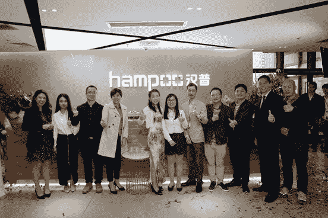
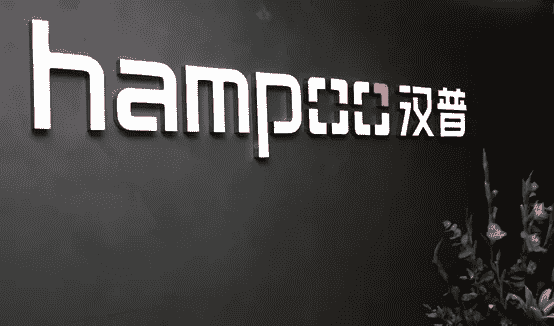
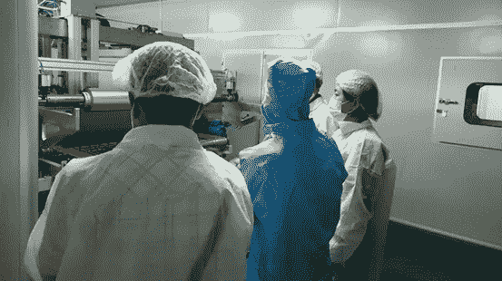
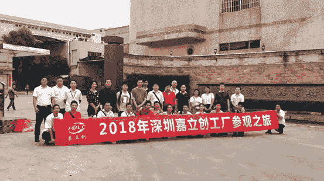
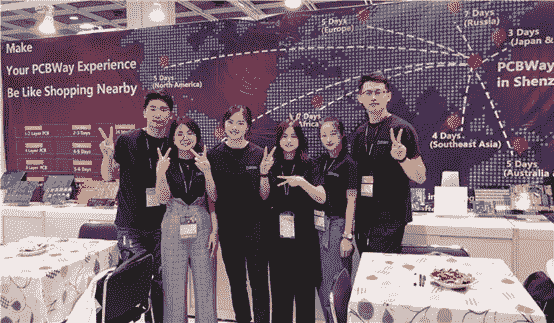
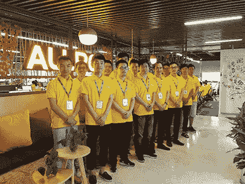

# 4 推荐的中国 PCB 制造和制造商

> 原文：<https://medium.datadriveninvestor.com/4-recommended-pcb-fabrication-manufacturers-in-china-2f21f245aa44?source=collection_archive---------6----------------------->

许多工程师需要以低产量和低价格制造定制的 PCB 和原型。但这两个特征通常不会同时并存，而且它们太多了，很难判断谁可以信任。所以，这里有一些可靠的 PCB 供应商在中国。

**汉普**

首先，你需要知道一个事实，大多数中国 PCB 制造商聚集在中国东南沿海城市深圳。最优秀的 PCB 制造商之一— —深圳市汉博科技有限公司是一家一站式 PCB 制造商和快速周转 PCB 组装解决方案提供商，拥有 15 年历史，与**英特尔、微软、瑞芯微、Avnet、百度、德州仪器**等合作伙伴。其一站式电子制造服务包括 PCB 设计、PCB 制造、零件采购、SMT、组装和测试。通过 **ISO 9001** 、 **ISO 13485** 、 **TS 1694** 和 **Rohs** 认证，其优质产品获得了微软 **CET 卓越合作伙伴奖&最佳数字化转型奖**。与授权供应商、采购零件代理商的密切关系，以及严格的进货质量控制流程系统帮助客户提高质量和降低成本。

**JLCPCB**

深圳 JLC 电子有限公司是中国**最大的 PCB 原型企业**，周转时间快，出货快。已通过 **UL、建滔 FR-4 材料认证和 Rohs 测试**。与其他 PCB 制造商相比，其 2 层尺寸≤ 100×100mm 的原型 PCB 的价格可以低至 **2 美元/10pcs** ，只有三种不同的交付方式，包括 DHL、航空邮件和 EMS。

**PCB 方式**

PCB Way 成立于 2014 年，是一家总部位于杭州的 PCB 制造商，提供全面的 PCB 原型制作、小批量生产和组装服务。高交货率，无最低要求，快速周转，公平的价格使其深受学生的欢迎。你甚至可以试试它的**教育 PCB 项目**，通过在它的网站上注册你的电子邮件地址并提供一些必要的信息来赞助你的 PCB 需求。此外，教师和学生还可以在 PCB 组装服务上享受很大的折扣。

**所有 PCB**

ALLPCB 是杭州一家专业从事 PCB 原型制作、PCB 组装和 SMT 模版服务的现代化高科技 PCB 企业。目前，公司已获得**、**、**、【杭州市十大行业重点企业】、**等称号，产品广泛应用于电脑、通讯、汽车、数码等高科技电子产品。与 PCB Way 一样，ALLPCB 也有**学生 PCB 赞助计划**，同时 ALLPCB 经常在节假日提供一些特别优惠或折扣。

