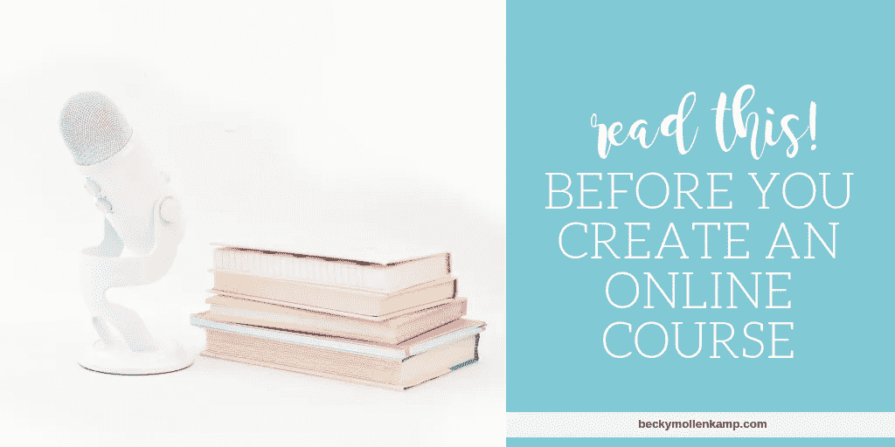

# 创建在线课程？先看这个！

> 原文：<https://medium.datadriveninvestor.com/4-secrets-you-need-to-know-about-creating-an-online-course-fb56e418e56d?source=collection_archive---------36----------------------->

去年我开设了三门课程，我学到了很多。

今天，我将分享我在创建和销售课程的过程中所学到的 4 条经验。

我希望我的成功和失败能为你自己的课程省去一些头痛和心痛。

4 tips from an online course creator

**1。没你想的那么难。**如果你对开始第一道菜感到紧张，可能是因为你想得太多了。从小处着手，简单易行；你的目标是学习课程设计，而不是赚很多钱。(如果你真的赚到了钱——太棒了！)

有什么事情对你来说似乎超级简单，但别人却总是要求你的帮助？这是你的第一个课程主题。

对我来说，是 [LinkedIn](https://el2.convertkit-mail.com/c/preview/dpheh0hz/aHR0cHM6Ly9iZWNreW1vbGxlbmthbXAubHBhZ2VzLmNvL2xpbmtlZGluLWNvdXJzZS8=) 。我从网站上获得了大量的线索，所以有人建议我开一个大师班，分享我的秘密。啊哈！第一道菜。

当您采用这种方法时，您可以在一天内创建并启动基础课程。说真的([我做过](https://el2.convertkit-mail.com/c/preview/e5uph7h9/aHR0cHM6Ly9iZWNreW1vbGxlbmthbXAubHBhZ2VzLmNvL2NydXNoLXlvdXItZ29hbHMv))。

编写内容
·录制音频或视频(简易选项:Loom)
·创建工作簿或清单(简易选项:Canva)
·上传到课程托管平台(简易选项:[Podia](https://el2.convertkit-mail.com/c/preview/78i7h8hv/aHR0cHM6Ly9iZWNreW1vbGxlbmthbXAuY29tL3RoaW5raWZpYy12cy1wb2RpYS8=))
·出售(参见#2)

**2。这比你想象的要难多了。**创建课程？简单。卖课程？H-A-R-D。

人们很容易被 Instagram 上的炒作所迷惑:一个可爱的 20 多岁的年轻人，当你在海滩上啜饮玛格丽塔酒时，承诺经营 7 位数生意的 3 个秘密。听起来很棒。

这完全是废话。她可能还会把挑选中奖彩票号码的秘密卖给你。

“被动收入”是胡扯。

是的，你可以坐在沙滩上赚钱，但你需要随身携带笔记本电脑，因为 99%的课程工作是在课程完成后进行的。

除非你已经有了一大群追随者，否则你会花大部分时间去想办法把你的课程介绍给理想的买家。这意味着写客座博文，尝试上播客，在脸书团体中推广，在你自己的社交媒体上大量推广，等等。

这是一项艰巨的工作，不要被那些让你相信并非如此的大师们所愚弄。

**3。设定现实的期望。也不要被“5 位数或 6 位数的产品发布”的宣传所迷惑。**

要在一门课程上赚 10 万美元，你需要 1 个愿意支付 10 万美元的买家，或者 1，000 个愿意支付 1，000 美元的买家。两者都很难找到。当然，不是不可能，但是真的很难。

总会有一些随机的人在瓶子里抓住闪电，有一个 5 或 6 位数的发布，没有追随者，也没有电子邮件列表。我希望你这么幸运。你只要知道这就是——运气。

对于我们中 99.9%的人来说，课程收入与我们的粉丝数量直接相关。

如果你的电子邮件列表或社交媒体关注的人数没有玛丽·弗里奥、艾米·波特菲尔德或詹娜·库彻的多，你就不能指望从课程中获得和他们一样多的收入。我说这些不是为了打击你，只是为了帮助你设定现实的期望。

[在开始一门课程之前建立你的电子邮件列表是明智的；在你开始推销之前，这给了你时间来培养这份清单。这就是为什么我会在 11 月 15 日联合主持一个网络研讨会，教你 5 个非常规的技巧来增加你的邮件列表。[点击这里保住你的座位](https://el2.convertkit-mail.com/c/preview/opfkhqh3/aHR0cHM6Ly96b29tLnVzL3dlYmluYXIvcmVnaXN0ZXIvV05fXzAtLXJiMGVTQ0M5Ylp2clhrQTVrQQ==)！]

**让我分享一下我的数字。**在我第一道菜的[首发式上，我以大约 1400 美元的价格卖出了 39 个座位。从那以后的一年里，我在两门课程上多赚了大约 6000 美元。这是因为电子邮件列表不到 1000 封，社交媒体总接触人数约为 14000 人。(我的第三个课程《粉碎你的目标》是免费的——目标是新的电子邮件订户，而不是收入)。](https://el2.convertkit-mail.com/c/preview/zvtghnh9/aHR0cHM6Ly9iZWNreW1vbGxlbmthbXAuY29tL2xhdW5jaC1sZXNzb25zLw==)

**4。常青树很难卖。**随时让人买你的课程，似乎顺理成章。如果你限制销售，你的收入潜力会大大降低，对吗？不对。

我了解到“常青树”课程(那些随时可用的课程)更难推销。人们会想，“哦，我可以以后再来拿”，所以他们会等。但后来很少来，因为生活发生了，他们忘记了你的课程。

我大约 90%的销售发生在我的每门课程的初始阶段。人们购买是因为:

1.我正在积极推广它。这又新又有趣。我提供了一个早期的价格

一些人仍然会随机购买我的课程，但我认为一年只卖几次你的课程可能更聪明。人们对稀缺性有反应，所以有时你必须制造它。我可能会在 2019 年转向这种方法。

**保存日期！**我将于 2018 年 11 月 15 日联合主持一场网络研讨会，**如何建立您的电子邮件列表**以便您可以销售课程。你不会想错过这个的！[点击此处保留您的座位](https://el2.convertkit-mail.com/c/preview/pnceh9hk/aHR0cHM6Ly96b29tLnVzL3dlYmluYXIvcmVnaXN0ZXIvV05fXzAtLXJiMGVTQ0M5Ylp2clhrQTVrQQ==)。