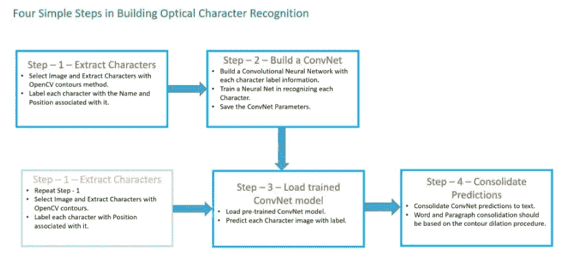
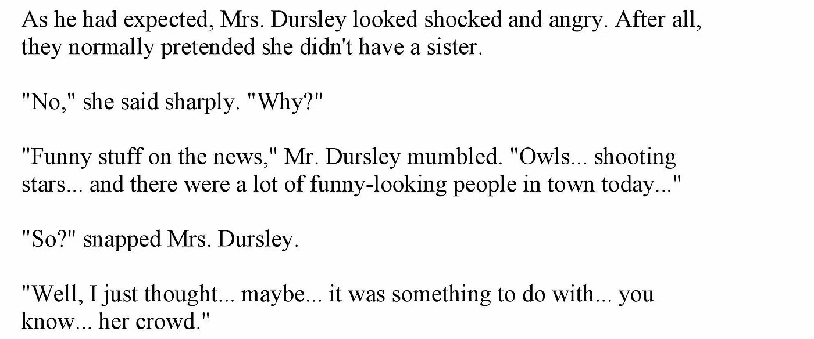
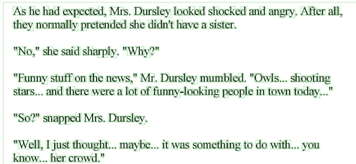
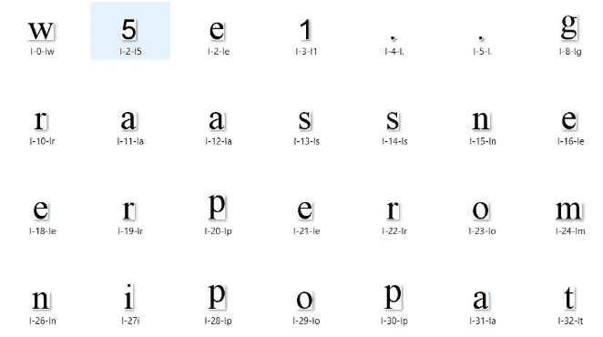
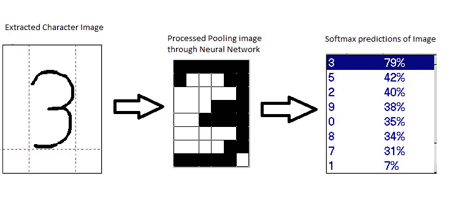
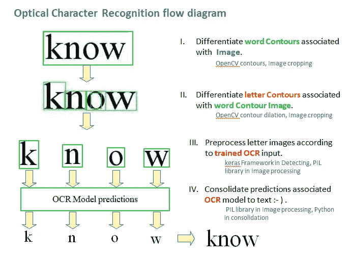
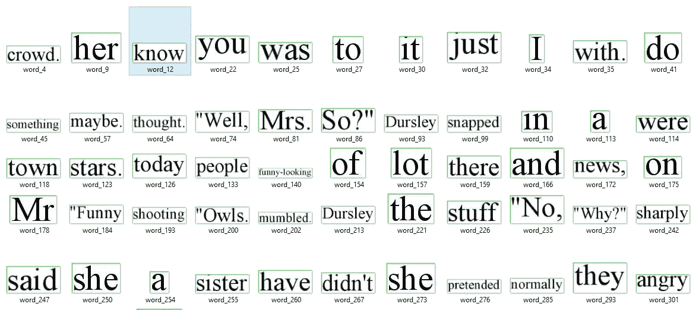

# 构建 OCR 的 4 个简单步骤

> 原文：<https://medium.datadriveninvestor.com/4-simple-steps-in-building-ocr-1f41c66099c1?source=collection_archive---------0----------------------->

[](http://www.track.datadriveninvestor.com/1B9E)

> 光学字符识别(OCR)是对包含在数字图像中的光学图案进行分类的过程。字符识别通过分割、特征提取和分类来实现。

OCR(光学字符识别)是计算机对印刷或书写文本字符的识别。这包括逐字符地扫描文本，分析扫描图像，然后将字符图像翻译成字符代码，如 ASCII，通常用于数据处理。

在 OCR 处理中，对扫描输入的图像或位图进行亮区和暗区分析，以识别每个字母或数字。当一个字符被识别时，它被转换成一个 ASCII 码。专门为 OCR 设计的特殊电路板和计算机芯片被用来加速识别过程。

[](https://www.datadriveninvestor.com/2019/03/03/editors-pick-5-machine-learning-books/) [## DDI 编辑推荐:5 本机器学习书籍，让你从新手变成数据驱动专家…

### 机器学习行业的蓬勃发展重新引起了人们对人工智能的兴趣

www.datadriveninvestor.com](https://www.datadriveninvestor.com/2019/03/03/editors-pick-5-machine-learning-books/) 

## 光学字符识别涉及的步骤:-

> 光学字符识别步骤:-
> 
> 1)从图像中提取字符边界，
> 
> 2)在记忆字符图像时建立卷积神经网络(ConvNet ),
> 
> 3)加载训练好的卷积神经网络(ConvNet)模型，
> 
> 4)巩固字符的 ConvNet 预测

[](https://github.com/Nagakiran1/4-simple-steps-in-Builiding-OCR) [## nagakiran 1/4-简单步骤-内置-OCR

### 光学字符识别(OCR)是对包含在数字图像中的光学模式进行分类的过程

github.com](https://github.com/Nagakiran1/4-simple-steps-in-Builiding-OCR) 

该算法的构建方式是将图像中的每个单个字符分割为单个图像:-)，然后识别并合并为图像中的文本。

*   *下载* [*预训车型*](https://drive.google.com/file/d/1ckskSVzzFpkaMO7VyTZo0fz_m32q_S_C/view?usp=sharing) *。*
*   *下载样本* [*标签字符图像*](https://drive.google.com/open?id=1UtChjL6z30hOPpm8cdlzKj4jGDF56Ym8) *列车数据。*



**1)来自图像的光学扫描✂️:**

*   选择任何包含文本信息的文档或信函



*   ***提取字符边界:*** 轮廓可以简单解释为连接所有连续点(沿边界)的曲线。轮廓是形状分析和物体检测与识别的有用工具。这里的轮廓解释了使用[轮廓膨胀](https://docs.opencv.org/trunk/d9/d61/tutorial_py_morphological_ops.html)技术区分图像中的每个字符。使用 [OpenCV 轮廓](https://docs.opencv.org/3.3.0/dd/d49/tutorial_py_contour_features.html)方法创建图像中每个字符的边界。用开放轮廓法进行字符识别。
*   利用轮廓区分单词的 OpenCV 代码实现

```
ret,thresh1 = cv2.threshold(im1,180,255,cv2.THRESH_BINARY_INV)
kernel = np.ones((5,5),np.uint8)
dilated = cv2.dilate(thresh1,kernel,iterations = 2)
_,contours, hierarchy = cv2.findContours(dilated,cv2.RETR_TREE,cv2.CHAIN_APPROX_SIMPLE)
cordinates = []
**for** cnt **in** contours:
    x,y,w,h = cv2.boundingRect(cnt)
    cordinates.append((x,y,w,h))
    *#bound the images*
    cv2.rectangle(im,(x,y),(x+w,y+h),(0,255,0),1)

cv2.namedWindow('BindingBox', cv2.WINDOW_NORMAL)
cv2.imwrite('data/BindingBox4.jpg',im)
```



***遵循命名约定(标注):*** 提取的文本字符要标注与之关联的原字符名称。

这里遵循的命名惯例是，文件名的最后一个字母应该是与预处理图像数据的字符相关联的名称。



*   ***预处理***

1.  取决于数据采集类型的原始数据经过许多初步处理步骤，以使其可用于特征分析的描述阶段。扫描过程产生的图像可能包含一定量的噪声
2.  平滑意味着填充和细化。填充消除了数字化字符中的小中断、间隙和孔洞，而细化减少了线条的宽度。

```
(a) noise reduction

(b) normalization of the data and

(c) compression in the amount of information to be retained.
```

**2)建立一个 ConvNet 模型✂️(Character 识别模型):**

具有 2*4 层剩余反馈的 8 层卷积网络用于记忆单个字符图像的图案✂️。



*   第一个模型将使用直接分类对单个字符图像进行训练，以预测使用 softmax 字符类别分类的图像。
*   第二个模型是相同的模型，具有作为预测器的前一层，其将计算指定展平神经元的嵌入(预测的展平值将具有收据图像的特征信息)。

**3)加载训练好的 ConvNet OCR 模型:**

光学字符识别的最后一步包括将图像预处理成特定的单词相关轮廓和字母轮廓，随后根据图像中的字母和单词相关轮廓进行预测和合并。

一旦训练完模型，我们就可以[保存并加载预先训练好的光学字符识别](https://machinelearningmastery.com/save-load-keras-deep-learning-models/)模型。



**4)测试并巩固 OCR 的预测:**

合并预测包括，用与图像中的单词相关联的线为每个单词相关轮廓分配特定 ID，将所有预测合并到特定单词相关轮廓和字母相关单词的排序序列中。

