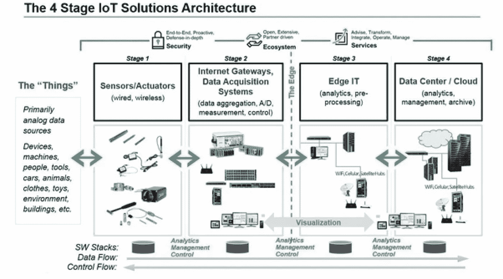

# 用简单的语言解释物联网架构的 4 个阶段

> 原文：<https://medium.datadriveninvestor.com/4-stages-of-iot-architecture-explained-in-simple-words-b2ea8b4f777f?source=collection_archive---------0----------------------->

**什么是物联网架构？**

由于物联网带来的巨大机遇，越来越多的组织寻求将物联网产品纳入其业务流程。然而，当涉及到现实时，这个绝妙的想法似乎太复杂而无法实现——考虑到实现它所需的设备和条件的数量。换句话说，建立一个可靠的物联网架构的问题不可避免地进入了舞台。

其中，要应对影响物联网架构的各种因素，找到一家可靠的[物联网解决方案](https://iot.intellectsoft.net/iot-projects)提供商更容易、更有效。这一决定将大大减少途中花费的资源数量。虽然理解创建软件的过程是可能的，但它的 4 个阶段的实际应用包含太多的细微差别和方面，无法用简单的语言来描述。因此，使用本指南来建立对物联网架构过程中发生的事情的正确理解——但考虑向专家咨询以使这一过程实际发生。这个决定将有助于获得所需的结果，并保证成为一个软件开发公司的满意客户。

在揭示这个秘密和提供这个计划的清晰结构之前，理解这个概念实际上意味着什么是很重要的。本质上，物联网架构是由众多元素组成的系统:传感器、协议、执行器、云服务和层。鉴于其复杂性，物联网架构存在 4 个阶段。选择这样的数量是为了将这些不同类型的组件稳定地包括到复杂且统一的网络中。

此外，为了跟踪系统的一致性，区分物联网架构层。在物联网架构流程开始之前，也应考虑到这一点。

> [DDI 编辑推荐——构建物联网:实施新的商业模式，瓦解竞争对手，改变你的行业](https://www.amazon.com/gp/product/1119285666/ref=as_li_qf_asin_il_tl?ie=UTF8&tag=ddi018-20&creative=9325&linkCode=as2&creativeASIN=1119285666&linkId=5d834d376824cb1394afbb4a38e32722)

基本上，有三个物联网架构层:

1.客户端(物联网设备层)

2.服务器端的运营商(物联网逃逸层)

3.连接客户和运营商的途径(物联网平台层)

事实上，解决所有这些层的需求对于物联网架构的所有阶段都至关重要。作为可行性标准的基础，这种一致性使设计的结果真正起作用。此外，可持续物联网架构的基本特征包括功能性、可扩展性、可用性和可维护性。不解决这些条件，物联网架构的结果就是失败。

因此，在这里描述的物联网架构的 4 个阶段中解决了所有上述要求——在每个单独的阶段中和在完成整个构建过程之后。

**物联网架构图中主要阶段的概述**

简单来说，4 阶段物联网架构包括

1.传感器和执行器

2.互联网出行和数据采集系统

3.边缘

4.数据中心和云。

这些阶段的详细介绍可以在下图中找到。

要正确理解该流程中的主要行动和每个阶段的重要性，请参考下面的详细回顾。

**第一阶段。物联网(无线传感器和执行器)**

传感器的突出特点是能够将从外部世界获得的信息转换成数据进行分析。换句话说，重要的是从物联网架构框架的 4 个阶段中包含传感器开始，以获得可以实际处理的外观信息。

对于执行器，这个过程甚至更进一步——这些设备能够干预物理现实。例如，他们可以关掉灯，调节房间的温度。

正因为如此，感测和致动阶段涵盖并调整物理世界中所需的一切，以获得进一步分析所需的洞察力。

**第二阶段。传感器数据汇总系统和模数数据转换**

尽管物联网架构的这一阶段仍然意味着在传感器和执行器的近距离工作，但互联网通道和数据采集系统(DAS)也出现在这里。具体来说，后者连接到传感器网络并汇总输出，而互联网 getaways 通过 Wi-Fi、有线局域网工作并执行进一步的处理。

这一阶段至关重要的是处理前一阶段收集的大量信息，并将其压缩到最佳大小以供进一步分析。此外，时间和结构方面的必要转换发生在这里。

简而言之，第二阶段将数据数字化和汇总。

**第三阶段。边缘 IT 系统的出现**

在物联网架构阶段的这一时刻，准备好的数据被传输到 IT 世界。特别是，边缘 IT 系统在这里执行增强的分析和预处理。例如，它指的是机器学习和可视化技术。同时，在进入数据中心阶段之前，这里可能会发生一些额外的处理。

同样，第 3 阶段与构建物联网架构的前几个阶段密切相关。因此，edge IT 系统的位置靠近传感器和执行器所在的位置，形成了一个配线间。同时，驻留在远程办公室也是可能的。

第四阶段。数据的分析、管理和存储

物联网架构最后阶段的主要流程发生在数据中心或云中。准确地说，它可以进行深度处理，并根据反馈进行后续修改。在这里，需要 IT 和 OT(运营技术)专业人员的技能。换句话说，这个阶段已经包括了数字世界和人类世界中最高等级的分析技能。因此，此处可能包含来自其他来源的数据，以确保进行深入分析。

在满足所有质量标准和要求后，信息被带回物理世界，但已经经过处理和精确分析。

**物联网架构的第五阶段？**

事实上，有一个选项可以通过在其中引入一个额外的阶段来扩展构建可持续物联网架构的过程。它指的是启动用户对结构的控制——当然，前提是你的结果不包括完全自动化。这里的主要任务是可视化和管理。在包括阶段 5 之后，该系统变成一个圆圈，其中用户向传感器/致动器发送命令(阶段 1)以执行一些动作。

这个过程又重新开始了。