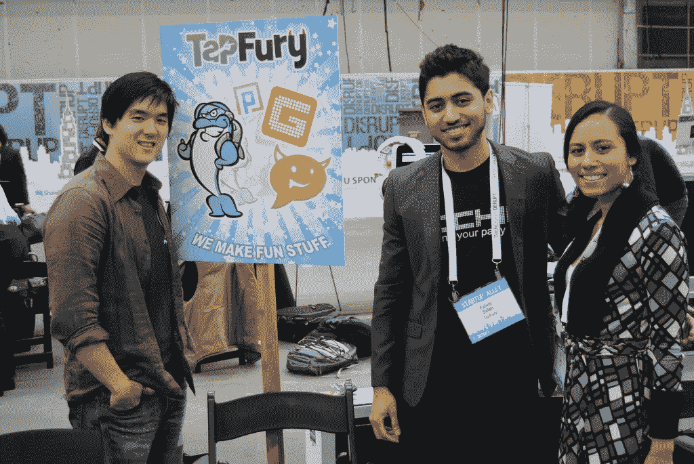

# 我 16 岁时的 4 个成功策略，至今仍在使用——2000 万美元后

> 原文：<https://medium.datadriveninvestor.com/4-success-strategies-from-my-16-year-old-self-that-i-still-use-today-20-million-later-ebd876664da1?source=collection_archive---------1----------------------->

我第一次进入创业领域是在 16 岁的时候，当时我是一名网站开发人员。

从那以后，我转向了更大的企业，比如创立了风险投资公司，这是一家在发展中国家创业的风险基金和孵化器。

> 但直到今天，我仍然做着许多帮助我作为一名青少年企业家取得成功的事情。

虽然我一路走来获得了世界的洞察力，但我在高中时建立的那些战略基础仍然很好地为我服务——后来带来了数百万美元的收入。

无论你是 16 岁还是 61 岁，每个企业家都应该做这四件事。

# **1。外包低价值的任务。**

自由职业者可以成为你最好的朋友。

它们为你节省时间*和*金钱——这是企业家最宝贵的两种资源。

当我 16 岁的时候，我运行了几个不同的网站，允许用户下载图片。

> 起初，我什么都做:寻找图片，编辑它们，上传它们，审查用户提交的图片。

这些简单但耗时的任务占据了我一天中的数小时，使我很难探索新的想法，推出新的网站，或追求其他发展业务所必需的高级功能。

所以我求助于自由职业者网站，在那里我发现了一大批自由职业者，他们愿意以合理的价格满足几乎任何工作要求。

如今，更容易找到高质量的自由职业者。

我通常使用 [Upwork](http://www.upwork.com) ，这是一个巨大的自由职业者市场，你可以在那里发布工作，并从想要你的项目的人那里收集出价。尽管 Upwork 和其他网站都有自由职业者的工作评论，所以你可以知道这个人是否擅长他们的工作，我也创造了自己的第二道防线来避免平庸的员工。

我写了一份详尽、具体的工作描述，其中包含了大约四分之三的代码。

> 然后，我要求所有申请人使用该代码作为他们邮件的主题，这让我知道他们完全阅读了我的描述。任何没有该代码的消息都可以立即删除。

当然，我必须花些时间培训我雇佣的自由职业者——但这总是值得的。向海外自由职业者支付每小时 6-10 美元，再加上花几个小时培训他们，为我节省了无数宝贵的时间，我可以将这些时间投入到更具战略性的工作中。

# **2。向人们伸出手，提出问题。**

你会惊讶有多少人愿意向一个完全陌生的人伸出援助之手。

作为一个 16 岁的孩子，我有一个很棒的网站想法，但是没钱支付托管费用。我不想向我爸要钱，所以我决定在一些不同的在线商业论坛上试试运气。

> 我写了一个简单的帖子，大意是，“嘿，我 16 岁，有一个很棒的想法，想做一个叫做 TeenHangout.com 的社交网站，但是我没钱管理它。如果有人愿意提供虚拟主机，我会把你的广告放在网站上。”

很多人告诉我，本质上，“祝你好运。”但是在一周之内，我确实收到了两个虚拟主机的邀请，作为一个小广告位置的回报。我几乎免费获得了我的第一个域名和网站。

目前，我和我的员工正在处理另一个问题——这次是一个稍微大一点的问题。

> 我们在碧昂斯的关注下出价。

我们的目标是得到她的支持，投资我们正在建立的尼日利亚公司。不，我个人并不认识碧昂斯，我也肯定没有她的电子邮件地址——但我认为这值得一试。

无论是著名运动员碧昂斯，还是主要科技公司的首席执行官，都不要害怕接触你不认识的人。他们很可能会给你一个积极的回应，让你大吃一惊。

# **3。寻找志趣相投的人来围绕你。**

找到合适的影响力和支持演员是至关重要的。

16 岁时，我开始进入网站开发者的在线领域。我在各种论坛上建立了密切的职业关系，并向那些每月赚 10，000 美元的网站运营者学习。

因为我太年轻了，能够在网上建立这些关系，而人们不知道我的年龄，这被证明是非常有利的。我敢肯定，如果他们知道我是个青少年，他们不会把我当回事。

今天，我更喜欢面对面地做生意。当你在一个活动中，分享一瓶啤酒，或者在晚餐时，面对面可以更快地建立联系。虚拟协议所缺乏的非语言元素——肢体语言、眼神交流、有力的握手——对建立信任非常有效。

> 毕竟，没有人会通过即时消息达成一笔 100 万美元的交易。

# **4。投资你的企业形象。**

感知就是一切——尤其是当你在创业的时候。

随着今天的负担得起的技术，每个人都有能力发展一个突出的品牌和形象。正因为如此，小企业对潜在客户或投资者来说可能看起来很大。

16 岁时，我知道我想让我的生意看起来合法，所以我在海外雇佣了专业的网页设计师，那里的价格更便宜。我们得到了一个时尚、高质量的网站，给广告商留下了深刻的印象。事实上，我们会接到电话询问我们的销售主管，而实际上，整个业务只有我和我 16 岁的生意伙伴凯尔。

> 从那以后，对于我建立的每一个企业，我总是优先考虑一个专业的顶级网站。

但是还有很多其他的方法来提升你的商业形象。

您可以获得一个 1–800 电话号码，该号码会转发到您的手机。你可以花 10 美元买一个域名，然后每月花几美元就可以在这个域名上收到一封电子邮件。如今，像 Squarespace 和 Wix 这样的网站托管平台使得在没有开发者的情况下创建一个好看的网站成为现实。

有了正确的心态、一点诀窍，并有效地执行基本原则，创建一个成功的企业对任何年龄的任何企业家来说都是一个现实的目标。

# 相关帖子:

 [## 你需要明白一件事

### 让我解释一下…

medium.com](https://medium.com/datadriveninvestor/uncertainty-now-you-can-handle-it-2e80cefe7e18)