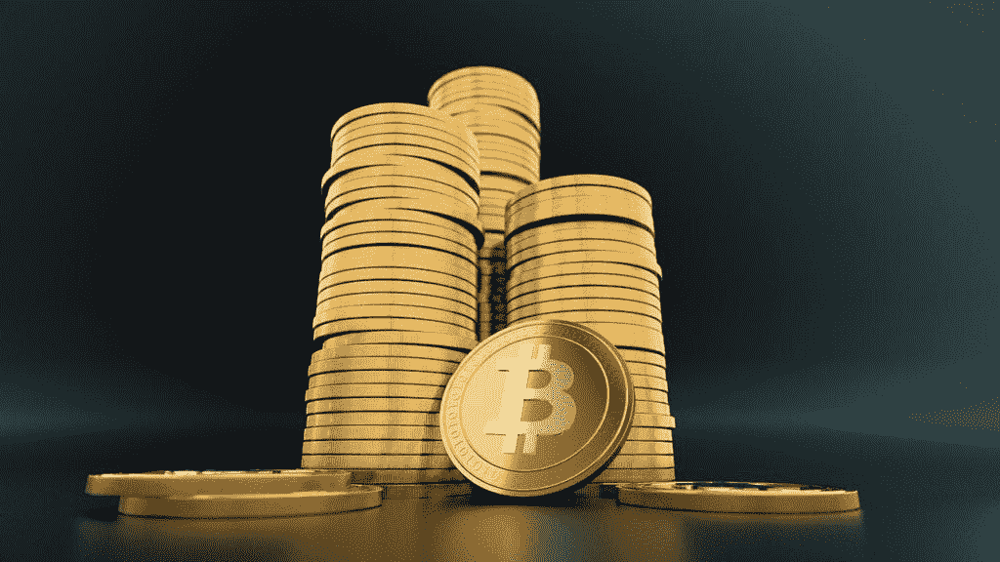

# 投资比特币前你需要知道的 4 件事

> 原文：<https://medium.datadriveninvestor.com/4-things-you-need-to-know-before-you-invest-in-bitcoin-2be1e6b167a9?source=collection_archive---------7----------------------->

Image by [3D Animation Production Company](https://pixabay.com/users/QuinceMedia-1031690/?utm_source=link-attribution&utm_medium=referral&utm_campaign=image&utm_content=3024279) from [Pixabay](https://pixabay.com/?utm_source=link-attribution&utm_medium=referral&utm_campaign=image&utm_content=3024279)

因此，加密货币似乎不会很快消失，即使它消失了，也肯定不会不战而退。你可能还记得摩根大通首席执行官杰米·戴蒙发表声明称比特币是一种欺诈。他说，它最终会爆炸，让任何投资它的人看起来都很愚蠢。这当然让很多人感到愤怒，但同时也很有趣，因为就在他说这话之后，他的女儿给他发来电子邮件说，“爸爸，我实际上拥有比特币，我正在用它赚钱。”这对戴蒙来说绝对是尴尬的。

在杰米发表声明的同时，中国宣布他们将试图禁止比特币。这一消息使比特币暴跌至每枚 3500 美元左右。在那之后，大约一个半月后，比特币飙升至每枚 7300 美元，在短短几周内，人们的钱翻了两倍多。太疯狂了。甚至一个普通的股票市场每年也会上涨 10%左右，想想比特币投资者能够在短短几周内将他们的钱翻一番还多，简直是疯了！如果你不熟悉什么是加密货币和比特币，你可以点击下面的链接，阅读我解释这一切的文章。

 [## “价值互联网”入门指南

### 对密码世界的所有行话感到困惑？关于‘价值互联网’，你需要知道的就是这些。

medium.com](https://medium.com/opinined/a-beginners-guide-to-the-internet-of-value-1bad51ad3823) 

今天，在你投资比特币之前，我要告诉你关于比特币的 4 件事。和往常一样，你投资任何东西都不能保证赚钱。投资时你甚至可能会赔钱。因此，你应该经常与你所在地区的专业人士交谈，这样你就能了解当地所有的法律法规，以及管理投资的风险。

## 不要在情感上投资

这是一个更一般的投资建议。它不仅仅适用于加密货币。不要在感情上投资！投资金融类股。最近，关于是否投资加密货币的困境，最常见的争论是，如果你今天在比特币上投资 100 美元，几年后它的价值将超过 2 亿美元；所以你不想错过这个机会。虽然已经发生的事情是绝对疯狂的，但我们不能回到过去。这是一场情绪化的争论。这不是财务上的争论。资产或服务的过去表现并不能无限期地预测其未来。所以请记住，你是在今天购买比特币，而不是回到 2010 年。没人能预测一种加密货币是注定要去月球还是跌跌撞撞地回到地球。由于加密世界是如此之新，其价值非常不稳定，这意味着它可以像过去一样迅速飙升，也可以同样迅速地暴跌。

 [## 如何创建加密货币[逐步指南] |数据驱动的投资者

### 加密货币是如何工作的？如何制作加密货币？如何创建自己的加密货币？所有这些问题…

www.datadriveninvestor.com](https://www.datadriveninvestor.com/2019/03/25/how-to-create-your-own-cryptocurrency-and-make-your-business-ready-for-the-future/) 

## 知道你要买什么

比特币是一种加密货币。它是一种在分布式账本上交易的去中心化数字货币。这意味着比特币既不受政府监管，也不受政府控制。它也不受任何私人实体如美联储或大银行的控制。现在，这对加密爱好者来说是一个好消息，因为他们知道这些实体无法影响加密货币的价值，就像他们可以通过印刷更多的法定货币来影响法定货币一样。但这对他们来说也是一个坏消息，因为他们知道这些实体肯定不想失去他们的主导地位。他们将尽一切可能阻止或禁止加密货币，正如我们观察到的那样，这种情况不时在各个国家发生。

此外，比特币是在点对点网络中交易的，这意味着比特币的用户会监控其活动。这种点对点系统相当新，这使得它作为货币使用存在问题。大部分地方还不接受比特币。但与此同时，许多人都很兴奋，因为在过去的几年里，一些大公司正在考虑投资 it。例如，亚马逊在 2017 年 11 月购买了三个与加密相关的域名。

那么这到底意味着什么呢？只有时间能证明一切。但如果像亚马逊这样的公司在未来开始使用比特币作为支付手段，那肯定会是密码世界的一个改变游戏规则的事件。

你也应该清楚比特币是如何估值的。比特币的价格是基于人们愿意为其支付的价格。这个概念可以追溯到供给和需求。一方面，随着越来越多的人通过比特币经纪人和[加密相关新闻门户](https://opinined.com/technology/cryptocurrency/breaking-news/)了解比特币，比特币买家大量涌入，这提高了其需求。在供给方面，比特币是有上限的。最初，可能只有 2100 万个比特币存在。一旦这 2100 万个比特币被创造出来或者被“开采”出来，就没有人能再制造出更多的比特币了。众所周知，当对某种东西的需求增加而供应有限时，它的价格就会上涨。

## 知道怎么买比特币吗

如果你决定购买或投资比特币，你必须使用允许你买卖比特币的加密货币交易所。大多数正规交易所不允许你交易加密货币。不同的国家有不同的规定。我们已经看到像中国和越南这样的国家试图禁止某种交流。所以你需要研究一下在你的领域里什么是被允许的。

如果你有兴趣了解不同国家在监管比特币方面面临的挑战，你可以点击下面的链接阅读我的文章。

 [## 监管加密货币的挑战

### 作者 Sana Uqaili，发表在《ALTCOIN》杂志上

medium.com](https://medium.com/altcoin-magazine/the-challenge-of-regulating-cryptocurrency-d294269a9b83) 

## 不要变得贪婪

是的，我知道比特币已经从每枚 0.003 美分涨到了 7000 多美元，但请记住我之前说过的话。它过去的业绩不能成为决定其未来价值的唯一因素。

如果你赚了一笔你满意的利润，你可以把利润拿出来卖掉。我知道很多时候人们可能会想，“我不知道我现在是否应该卖掉它。如果比特币涨到 2 万美元一枚呢？我要错过这么多钱了！”好吧，如果这就是你所担心的，那么你可以分期出售。这样，如果比特币真的下跌，你就已经卖出了一些股票，获得了一些利润。如果你认为这是一个很好的买入机会，你可以在这次下跌中买入。现在，如果比特币最终真的走高，你可能已经拿走了一部分利润，你仍然可以从这场持续的游戏中获益。

简单的事实是，我无法预测未来，世界上其他任何人也无法预测未来。所以不要相信别人的话。

在结束这篇文章之前，让我简单地说最后一点。从历史上看，在任何资产类别中，遭受损失最大的人都是那些相信不会出问题的人。

*原载于 2019 年 11 月 10 日*[*【https://opinined.com】*](https://opinined.com/4-things-you-need-to-know-before-you-invest-in-bitcoin/)*。*