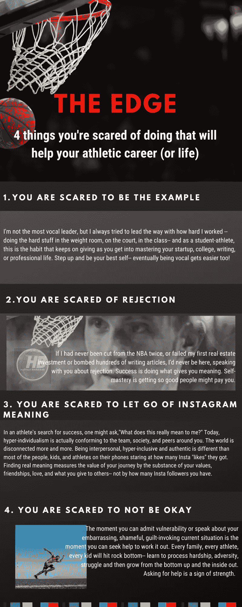

# 你害怕做的 4 件事让你无法自控

> 原文：<https://medium.datadriveninvestor.com/4-things-youre-scared-to-do-that-stop-you-from-self-mastery-27a4e49c4a7a?source=collection_archive---------9----------------------->

## 面向千禧一代、运动员、创业迷、有抱负的父母、首席执行官和陷入困境的孩子

我的腿感到无力。

“我要晕倒了吗？”

“我可能会晕倒。”

“不，你很好。玩就好。尽情地玩吧。”

## 那是 2004 年，[斯蒂芬·马布里](https://medium.com/grandstandcentral/my-failed-tryout-with-the-7-seconds-or-less-phoenix-suns-dcc8b97197ff)，世界上最好的控球后卫之一，正对我微笑——而且不是以一种好的方式。

T 他的声音在我的脑海里肆虐。我将在菲尼克斯太阳队的教练面前和 NBA 全明星球员斯蒂芬·马布里进行一对一的比赛，而斯蒂芬是 NBA 有史以来最令人畏惧的控卫之一。他是我实现梦想的唯一障碍。

“是的，我很害怕……但我没事。我在这里。我还活着。我很强壮。我的家人爱我。我为自己的努力感到骄傲。让你的恐惧。”

 [## 成功人生的 25 种自我提升方式|数据驱动的投资者

### “我活得越久，学到的就越多。学的越多，体会的越多，知道的越少。”―米切尔·莱格兰德时间到…

www.datadriveninvestor.com](https://www.datadriveninvestor.com/2019/03/12/25-self-improvement-ways-for-a-successful-life/) 

斯蒂芬·马布里带着傻笑接过球。当他运球向我走来，真的，我很快就想知道大便会不会顺着我的腿流下来，滑进我的耐克篮球鞋，在我的袜子和脚趾之间变得软软的。

我最可怕的噩梦。

“只是玩玩。玩就好。努力玩，”我不断重复。

一旦斯蒂芬·马布里迈出第一步，音乐就开始在我脑海中播放，我就什么都忘了。我忘记了那一刻。我忘记了恐惧或者我的大脑告诉我的东西。我超越了恐惧，它超越了我的身体进入了以太。

我前进。

> 随着恐惧的消退，我只是演奏——尽我所能地演奏——一些我习惯做的事情。

第二项运动告诉我，我们在生活中都会害怕做某些事情——接受一份新工作、离开家、去一个新的国家旅行、背包穿越阿尔卑斯山、离开公司、开始一个新的健身社区、加入一个新的健身社区、尝试冥想、瑜伽或与朋友谈论我们生活中最深处的愿望和目标——是的，这些恐惧可能是有意识的或无意识的。它们可能是合理的，也可能是不合理的。他们可能是真实的，也可能不是真实的。但最终，如果我们想要获得自我控制和成长，我们必须明白我们依恋什么，以及我们如何应对恐惧才是最重要的。

思想是冲突的根源——因为恐惧只是一种情绪——这种情绪既不好也不坏。所以就顺其自然吧。不要通过给它贴标签或者给它一个故事来赋予它更多的力量。

> 我们对恐惧的反应通常是痛苦的……知道了这一点，尽管感觉很痛苦，但我们必须顺其自然，带着情绪走向挡在我们面前的障碍。
> 
> 这是自我控制的艺术——做困难的事情，因为你可以。

四种思维是所有焦虑、抑郁、痛苦、悲伤、苦难和恐惧的来源——难道我们不应该教自己如何控制对我们并不可怕的世界的刺激的反应吗？

## 阅读更多自制力文章@ [特雷弗·霍夫曼](https://medium.com/u/5e7157084b29?source=post_page-----27a4e49c4a7a--------------------------------)。

## 或者加入我的“The Edge”时事通讯的其他 2000 名读者，分享我的职业运动员之旅，通过找到运动优势，实现[的自我控制。](http://www.trevorhuffman.com)