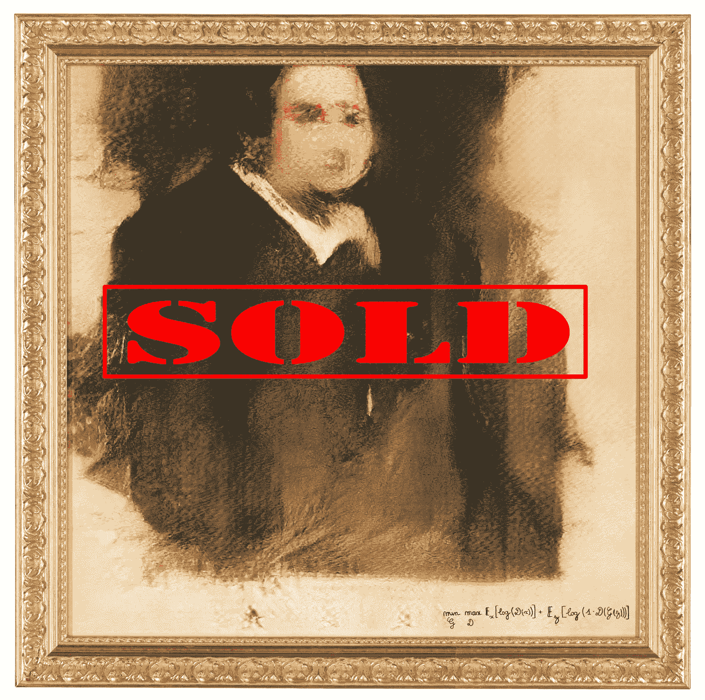

# 佳士得拍出 432 500 美元的艾作品——我的感想。

> 原文：<https://medium.datadriveninvestor.com/432-000-painting-by-ai-sold-at-christies-my-thoughts-4a33cd94f782?source=collection_archive---------5----------------------->

一幅使用 GANs(生成对抗网络)创作的画今天在佳士得拍出了 432 000 美元。

twitter 上有一个[帖子](https://twitter.com/DrBeef_/status/1055285640420483073)对这篇文章的原创性提出了抱怨。制作这幅画的集体([明显的](http://obvious-art.com))使用了开源代码的修改版本，其中很多是基于 [Robbie Barrat 的数据刮刀和 dcGAN](https://github.com/robbiebarrat/art-DCGAN) 的实现。这项工作本身是基于 2014 年 [Ian Goodfellow 的一系列研究。](https://papers.nips.cc/paper/5423-generative-adversarial-nets.pdf)

这场争论是一个微妙的问题，对我来说非常有趣。一方面，即使是作者也承认，在拍卖会上出售的作品绝不是甘作品的艺术水平。许多媒体对该作品的报道并没有对该作品在多大程度上基于 Robbie 的代码表示敬意。但是成功的艺术需要语境；它不仅仅是作品本身。例如，达明安·赫斯特雇佣了一个工人工厂来生产他的点画。但是他把他们成功的背景概念化了。甚至经常不是艺术家用正确的方式来突出他们的作品的更广泛的意义；这是艺术评论家、机构、收藏家和拍卖行之间的对话，让一件作品充满了这种对话，就像提供社会评论，或者挑战新旧观念。这件作品进入了著名的拍卖行，它在拍卖会上的价格反映了公众对人工智能的兴趣，也反映了公众对人工智能产生的艺术的误解。

创作方法，即通过训练 GANs 和使用精心挑选的数据集，对艺术品的背景也非常重要，因此对其销售价格也很重要。这就是为什么对作品衍生的抱怨是有分量的。这是关于人工智能增强艺术的更广泛对话的催化剂。

创造新颖艺术的一部分是探索如何用新的约束和新的工具进行创作。现在这个工具是一个神经网络模型。我们关注的不是绘画的物理行为，而是管理模型的数据，以便梳理出有趣的视觉输出。这个过程类似于将我们自己——一个模型——暴露给来自世界的新数据，从中汲取灵感。用这个模型创作就是要更多地了解它的局限性和表达能力，并有目的地操纵它。所有这些都将定义用人工智能工具进行有意义的创造意味着什么。

显然，出售这件作品的最初故事是“人工智能”创造了作品的主体。现在的问题是，用人工智能创造艺术的真实故事——这在很大程度上是人类的参与、策展和投入——是否会对艺术界保持兴趣。这幅作品的拍卖价格至少表明了人们对创造这一内容的技术有着浓厚的兴趣。这种兴趣可能被误导了，不知道这项技术到底有多智能，但如果有这种兴趣，那么就有机会更广泛地传播这项技术，或许让它更容易获得。有没有一种方式来讲述这个故事，从而吸引并教育更多的观众？

如果是这样的话，那么“爱德蒙·德·贝拉米”将不会是唯一一件在甘斯的帮助下创作并在拍卖会上如此大卖的作品。