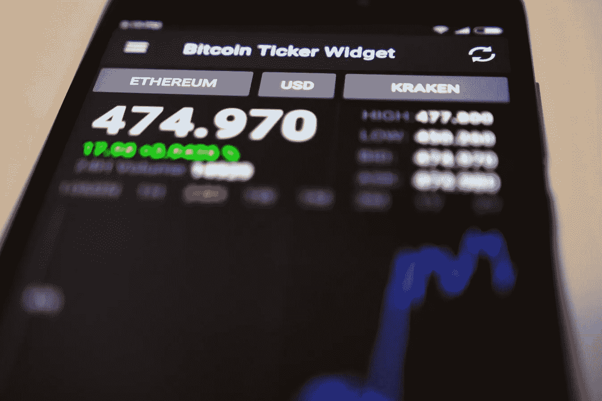
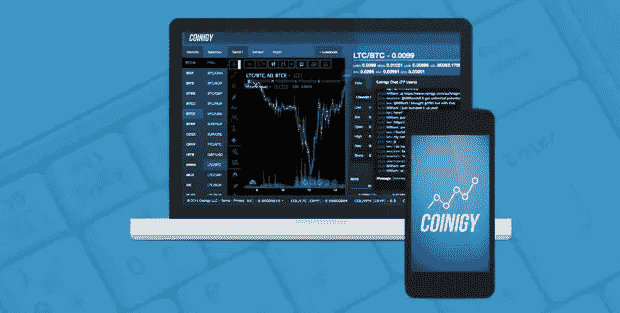
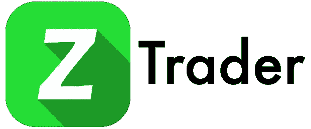
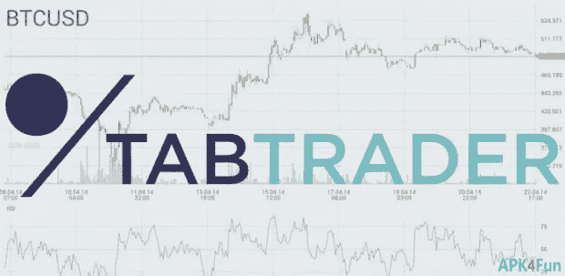
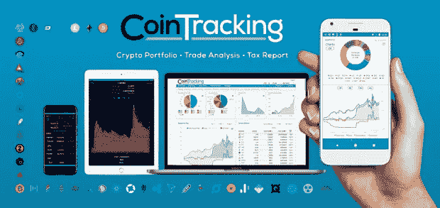

# 专业密码交易员应该使用的 5 个应用

> 原文：<https://medium.datadriveninvestor.com/5-apps-professional-crypto-traders-should-use-ac24c9a0ec06?source=collection_archive---------0----------------------->

随着[加密货币的市值增加](https://www.forbes.com/sites/kenrapoza/2018/01/02/2018-will-see-many-more-cryptocurrencies-double-in-value/#2c1507cf3eed)，专业加密货币交易商的应用和软件数量也在增加。如果您正在积极管理加密资产组合，您应该利用所有可用的工具。

在这篇文章中，你将发现五个最适合专业加密交易者的应用程序，它们可以帮助你掌控你的数字货币投资。

**Coinigy**

总部位于美国的 [Coinigy](http://www.datadriveninvestor.com/coinigy) 是一个基于网络的平台，让你只用一个账户就可以访问超过 45 个交易所。这非常有用，因为它减少了跟踪不同交易所的许多不同登录的需要。该应用程序允许您实时监控您的投资组合，并在交易所之间以尽可能好的价格卖出/买入。如果你正在运用套利策略，这可能是特别有益的。

此外，该应用程序使您能够利用 70 多个技术指标，并允许您直接根据图表进行交易。Coinigy 建立在多层服务器基础设施以及对您的数据进行高级加密的基础上，这使得它非常安全。此外，该应用程序可以让你完全控制你的资金，因为它不会为你持有你的硬币。相反，它们储存在你的钱包或交易所。

你可以注册通过手机短信、电子邮件或应用程序接收提醒。Coinigy 提供了有用的资源，如历史价格数据以及如何使用该平台的教程。如果您需要，可以很容易地获得客户服务。它也有适用于 Android 的移动版本，并计划在 2018 年第一季度推出 IOS 应用。

**zTrader**

[zTrader](https://play.google.com/store/apps/details?id=co.bandicoot.ztrader&hl=en) 是一款目前仅适用于 Android 手机的应用。这款免费的智能手机应用程序允许数字货币交易者在旅途中在 17 个交易所进行交易。该应用程序支持比特币以及其名册上各种交易所支持的所有其他替代硬币。

您可以利用应用程序中提供的图表、技术分析工具和数据进行无缝交易。该应用程序还提供市场概述和新闻提要，其中包含领先的比特币和加密货币出版物的实时新闻。还有一个聊天室，你可以在那里与该应用程序的其他用户交流，交流与市场相关的思想和想法。

该应用程序不会占用你的手机内存太多空间，使用不到 3 MB。此外，您可以选择通过限制应用程序的刷新率来减少数据使用量。它还会加密您的 API 密钥，并强制执行您指定的锁定计时器，从而确保增强的安全性。

**组合证券**

跟踪你对数字货币的投资可能是一个挑战，特别是如果你对各种不同的硬币感兴趣。 [Blockfolio](https://www.blockfolio.com/) 是一款移动应用，可以通过在一个屏幕上完整显示您的加密货币组合来帮助简化这一过程。

该应用程序有一个简单的用户界面，易于使用。您可以跟踪您的硬币持有价值的变化，以及查看详细信息，如烛台图表，订单以及每枚硬币的市场详情。为了利用价格变动，你可以设置应用程序，在达到某个价格时发出提醒。这可以帮助你获利或减少损失。

此外，该应用程序允许您查看加密货币领域内许多主要出版物的故事，让您了解所有相关事件。Blockfolio 是免费的，适用于 Android 和 iOS 设备。

**TabTrader**

TabTrader 是一款免费的应用程序，在 iOS 和 Android 上都可以使用。这款智能手机应用最适合那些已经掌握加密货币交易大量知识的人，因为它具有复杂的交易工具。然而，它有一个友好的用户界面，提供了一个愉快的用户体验。

该应用程序支持超过 20 个交易所，并使用户能够使用 API 密钥轻松地将交易所的帐户链接到应用程序。这些密钥被加密以获得最大的安全性。此外，该应用程序将只允许查看您的余额和进行交易，但不能提取任何资金，以确保您的投资安全。

该平台使用布林线、随机指标、斐波那契、MACD、移动平均线以及相对强弱指标等工具提供深入的技术分析。此外，该应用程序创建图表，让您可以轻松跟踪货币的价格走势。要交易，你可以直接从图表中执行，也可以手动输入精确的订单参数。

TabTrader 是一个轻量级的应用程序，将通过移动设备上的推送通知向您发送警报。此外，应用程序上没有广告，让你专注于自己的交易，而不会分心。

**硬币追踪**

CoinTracking 是一个基于网络的应用程序，可以帮助你跟踪你所做的交易。该网站拥有大多数现有加密货币的数据和历史信息，支持超过 5155 种硬币。

一旦你创建了一个 CoinTracking 账户，并使用 API '或 CSV '将你的交易所账户链接到它，你就可以很容易地跟踪你的交易。该网站将产生利润/损失图表，平衡，以及显示你的硬币的价值。它还显示你的已实现收益，并提醒你任何未实现的收益。

此外，您将能够查看您的所有交易和费用，这些交易和费用是按交易所分组的。这个基于网络的平台通过了 SSL 认证并完全加密，并且无法访问您的 exchange 帐户中的资金。

在计算你应该为加密货币利润缴纳的税款时，CoinTracking 非常有用。它可以根据您所在国家/地区所需的参数为您编制报告，因为它支持所有国家/地区。在准备和提取报告时，可以考虑会计师和税务官员。