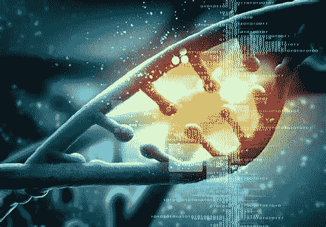
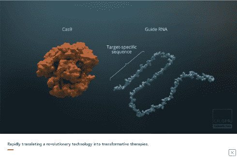
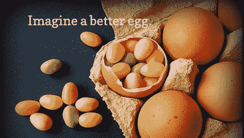
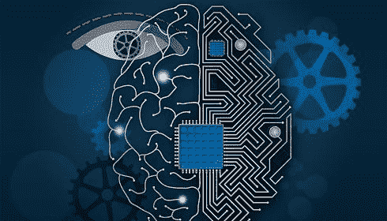
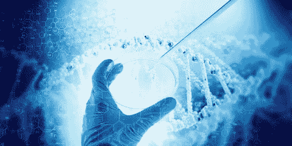

# 塑造未来的 5 大生物技术趋势

> 原文：<https://medium.datadriveninvestor.com/5-biotech-trends-shaping-the-future-68279160f707?source=collection_archive---------1----------------------->

技术和摩尔定律是相辅相成的。当技术与任何行业融合时，颠覆和进化必然会自然发生，并以指数速度加速。生物技术有着光明的前景，它将改变我们选择健康和生活方式的方式。这种增长可能只是大多数人不知道的地震波的一部分，就在他们的皮下。

就像任何技术一样，这里也有优点和缺点。尽管这一领域的风险系数要高得多，但它将具有改变人生的意义。

**基因组编辑**

有时被称为基因组黑客，是一种**遗传**工程，其中 **DNA** 被插入、删除、修改或替换在生物的**基因组**中。这些应用包括药物发现和基因改造，以对抗特定的医学综合症或疾病。这项技术在未来的潜力可能包括人类的增强，如改善夜视或嗅觉，改变你身体的特定特征，以及治疗目前无法治愈的疾病。如果编辑可以实时完成，它甚至可以取代制药业。CRISPR 正在将他们的基因编辑平台转化为治疗血红蛋白病、癌症、糖尿病和其他疾病的疗法。

**食品工程**

这个行业的先锋有一个雄心勃勃的使命:通过使用尖端技术创造食品来取代肉类和乳制品行业，以减少工厂化养殖、碳排放、过度耗水和污染等巨大的环境破坏。这个行业的确是通过基因改造和实验室培育的细胞肉获得技术的。像 Clara Foods 这样的初创公司正在引领食品工程风险投资的进军。

**脑机接口/人体增强**

人类已经是半机器人了，有了便携式设备，如笔记本电脑或手机，可以随时获取信息。下一个可预见的步骤是从更接近他们的身体到直接进入他们的身体，这已经是趋势了。扩展认知能力的听觉植入物或接口设备，如无声语言——麻省理工学院的 [AlterEgo](https://www.media.mit.edu/projects/alterego/overview/) 项目。由埃隆·马斯克创立的 Neuralink 是旨在实现人类和人工智能融合的先驱之一。

**数字生物**

数字制造技术可以与生物界互动。在计算设计、增材制造、材料工程和合成生物学的交叉领域工作， [Stratys 3D](https://www.media.mit.edu/posts/neri-oxman-ted-talk/) 正在开创微生物、我们的身体、我们的产品甚至我们的建筑之间共生的新时代。Helixworks 正致力于 DNA 数据存储与网络安全的结合。研究人员已经数字化打印出可以为小型电子设备供电的蓝细菌。生物学和数字生活的融合不只是在未来，而是正在从我们身边流过。Parabon nanolabs 开发了一种产品，可以绘制 DNA 留下的痕迹，并对其进行分析，以根据基因组研究通过计算生成 3d 打印的真人大小的全色肖像，代表这些个人可能的样子。

**数字健康成长/监测跟踪**

目前市场上有一系列像 Fitbit 这样的可穿戴设备，它们可以在传感器的帮助下监测和跟踪某些生命体征。日益增长的趋势在于，如果需要，将这些设备与实际的医疗护理相连接。MiaLabs 开发了一种技术，可以分析来自临床和商业设备组合的数据，以跟踪患者在家的健康状况。未来预测我们将佩戴或被设备包围，这些设备将持续监控我们的健康，并在紧急情况下随时通知我们或通知真实或人工智能医生。可悲的是，如果你的健康状况将受到数据支持的监测，这不仅意味着你会立即得到诊断，还意味着你几乎会一直被称为生病或需要关注。

在未来，破解我们自己的基因组可能会比支付医疗保险费更便宜、更快。在接下来的十年或二十年里，我们可能会获得一些负担得起的基因组修复疗法，这些疗法将被全民基本医疗保健所覆盖。

*ImageCredits:* [*华盛顿邮报*](http://washingtonpost.com) *，*[*CRISPR*](http://www.crisprtx.com/)*，*[*CrueltyFreeLifestyle*](https://cruelty-free-lifestyle.org/egg-alternatives/)*，* [*Seamgen*](https://www.seamgen.com/blog/neuralink-elon-musk/) ， [TranslationPeople](https://translationpeople.com/biotech-translation/)

earn.com/dnivrav

原贴[此处](https://deltavlabs.wordpress.com/2019/01/25/biotech-trends-shaping-the-future/)。