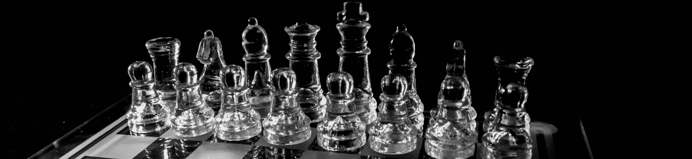

# 5 个聪明的生活专业建议

> 原文：<https://medium.datadriveninvestor.com/5-clever-life-pro-tips-efc9f7eef0a4?source=collection_archive---------9----------------------->

## 在生活中寻找更高的境界并不总是需要做出艰难的决定，有时你需要的只是一些聪明的生活建议。

*最初发表于*[*【millennialmoderator.com】*](http://millennialmoderator.com/5-clever-life-pro-tips)*。*

如果你像我一样，你喜欢寻找新的和创造性的方法来优化你的生活方式。从个人卫生小贴士到财务管理建议，越抽象(但有效)越好！所以，我决定总结本周发现的五个聪明的生活小窍门，与你分享。我们走吧！

# 1.把你的衣服反过来洗

我觉得这是我们早就知道的事情，但从未想过要真正去做。当你把衣服翻过来洗的时候，你要保证彻底清洁内部，这是最重要的清洁部分，因为它直接在你身上。此外，这减缓了外部**设计**的磨损。没有比褪色的图形 t 恤更糟糕的了。

# 2.给别人拍照时，数到三

这是我在 Reddit 上找到的一个聪明的小技巧，并且已经在现实生活中使用了(我的女朋友刚刚得到了新的 iphone，所以必须拍照)。像往常一样数到三，然后继续，直到他们开始嘲笑你。然后拍照。

# 3.吃甜点前刷牙

你是否雄心勃勃地试图避免在睡前(或一般情况下)吃甜食？饭后马上刷牙，注意一想到品尝含氟化物的甜点就让你恶心。经常这样做，你可能会发现自己的牙齿更白了！

# 4.标记 USB 的正确一侧

这是你一直都能做的简单事情之一，只是从来没想过要真的去做。用一块白色胶带标记 u 盘的**上侧**。现在你可以让你的朋友惊讶于你第一次尝试时是如何正确地把它放进去的。

# 5.漂亮的酒店意味着城市的安全区域

当你[计划旅行](http://millennialmoderator.com/finding-the-cheapest-flights-online)时，通过定位**五星级酒店**找到城镇的安全地带。即使你住在二星级酒店，你至少知道在哪里度过你的大部分时间。

还有其他我没注意到的生活专业技巧吗？在 [Twitter](https://twitter.com/alekseyweyman) 上与我分享吧！

标签输入:[生活小贴士](http://millennialmoderator.com/5-clever-life-pro-tips#)

【millennialmoderator.com】最初发表于**。**