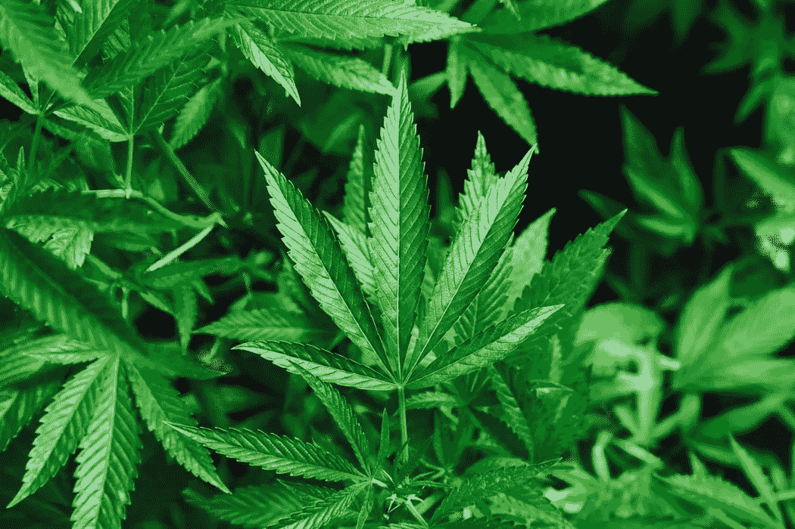

# 对拉丁美洲大麻业的 5 种常见误解

> 原文：<https://medium.datadriveninvestor.com/5-common-misconceptions-about-cannabis-industry-in-latam-1dc8fb435f83?source=collection_archive---------7----------------------->

大麻产业发展迅速，提供了大量的就业和投资机会。然而，由于围绕该行业的一些误解，人们对进入该市场有些犹豫。在这里，我们给出了这些误解的全面概述，澄清它们，并强调你的企业如何从现在进入这个蓬勃发展的行业中实际受益。

**业务的合法性**

许多人怀疑大麻在一些国家是合法的。犹豫通常源于对这种植物由来已久的偏见。然而，许多国家已经将这种植物的药用及其生产和销售合法化。走在曲线前面的企业和投资者已经认识到这些市场中的巨大机会，并抓住了一些医药市场。

 [## 信息图:大麻的生意|数据驱动的投资者

### 仅在 2017 年，美国就销售了价值超过 8 亿美元的合法大麻产品。生长在 19 个州…

www.datadriveninvestor.com](https://www.datadriveninvestor.com/2018/09/25/infographic-the-business-of-hemp/) 

最著名的是，乌拉圭在 2013 年成为世界上第一个将大麻的医疗和娱乐用途完全合法化的国家。尽管大麻是合法的，但仍受到相当严格的管制。例如，政府管制所有产品中的 THC 和 CBD 含量，无论是用于医疗还是娱乐目的。此外，立法的目的是进一步教育人们，提高人们对这种植物的认识。即使有受管制的物质，如果你选择[在乌拉圭](https://www.bizlatinhub.com/company-formation-uruguay/)注册，这个国家仍然是大麻合法化和商业的先锋和梦想家。

此外，哥伦比亚最近将大麻的医疗用途合法化。2017 年，该国通过了立法，提供了安全和受管制的大麻种植和获取药用衍生物的途径。哥伦比亚目前有四种不同的[类型的大麻许可证](https://www.bizlatinhub.com/how-obtain-license-medical-marijuana-colombia/)，如果个人和企业想要种植和制造大麻，可以申请这些许可证。随着全球大麻市场的发展，哥伦比亚政府继续围绕该行业的生产、消费和可能的出口进行调整和立法，为外国投资者创造全方位的[商机](https://medium.com/@craigdempsey_25901/law-changes-position-latin-america-to-dominate-global-cannabis-industry-54e8ef1b82be)。

最后，最近一个将医用大麻合法化的国家是秘鲁。2017 年 11 月，秘鲁总统签署了监管 THC 组件的立法，建立了一些可能的许可证，并控制消费。此外，法律允许个人拥有大麻，但分销和销售必须通过官方商业企业进行。目前，禁止单独种植这种植物。秘鲁接下来可能会出台更宽松的种植法。

**行业安全**

从历史上看，围绕非法毒品市场和帮派的暴力事件相当多。难怪有些人对拉丁美洲各种大麻市场[的安全性持怀疑态度。然而，政府对大麻的监管和合法化实际上让这个行业更容易进入，也更安全。就安全性而言，大麻生产在许多领域都不理想，但在大多数情况下，该行业是安全的。](https://www.bizlatinhub.com/major-players-latin-america-cannabis-sector/)

在乌拉圭和秘鲁等国家，安全问题并不普遍。这是因为生产许可证只发放给经过批准的企业和药店。因此，暴力不是一个大问题。

对哥伦比亚来说，情况有所不同。整体而言，这个国家现在是一个安全且受到严格监管的地方。政府已经并继续在改善国家安全方面取得进展。应当指出，虽然哥伦比亚在安全和安保方面取得了巨大进展，但仍有一些领域需要警惕。如果种植者和农场位于这些地区，他们应该寻求当地合作伙伴的建议和指导，以确保他们的业务和他们自己的人身安全。这些当地的联系可以让你深入了解在哥伦比亚建立[大麻生意的最佳地点](https://www.linkedin.com/pulse/medicinal-cannabis-colombia-exciting-opportunities-craig-dempsey/?published=t)，以及如果你打算出口，如何最大限度地提高成本效益。

**对大麻的社会偏见**

在这段“启蒙”时期之前，大麻有一个非常负面的含义。可能是为了避免这些负面含义，行业领袖给他们的产品贴上了“大麻”的标签，而不是“大麻”此外，随着大麻的合法化，各国政府正在借此机会教育公众了解大麻、其特性、作用以及如何负责任地使用大麻。

尽管集体意见正在改变，但仍有一种负面的气氛笼罩着这个行业。然而，怀疑者没有认识到的是，这种植物提供了广泛的医疗益处，尤其是对患有严重疾病的人。例如，医用大麻最常见的用途是控制疼痛。这在患有癌症、多发性硬化症和其他类型神经疼痛的患者中尤为常见。此外，它有助于缓解通常与帕金森病相关的震颤，并减轻 PTSD 的症状。

**行业内的商业机会很少**

因为在许多国家合法化是最近的事，许多人怀疑这个行业的发展和规模。然而，[拉丁美洲的大麻产业预计在未来九年内价值将达到惊人的 127 亿美元。更具体地说，每个国家在市场内提供不同的利益和优势。最终，各经济体的就业岗位、GDP 和出口机会将大幅增加。](https://www.nearshoreamericas.com/arrival-pharma-firms-latam-cannabis-cultivation-looks-set-blossom/)

乌拉圭在市场中处于有利地位，因为它在该行业中具有先发优势。作为第一个将大麻合法化的拉丁美洲国家，他们已经完善了系统、法律和法规，以使该行业尽可能地有利可图和安全。乌拉圭的大麻市场已经吸引了近 8000 万美元的投资。

像哥伦比亚和秘鲁这样的国家也在进入这个市场，但速度没有那么快。在这些国家，机会在于市场没有被制造商和经销商过度饱和。此外，这些国家的土地和生产成本非常低廉，而且需求仍然很高，这为制造商和经销商带来了极其有利的利润。

虽然加拿大的[有合法的医用和娱乐用大麻](https://www.canada.ca/en/services/health/campaigns/cannabis/canadians.html#a2)，但加拿大的市场正面临着严重的短缺。人们对大麻的需求被严重低估，因此，种植者对如此惊人的需求毫无准备。拉丁美洲有机会利用这一短缺，填补北美的供需缺口。

不幸的是，对于像墨西哥这样需要更长时间才能使大麻合法化的国家来说，全球市场、出口机会以及最终的行业利润都被更加积极主动的国家和公司所攫取。这个行业的关键是在它开始产生预期的惊人数字和利润之前介入。

**没有市场扩张的机会**

尽管拉丁美洲正寻求向其他国家出口大麻，但仍有一些法规需要遵守。例如，从哥伦比亚出口大麻时，叶子本身不能出口。只有大麻的衍生物，比如大麻油，才能出口到国外市场。

相反，乌拉圭目前的法律和金融环境使其难以出口大麻及其任何衍生物。尽管它是第一个将大麻合法化的国家，但它很可能是最后一个出口大麻的国家。截至目前，乌拉圭第一家获得许可的大麻公司 [Fotmer](https://fotmer.com/news/) 有望成为该国第一家出口大麻的公司。第一批离开乌拉圭的货物将运往德国。这将作为乌拉圭未来出口机会的“测试”,并有助于更好地构建管理出口机会的法律框架。

总的来说，围绕大麻市场的误解阻止了人们和企业涉足这个利润丰厚的市场。随着对市场及其法规的更好理解，企业和投资者可以看到该行业的巨大利润和收益，并将在未来几年保持增长。