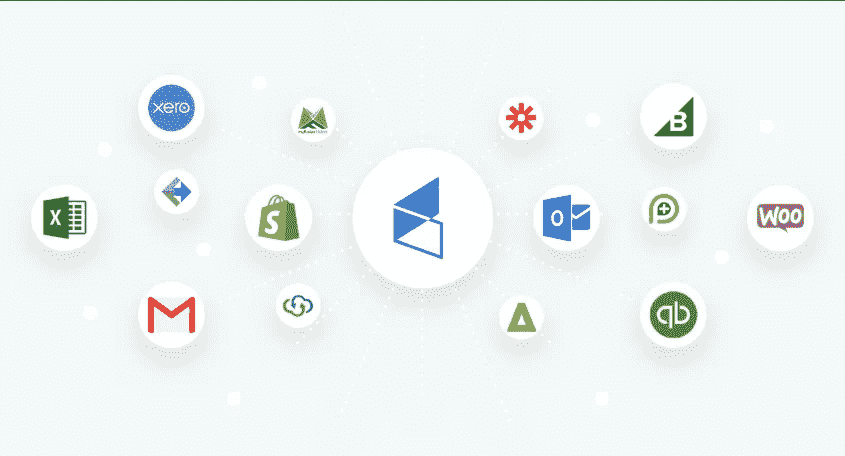

# 每个服务台普遍忽视的 5 个问题

> 原文：<https://medium.datadriveninvestor.com/5-commonly-ignored-issues-in-every-service-desk-f7f80caffaa4?source=collection_archive---------10----------------------->

60%的工作场所任务可以自动化。

Image source: Pexels

确定服务台表现不佳的根本原因可能是最困难的部分。要了解导致客户/用户不满意的原因，首先必须知道从哪里着手。对于任何服务台来说，最重要的价值是，

*   效率
*   响应性
*   无缝
*   对话的
*   用户满意度
*   用户数据可访问性

要使服务台高效工作，对用户问题保持高度响应，使运营无缝运行，使团队和用户之间的对话交流变得容易，实现更高的用户满意度，并保持所有用户数据都足够可访问，就应该引入创新。

> 自动化和人工智能是解决这一问题的方法。

自动化的能力和灵活性带来了专注于重要事情的优势。

此外，在人工智能和自动化的支持下，服务台可以比以往任何时候都更加自主地运行，并且可以自行高效运行。

说到服务台如何在更少或没有依赖的情况下更好地运行，让我们来看看存在的瓶颈。

## 1.忽略注意问题中的模式

Image source: Pexels

**每个服务台都会收到成群的求助请求**，这些请求通常与之前的请求相关联。在大多数情况下，报告的问题是多余的。对于代理来说，要迅速解决用户问题，首先应该将问题联系起来，然后确定模式。

这样就更容易对问题的根本原因进行分类。解决这个问题的一个方法是能够在**知识库**中记录重复性问题，并为这些重复性的简单问题提供**自助式**解决方案。

## 2.灾难管理期间的沟通失误

Image source: Pexels

如果出现任何不可避免的服务中断，必须通知所有用户。即使您试图在更短的时间内尽可能广泛地解决操作问题，对用户的快速更新也会控制局面。

根据您的运营规模，灾难管理团队可能独立工作，也可能与您的服务台一起工作。无论停机有多严重，灾难管理团队都应该**确定问题**并**与恢复团队沟通。**

SLA 在这里起着巨大的作用，因为无论何时发生重大事故，都必须满足它们。灾难管理团队有责任与用户保持良好的沟通。

如果不了解问题是什么，是否有解决方法，或者估计的停机时间是多少，用户将很难跟上操作。

## 3.冗长的解决过程

Image source: Google

在 ITSM 社会中，沟通是一个崇高的问题。如果没有有效的沟通平台，任何帮助台平台都难以应对服务级别挑战。在大多数情况下，**用户发送电子邮件来提出服务请求。**

没有简单的方法来跟踪这些电子邮件的状态。要么是处理晚了，要么是丢失了。

> 根据 Techvalidate 的调查，43%的服务台使用电子邮件来跟踪问题，而 16%的服务台使用电子表格。

先进的基于 ITIL 的事故管理系统便应运而生，它可以跟踪和处理事故，无需任何人工干预。

用户通过自助入口网站提出事件后，该事件会自动分配给服务台代理。事件状态会不断更新给服务台代理，如果问题需要很长时间才能解决，事件管理人员会立即通知代理。

> 根据 Zendesk:
> 
> “内部支持团队平均每月收到 492 张罚单”

## 4.缺乏数据可见性

Image source: Pexels

对于一个处理服务台请求的 IT 人员来说，从一张**老式的电子表格**或者从一封**冗长的电子邮件**线程中出来完全是一场噩梦。当 IT 团队使用独立的企业工具时，数据通常是孤立的，他们经常会忘记时间。

用户拥有的设备类型、服务历史记录、设备中运行的软件类型等数据可见性对于解决服务台票证非常重要。

将 CRM 和票务系统连接起来是唯一的最佳途径。这将使 It 代理对用户数据有一个绝对的了解。根据提出的事件类型和票证的状态，服务台代理会收到通知，这导致用户满意度提高，票证总量大幅下降。

## 5.缺少 messenger 集成

Image source: Infusionsoft

即使在建立了一个**可定制的自助服务门户**来处理所有报告的问题和设备请求后，如果没有消息平台，大量的数据可能会被遗漏。

为了确保每一个问题都得到确认、分析和解决，将消息传递解决方案集成到服务门户可以涵盖大部分流程。

对于 IT 人员来说，这意味着监控仪表板以更快地解决问题，而对于用户来说，这意味着他们可以登录系统进行报告并跟踪他们的票证。此外，集成消息传递解决方案使整体沟通更加无缝，从分享门票到分析见解。

这些是服务台内经常未解决的一些问题，它们给企业带来的成本确实很高。它们还会严重影响用户和 IT 团队的工作效率。学习是，如何使自动化和使**成为一个更智能的服务台**能够帮助企业为他们的员工留出额外的生产时间，以及提供一个美好的工作场所体验，而不会烧坏他们的口袋。

要了解更多关于人工智能、自动化、技术和营销的见解，请点击这里😺 ✋