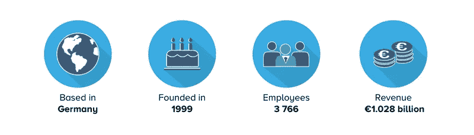
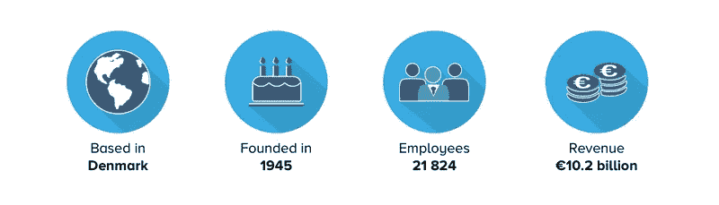
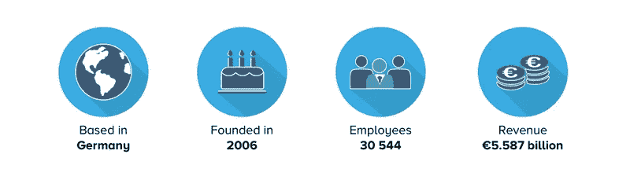
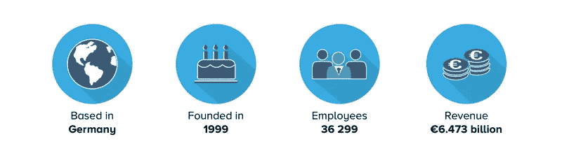

# 2018 年值得关注的 5 家公司

> 原文：<https://medium.datadriveninvestor.com/5-companies-to-watch-in-2018-6db0a765248a?source=collection_archive---------11----------------------->

这是大创新、大合作和大收购的一年。现在，2017 年的帷幕已经拉开，我们正在盘点发生了什么…以及 2018 年要看什么。

首先，一个重要的免责声明。以下文章无意作为投资建议。分析师一直在关注这些公司，所以一般来说，股价已经反映了我们在这篇文章中所写的东西。如果你对这些公司中的任何一家感兴趣，我们可以[帮助你将这些股票](https://medium.inyova.ch/?utm_source=Mediumcom&utm_medium=QLpage)构建成多元化的投资组合，旨在长期增值。更多相关信息请见本文末尾。

# 交易经纪人:Wirecard

**所有收入数据&员工数据均来自 2016 年年报(最新官方数据)。*

中国超级应用'[微信](https://web.wechat.com/)'刚刚与这家支付提供商签订了合同——[Wirecard](https://www.wirecard.com/)现在将为微信每月 6 亿活跃用户出国旅行时的支付提供便利。

该公司有一个通过收购和合作伙伴关系进行扩张的不间断战略(2017 年，它还收购了花旗预付卡服务公司，并推出了 Wirecard North America)。它还与有前途的初创公司和理财应用合作，以保持创新曲线的领先地位。前一批包括 Funding Circle、Monese 和 Monzo(仅举几例)。看好这个空间！

# 后卫:维斯塔斯

既然可再生能源与化石燃料相比具有价格竞争力，该行业正在为显著增长做准备。作为市场份额最大的风力涡轮机制造商，维斯塔斯拥有独特的地位。然而，在地平线上有逆风— [GE](https://www.ge.com/) (通用电气；世界上最大的公司之一)正在对他们提起知识产权诉讼。维斯塔斯称这些指控“没有法律依据”，并表示将在法庭上挑战通用电气。专利诉讼案件既复杂又昂贵，所以我们在关注这个案件的发展。

# 挑战者:扎兰多

决心与亚马逊(Amazon)展开正面竞争， [Zalando](https://www.zalando.ch/) 已准备好一战:它正在进入美容市场，开设一家“真实世界”概念店，并战略性地发展与品牌的合作关系。像亚马逊一样，供应商可以选择使用 Zalando 仓库，或者自己管理履行情况。

该公司最近增加了对物流和技术的投资，并重申了到 2020 年将其业务翻一番的目标。从 Q2 到 2017 年第三季度，Zalando 的活跃客户增加了 100 万，达到 2220 万。让我们看看这是否足以让亚马逊的钱跑起来！

# 自动机:离子群

作为工业卡车和相关供应链解决方案的全球领导者，[凯傲集团](http://www.kiongroup.com/en/main/homepage.jsp)近年来一直在创新高速公路上加速前进:向全球市场推出新的自动驾驶机械，将其叉车从有毒电池转向节能的锂离子技术，等等。

Kion 还收购了总部位于瑞士的自动化专家[de matic](http://www.dematic.com/en-us/)——该公司负责世界上一些最大的电子商务仓库的自动化(包括阿迪达斯等品牌，其拥有超过 70，000 种独特的产品类型。不小的壮举！).

# 安静的成功者:英飞凌

2008 年危机后，英飞凌差点破产——其股票成为德国股票指数上的第一只细价股。快进到今天，英飞凌正在杀死它。这家半导体公司正在为新奥迪 A8(世界上第一款具有“眼睛离开”和“手离开”自动驾驶功能的量产汽车)提供几个零部件。它正在开辟新的领域，以保护世界免受量子计算机时代网络攻击者的攻击，并致力于克服物联网(从自动化工厂到智能家居设备)带来的所有令人讨厌的安全问题。

这些只是英飞凌成为我们 2018 年最值得关注的公司的众多原因中的一部分。随着英飞凌在硅谷悄然扩展其关系，我们正在密切关注这一事件…

# 想了解更多(甚至想投资这些股票)？

➡️从这里开始建立你的投资组合(没有任何义务)。

➡️点击这里了解我们如何多样化和优化您的投资组合[。](https://inyova.ch/en/investment-insights/efficient-frontier-investment-theory)

➡️在这里了解为什么你的瑞士银行账户可能会亏钱。

*原载于*[*https://yova . ch*](https://yova.ch)*。*

在 Yova，我们帮助人们通过符合他们价值观的投资组合来积累财富。