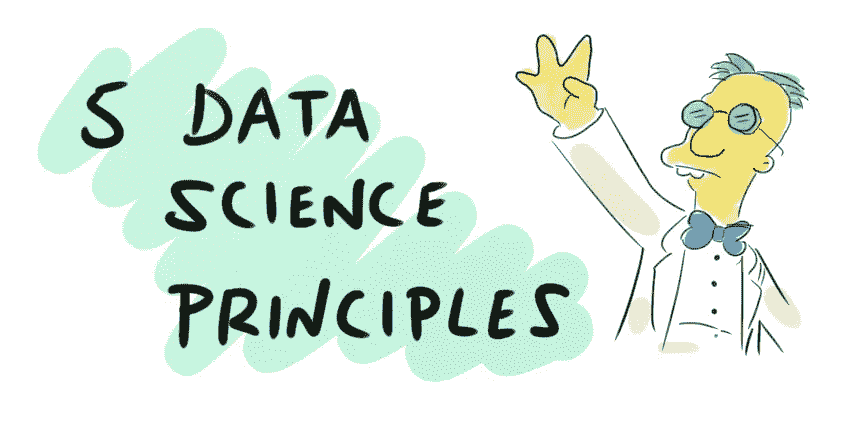
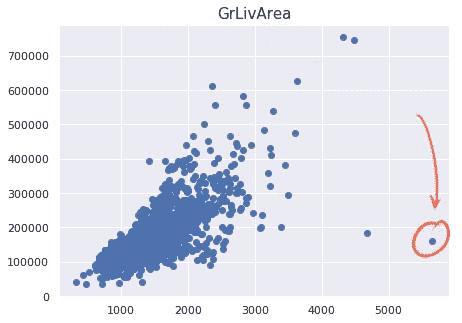
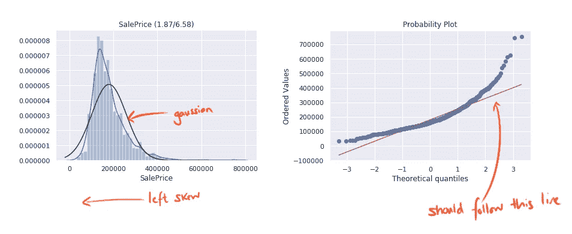
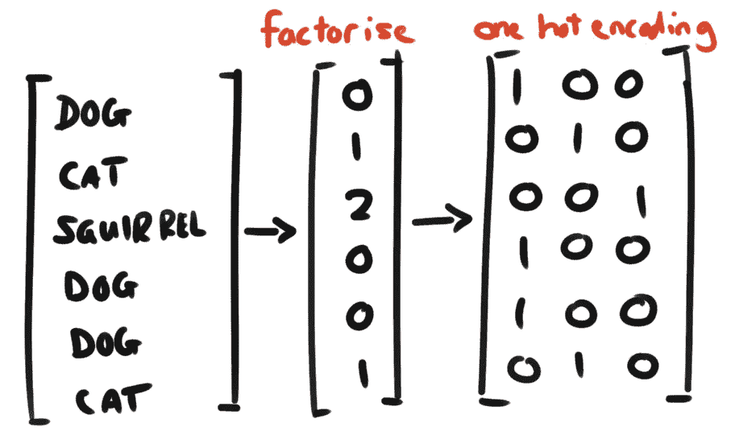
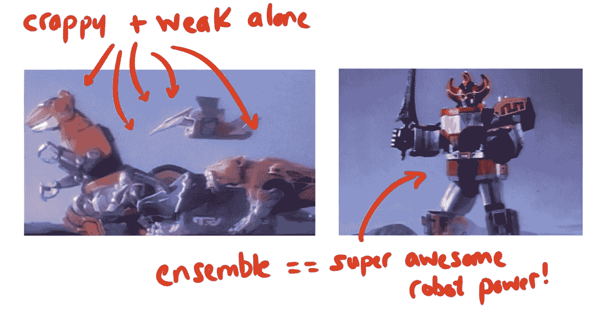

# 5 个数据科学原理(用于预测房价)— #100DaysOfMLCode

> 原文：<https://medium.datadriveninvestor.com/5-data-science-principles-for-predicting-house-prices-100daysofmlcode-84bb47d7a99a?source=collection_archive---------8----------------------->



作为我的#100DaysOfMLCode 挑战([见此处](https://medium.com/@notmattlucas/100daysofmlcode-a-new-challenge-day-zero-ffedd3e99113))的一部分，我接受了一个相当长的休息时间，从阅读到将一些工具应用于 Kaggle [房价高级回归](https://www.kaggle.com/c/house-prices-advanced-regression-techniques)挑战。

通过一些起伏，试验和错误，我最终进入了中游位置(前 44%)，虽然不是特别令人惊讶，但对于初次出场来说已经足够体面了。回顾这个练习，我可以看到我陷入的许多陷阱，我学到的技巧，以及我在将来再次做这个练习时应该记住的原则。

# 1.了解数据

特别是作为一个 ML 领域的新手，关注大量可用的奇特学习算法是非常诱人的，每个算法都有同样令人印象深刻的名字。我应该使用岭回归、支持向量机还是 XGBoost？——最后一首甚至尖叫着要一首怒族金属圣歌的配乐。

无论底层技术有多棒，如果源数据是垃圾或被误解，所有算法——深度学习可能会有一些例外——都会彻底失败。那句老话，垃圾进垃圾出。

花大量时间探索、研究和分析数据是很重要的。关于这个主题已经出版了无数的书籍，但是我将谈谈最近帮助我的三个简单的方法:

**关联**

如果您正在使用 pandas，并且几乎可以肯定您正在使用 pandas，那么数据框有一个有用的内置功能来查找一个要素和另一个要素之间的相关性。

在前面提到的房价示例中，计算所有特性和销售价格(目标)之间的相关性很有用。这可以建议那些最有可能帮助您建立准确模型的功能。

```
corr_matrix = train.corr()
corr_matrix["SalePrice"].sort_values(ascending=**False**)
```

**离群值**

机器学习的核心就是在数据中寻找相关的模式。大多数数据遵循的规则。

数据中的任何噪音或异常值都会使算法很难找到有效的规则。因此，识别那些有问题的数据点非常重要，并在它们影响我们模型的准确性之前将其从训练集中删除。



**歪斜**

根据所选择的算法，您的学习过程可能对数据的分布很敏感。线性模型(例如线性回归)与正态/高斯分布变量相比效果更好。

可以通过使用直方图和概率图来识别分布，从而识别数据中的偏差。



一旦识别出来，你可以通过使用能够归一化数据的函数(例如对数)或者使用一个 [boxcox](https://docs.scipy.org/doc/scipy/reference/generated/scipy.stats.boxcox.html) 函数来代表你神奇地解决这个问题。

# 2.保持你的笔记本整洁

与任何软件开发实践一样，我发现技术债务和快速破解很容易滚雪球般变成维护噩梦。由于编码的实验性质，并且破坏某些东西并不总是完全显而易见的(不存在任何意外破坏某些重要特性的编译错误),因此编码卫生在这个领域中显得非常重要。

**可重复**

许多算法都有随机成分(随机森林有点泄露了这一点)。如果你让这种随机因素失控，跟踪你的进展会变得非常困难，所以尽可能地控制它是很重要的。

大多数(如果不是全部的话)函数允许您设置一个伪随机种子，以一种更加可预测的方式驱动事情。

```
RandomForestRegressor(random_state=42)
```

**版本控制**

很多次，我从容不迫地进行破解，制作出一些奇妙的模型，然后通过一系列巧妙的调整彻底摧毁它。


后来，我不可避免地放弃了逃脱的那个。

确保你经常提交！！

# 3.快速反馈

没有什么比等待 30 分钟来检验一个想法是否可行更能扼杀创新的了。数据处理管道、交叉验证和集成模型都可以在时间上非常快地累积起来，如果处理不当，会使您的迭代非常缓慢。我发现即使是非常小的数据集也是如此！

太多次了，我在管道早期懒洋洋地改变了一些特性，然后使用 Jupyter 的“重启内核并运行所有单元”选项来看看结果如何——真无聊！

大多数时候，这是一种症状，不明白我到底在做什么，只是盲目地改变东西，看看它有什么效果。更加留意正在发生的事情，理解你正在做出的改变，并保持这些反馈循环紧密！

# 4.准备数据

在你花时间理解领域(1)之后，准备数据对你的算法来说是非常重要的。

有数百种技术可以应用，但我将触及三种简单的技术(因为我能理解它们)

**缩放比例**

很少会出现所有数据都具有相似规模的情况。一个特征是几十万或几百万的房价，另一个特征是房产中卧室的数量。当它们的真实值相差如此之大时，一个糟糕的机器学习工具应该如何计算出它们应该被类似地对待？

这就是伸缩性的用武之地。可以想象，缩放是一个极其重要的转换。通过这样做，我们用几个钉子把有巨大价值的特征取下来，把较小的特征加起来，这样它们就都在同一尺度上了。

有关这方面的更多细节，请查看[最小最大缩放器](http://scikit-learn.org/stable/modules/generated/sklearn.preprocessing.MinMaxScaler.html)或[标准缩放器](http://scikit-learn.org/stable/modules/generated/sklearn.preprocessing.StandardScaler.html)，了解两种常见的修复方法。

**一热编码**

大多数最大似然算法更喜欢处理数字而不是类别(例如某些动物分类器中的{狗、猫、松鼠})。最简单的转换方法是分解特征-狗(0)，猫(1)，松鼠(2)。

这样做的问题是，算法会假设相近的值比相距较远的值更相似:狗真的比松鼠更像猫吗！？

为了解决这个问题，我们可以使用一种叫做热编码的技术。每个类别都有一个二进制属性，当行包含该值时，该属性设置为 1，否则设置为 0。



[**管道**](http://scikit-learn.org/stable/modules/generated/sklearn.pipeline.Pipeline.html)

在一个即使是中等复杂的机器学习项目中，管理所有不同的转换可能会成为一场编码噩梦。本着(2)的精神，保持你的笔记本整洁，这是一个很大的帮助，将这些包装到一个定义良好的管道中，允许你一次又一次地巩固和重用一组定义良好的转换。

# 5.三个臭皮匠胜过一个诸葛亮

每种机器学习算法都有其优势和弱点——当然，有些比其他算法更强，但我不在这里进行评判。与其让他们互相争斗至死，不如让我们和睦相处，共同努力！

**集合模型**

听说过 [*群众的智慧*](https://en.wikipedia.org/wiki/Wisdom_of_the_crowd) *吗？这是一个社会学现象，给定一个问题，一群人的综合答案通常会优于个人的答案。*



机器学习算法也是如此。让一群人在一个房间里，你的模型很可能会超过那些单身者中最好的。这种聚合去除了噪声和偏差，产生了一个更好的模型。

这种技术有很多用途，但有几个值得注意的例子包括:

*   随机森林
*   投票分类器
*   助推
*   堆垛

# 鳍。

是时候将这些原则付诸实践了…并在一些新的原则上搞砸了