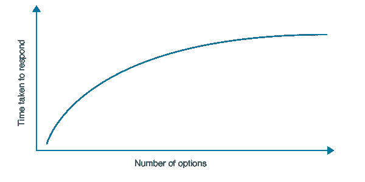
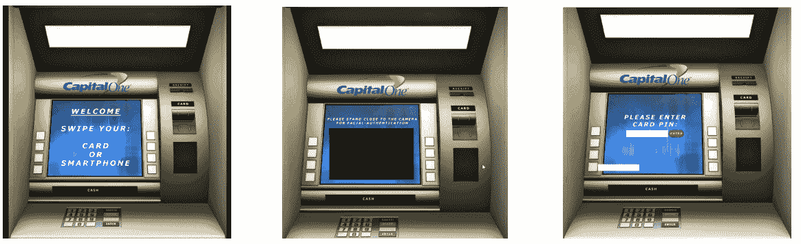
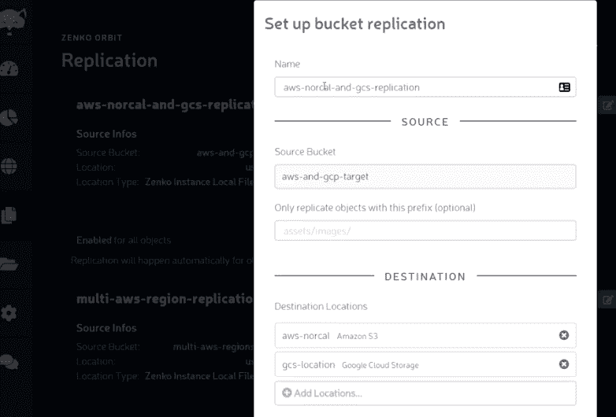

# 让用户留下来你需要知道的 5 个设计原则

> 原文：<https://medium.datadriveninvestor.com/5-design-principles-you-need-to-know-to-make-users-stay-a769a20e73ce?source=collection_archive---------6----------------------->

> 最初发布于 2019 年 7 月 9 日[Zenko.io/blogs](https://www.zenko.io/blog/5-design-principles-you-need-to-know-to-make-users-stay/)

我读过的关于产品设计的最有影响力的书之一是唐·诺曼的《T2 日常用品设计》。这些原则如此普遍，以至于它们几乎适用于从烤面包机到当今高科技产品的所有东西。这里是一个唐原则的演练，以影响我们的集体设计思想。

# 能见度

一个好的设计通过让用户更容易看到来引导他们知道什么是最重要的功能。关键是要区分内容和功能的优先级。目标应该是减少过度复杂，但也不要陷入过度简化。

用户需要知道所有的选项是什么，并且直接知道如何访问它们。我们下意识地根据感知的价值(收益)来权衡点击某样东西的决定(成本)。让人们采取行动的最有效方法是在确保最大利益的同时，使目标行动尽可能简单。以便以良好用户体验的形式提供高感知价值。关键是要缩小功能范围，满足用户的需求，引导他们使用特定的功能。

 [## 2019 年即将改变世界的技术|数据驱动的投资者

### 很难想象一项技术会像去年的区块链一样受到如此多的关注，但是……

www.datadriveninvestor.com](https://www.datadriveninvestor.com/2019/01/17/the-technologies-poised-to-change-the-world-in-2019/) 

在这样做的时候，你也要确保你不会让用户在太多的选择中不知所措。让用户陷入“下一步做什么？”的决策过程中影响成本效益。重要功能的可见性和可访问性与希克定律直接相关(从算法上来说，增加选择会增加决策时间)。在一个网站或应用程序中嵌入过多的功能会直接影响和损害用户体验。

**在设计时，牢记视觉感知的格式塔原则是很重要的**很多时候，我们的视觉感知受到空间、接近度、颜色、相似性、对称性等因素的影响。我们倾向于填补空白，并遵循连续性的路线。

这是功能可见性的一个很好的例子。这是 [Orbit](https://admin.zenko.io) 的截图， [Zenko](https://www.zenko.io/) 的基于 SAAS 的前端。左侧的菜单将功能分为以下 6 个类别，在每个类别下，它以清晰的层次结构展示了每个类别中的核心功能。还有，通过把它放在显眼的位置，赋予它对比色，让它在设计中脱颖而出。它既干净又简单。

# 反馈和约束

当移动设备的电池电量耗尽时，屏幕顶部的小电池符号会不断向我们反馈剩余的电池寿命。当我们插入手机时，一个小闪电符号给出了明确的反馈，即检测到电源，手机正在充电。这是关于所采取的行动和透明度的沟通，无论行动是成功还是失败。人们努力实现可预测性和控制，在大多数情况下，清晰的可操作信息会影响更好的决策。

观察你周围的各种系统设计，并注意它们如何提供当前状态的反馈。电梯在关门前会发出蜂鸣声，到达目的地楼层时也会发出蜂鸣声。如果司机没有系安全带，现在的汽车会提醒司机。大多数电子设备通电时，一个简单的 LED 就会亮起。所有这些信息允许您准确地评估与您交互的系统的当前状态。这引出了书中的一个重要观点。“太多的反馈比太少的反馈更令人讨厌。反馈必须以一种不引人注目的方式经过深思熟虑地规划。”关键是平衡，这才是真正的艺术所在。

同样重要的是防止用户做错事——*约束*的概念。约束是限制可能行动的有力线索。诺曼在他的书《烤面包机》中举了一个很好的例子。只有一个地方插入烤面包片，使得用户很难不正确地插入烤面包片。在设计中对约束的深思熟虑的使用让人们很容易决定适当的行动过程。

来自 Orbit 的另一个例子显示，当按钮被按下时，它会改变颜色以向用户提供反馈。这是一个告诉用户有事情发生的线索。

# 启示

简而言之，可见性是对产品或功能的理解。启示指的是可能的潜在行为。例如，旋钮的存在给用户一个信号，即这个表面可以以某种方式被转动、推动或拉动。这就像我们的大脑如何知道插槽是为插入东西而制造的。这个想法是，一旦有人察觉到一个特征，他们就知道该怎么操作。高启示性的一个例子是鞋子——很容易直观地知道如何使用它。

另一个例子包括 ATM 交互之上的映射。有物理约束来防止用户做错误的事情。插卡槽亮起，表示“反馈”该槽是您插入卡的地方。最后一个屏幕有一个清晰的白色测试框，上面有一个红色按钮“enter”，再次设置了一个可感知的启示，即这个白色框将接受 pin。每个数字会将盒子填满 25%。输入 3 个数字后，框中只剩下 1 个字母的空间，让用户知道只剩下 1 个数字。

下面，动态观察显示了通过禁用或变灰不能修改的内容可以在屏幕上采取的可能操作。它还显示了什么是“可选”的，以及可以输入什么来配置将这个源存储桶复制到另一个云目的地。

# 绘图

映射是控制和效果的关系。在汽车里，如果我找到控制温度的刻度盘，就很容易发现如何操作。如果我顺时针转动它，温度会升高。如果我逆时针转动，车会变冷。

手机上的一个滑动条显示了左右滑动圆点和屏幕亮度之间的直接映射。

# 一致性

创造一个新的令人印象深刻的产品会让用户来找你，但是拥有一致性会让用户想留下来。几个月前，Atlassian 改变了吉拉的设计，引发了一场互联网风暴。作为忠实客户的人们无法轻松过渡到新的布局。这种新设计没有给用户继续使用他们产品的动力。人们不再知道如何操作一切，而是被困在寻找每个按钮和重新学习执行旧习惯的步骤中。大范围设计变更的一个重大后果是，当您的用户的许可在变更发生的同时到期。一次又一次，如果他们觉得使用他们知道的产品会更好，他们不必学习新的东西，你就会失去更多的客户。

每当一种新方法被引入现有产品时，人们总是会反对和抱怨，因为它会直接影响可用性原则，比如:

*   可学性——用户必须学习新的设置。
*   可记忆性——如果新的设置很直观，用户觉得很容易记忆，这将是一个积极的结果。如果不是，那就是不欢迎。旧习难改。如果你已经训练你的用户使用你的功能，一致性在使事物看起来熟悉、没有学习曲线、带来更多效率和直接提高满意度方面起着极其重要的作用。
*   效率——用户看到了直接的感知价值，一旦用户学会了新界面，他们就可以看到自己在使用它，因为在用户眼中它是更高的性能。
*   错误和恢复——用户在这个新设计中犯的错误更少，反馈回路更好，或者新设计的直观性从一开始就阻止了用户做错误的事情
*   满意度——衡量用户对产品的满意程度。例如，这将推动净推介值。

当传统被打破时，就需要新的学习。新系统的优点往往无关紧要。

顺时针旋转旋钮增强效果，逆时针旋转减弱效果。蓝色水龙头表示冷，红色表示热。有些期望是难以调整的，并且与自然惯例一致，而其他的则是后天习得的行为。习得行为也会产生粘性。当你失去了用户的粘性，你就冒着失去客户的风险，因为竞争对手提供了更好的用户体验。

有用吗？你有什么要补充的吗？在论坛上联系我！