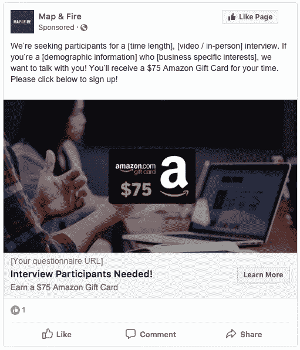
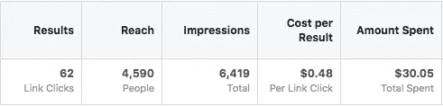

# 5 个简单的步骤将帮助你进行首次客户访谈

> 原文：<https://medium.datadriveninvestor.com/5-easy-steps-that-will-help-you-with-your-first-customer-interviews-a96e504ac83f?source=collection_archive---------35----------------------->

## 无论你是一家初创公司还是已经存在多年的公司，与客户交谈都是一项重要的实践。它提供了对您的业务的深入了解，这是您无法单独通过调查和分析获得的。

我最近在做一个研究项目，我们需要为一项新业务招募和面试客户。该公司处于秘密模式，所以我们没有任何参与者的线索。我们必须发现它们是冷的。

我提到最后一部分，是因为找个人来谈论他们的生意可能有点棘手，尤其是对初创公司而言。你不需要家人和朋友，你需要不偏不倚的观点。

你需要在野外代表你真正客户的人。

与这些人交谈，获得他们对你的业务的纯粹、未经过滤的意见，可以提供宝贵的数据。

这就是客户访谈的全部意义。这给了你检验自己假设的机会。找出什么适合你的想法，什么不适合。

如果你有兴趣为自己的企业进行面试，这里有一套快速的步骤和资源来帮助你开始。

# 1.设计你的面试

第一步是考虑你的目标是从面试中得到什么。

为此需要考虑的一个重要问题是:

> 你对自己的企业做出的最重要的假设是什么？

换句话说，你的企业要想成功，哪些事情是必须做到的？

想想你需要什么样的问题或视觉效果来获得顾客对这些想法的想法。

**面试时要记住的一些事情:**

*   你希望参与者感到舒适，这样他们就能提供真实的反馈。在面试开始时留出闲聊的时间，这样他们就可以习惯大声说出自己的想法。
*   你需要他们不带偏见的想法。避免将他们引向具体回答的问题(例如，问他们“你认为一杯咖啡的合理价格是多少？”*不是*“咖啡店太贵了吧？”)
*   面试的一大优势是你可以获得深入的反馈。准备问题，以及跟进问题。如果他们提出一些意想不到的事情，抓住机会挖掘更多。
*   把你想覆盖的内容列一个清单，这样你就不会错过任何重要的东西。

更多的建议，这里有一篇来自谷歌风投团队的精彩文章，关于你在准备面试时要考虑的想法。

在我们最近的项目中，我们使用了问题和网站模型的组合来衡量对我们正在测试的商业概念的兴趣和反应。

# 2.建立一个筛选问卷

当人们申请参与时，您需要一种方法来收集他们的联系信息，并确保他们符合您的需求。

除了基本的联系信息之外，还要添加一些问题，看看他们的背景是否与你的目标客户相关。

让问卷集中在你需要的最重要的信息上。大约 4-6 个问题足够长，可以剔除不太严肃的人，但也足够短，有人可以快速填写。

**要创建调查问卷，您可以使用大量免费工具:**

*   字体(【https://www.typeform.com】T2
*   调查猴子(【https://www.surveymonkey.com】T4)
*   谷歌表单([https://www.google.com/forms/about/](https://www.google.com/forms/about/))

谷歌表单的一个好处是，你可以将结果直接导出到谷歌电子表格中，以查看答案并与队友分享。

# 3.招聘广告

这可能是整个过程中最棘手的一步。

你可以在很多地方寻找参与者。Craigslist，Reddit，留言板，谷歌搜索，甚至招聘人员。

但是为了最大化目标、努力和成本，脸书广告可能是最好的选择。

如果你以前从未建立过脸书广告，有大量的初学者资源可以帮助你完成这个过程。

对于广告本身来说，一个很好的资源是来自 AJ Smart 的代理商。他们去年写了一篇关于如何利用脸书广告招募用户进行设计冲刺的帖子。

他们的方法很棒，但他们建议的广告形象(大致如下)对我们来说并不奏效。脸书抱怨说，该图片“文字太多”，这“可能会限制它收到的意见”:

自去年那篇文章发表以来，脸书有可能对此增加了限制。

相反，这是我们创建的图像和模板。请注意，我已经概括了副本，以便您可以在自己的活动中使用它。您可以根据需要调整奖励金额(详见下文):

广告中的链接可以将人们带到您在上一步中创建的筛选者调查问卷。

如果你想为你自己的广告窃取我们的图像，你可以点击这里。

The background image is from [Unsplash user Headway](https://unsplash.com/photos/5QgIuuBxKwM).

在这最后一个项目中，我们是这样运作我们的脸书活动的:

*   第一天刊登广告
*   设定 30 美元/天的预算
*   将脸书的广告目标设定为“流量”

**结果是:**

不过，重要的是我们预定的面试参与者的实际人数。我们的目标是大约 5，对于某些类型的测试，[已经显示出](https://www.nngroup.com/articles/why-you-only-need-to-test-with-5-users/)揭示了你需要的大部分信息。

**这个特定组的漏斗分解为:**

*   **62 次点击**广告
*   **11 填写筛选员**问卷
*   **5 人被预约**做采访

在我们的案例中，我们进行了额外的一轮，因为其中的 2 名参与者最终并不非常适合。

要点是，你应该为漏斗中的每一步计划一个缓冲区。一个安全的范围可能是根据你想做的采访数量收集 3 倍的回答。

在那项研究中，如果我们有 15 个筛选者的回答，我们可能会在第一轮就获得 5 个高质量的面试。

# 4.动机

这可能是你在这个过程中最大的硬成本，因为你需要补偿你的参与者的时间。

Google Ventures 的人谈到在他们的设计冲刺面试中使用 100 美元的激励。另一家可用性公司 media barn[写了一篇深度文章](http://www.mediabarninc.com/blog/2014/participantincentives/)，讲述他们如何根据项目改变激励措施。一小时的面试起价为 75 美元。

在 AJ&Smart 的文章中，他们说他们使用 30 欧元(又名。约 35 美元)奖励 30 分钟的视频面试。

对于这个最新的项目，我们决定花 75 美元进行一个小时的采访。有些是我们亲自做的，有些是通过视频做的，但我们对所有人的激励都是一样的。

# 5.位置

最简单的选择是避开实际地点，通过视频进行采访。

**视频方法有几个好处:**

*   减少参与者的工作量，增加可用的人数
*   更少的努力意味着你可以减少激励成本
*   如果你使用像 [Zoom](https://zoom.us/) 这样的视频工具，你可以记录整个过程，以备日后查看

但是视频也有不好的一面:

*   通过视频，你失去了谈话的微妙元素。这使得创造一个舒适的流程和捕捉他们的想法变得更加困难。
*   人们的互联网连接并不总是很好，这可能会导致谈话中的打嗝或难以听到/看到。
*   如果你想用模型或原型做测试，你必须共享屏幕或者单独给他们发送材料。

如果你亲自面试，你需要找到一个舒适、安全、理想的安静环境来进行面试。

**可以工作的地点很多:**

*   你自己公司的办公室
*   共享办公空间
*   朋友的办公室
*   公共图书馆会议室
*   大学/学校

你可以去咖啡店试试，但是那里的噪音和干扰并不是一个好的面试环境。

记住，你是在邀请你在网上招募的陌生人来见你。

一个公共的、固定的空间是有利的。

为了我们最新的项目，我们在当地的一所大学预订了一个房间。这非常有助于确保每个人都感到放松。

# 开始面试！

有了这些信息，你应该准备好设计和进行自己的客户访谈。

这需要一点努力，但是你的投资回报是*巨大的*。你会得到反馈和数据，而这些是你无法通过其他方式获得的。它可以让你节省几个月或几年的时间去追逐基于错误假设的想法。

花时间去了解你的客户是怎么想的，他们想要什么。否则，你真的只是猜测。

# [如果你想在这个过程中获得更多的帮助，请联系我们，让我们一起聊聊吧！](https://mapandfire.com/?utm_source=medium&utm_medium=article&utm_campaign=interview)

# 如果你做到了这一步，请在下面为它鼓掌:)

*原载于 2018 年 9 月 11 日*[*mapandfire.com*](https://mapandfire.com/blog/5-easy-steps-that-will-help-you-with-your-first-customer-interviews/)*。*