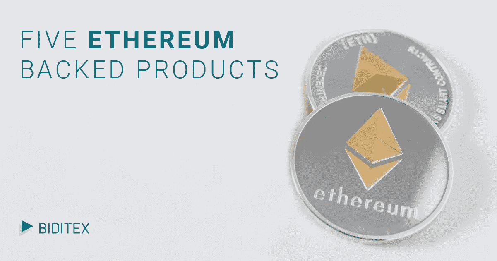

# 5 以太坊支持的产品:市值、硬币、智能合约

> 原文：<https://medium.datadriveninvestor.com/5-ethereum-based-products-market-cap-coins-smart-contract-3b69e0c2d592?source=collection_archive---------5----------------------->

[Biditex 团队](https://medium.com/@biditex)对基于以太坊的产品进行了自己的调查，并区分出 5 种最常用的产品。但首先我们要明白，为什么很多人发现以太坊比比特币更有潜力。就价格和规模而言，ETH 是加密领域交易的第二大加密货币，但所有的预测都表明，它将比 BTC 更稳定，因此这可能意味着其他硬币有更广泛的机会可以依赖。虽然就像比特币一样，它没有任何支持，但它以后有更好的机会。预见到这一点，今天的许多投资公司认为，一些已经开始推出以太坊支持的产品。最好的例子之一是摩根大通发行的 JPM 硬币。

在分析市场资本总额和整体利益范围内的令牌时，前 5 个令牌是:

 [## 5 行业转型区块链应用|数据驱动投资者

### 除非你一直生活在岩石下，否则我相信你现在已经听说过区块链了。而区块链…

www.datadriveninvestor.com](https://www.datadriveninvestor.com/2019/02/13/5-real-world-blockchain-applications/) 

**制造者**

**Maker** 是一个智能合约，通过抵押债务头寸(CDP)、自主反馈机制和适当激励的外部行为者的动态系统来稳定和支持戴。MKR 代币是根据戴币的价格波动创造或销毁的，以使其尽可能接近 1 美元，这是区块链以太坊完全可检查系统的一部分。MKR 代币也用于支付做市商系统的交易费用。

**Crypto.com**链条

**Crypto.com****链条**是 crypto.com 的另一个产品。后者成立于 2016 年，目标是加速世界向加密货币过渡。主要产品包括 Crypto.com 钱包&卡应用程序，这是一个用密码购买、出售和支付的地方，MCO 维萨卡，一种没有年费的金属卡，以及 Crypto.com 链，据报道，它使用户能够在任何地方免费用密码支付和获得支付。Crypto.com 总部设在香港，团队规模为 120+人。

**基本注意力令牌(BAT)**

**基本注意力令牌(BAT)** 因其创建数字广告平台的创新方式而成为以太坊区块链中市值第二的。英美烟草允许出版商、广告商和用户在一个更加高效、透明和分散的市场中联系，减少欺诈和侵犯隐私，同时增加出版商的收入。

**EOS**

EOS 是最大的以太坊代币，市值为 32.509811.57 亿美元。EOS 平台的独特之处在于其类似操作系统的结构，可以进行水平和垂直扩展。水平扩展使公司更容易运行多个 dApps 或分散应用程序，从而减少对 it 基础架构的需求。通过 EOS 平台可以支持和构建各种商业 dApps。如果 EOS 能够成功地成为企业级客户的首选网络，令牌的价值将会大大增加。EOS 价格为 3.52 美元。

**美元硬币**

**美元币**是以太坊提供动力的[稳定币](https://medium.com/@biditex/stable-coin-cryptocurrency-undervalued-but-envaluable-its-types-and-libra-f22d61b8f88b)。上面写着“价格稳定的加密货币”。美元债券由受监管和持牌的金融机构发行，这些机构以 1 USDC:1 美元的比例持有全部的法定货币储备。发行人被要求经常报告他们的美元储备持有情况，均富 LLP 每个月都会就这些持有情况发布报告。

参考资料:

[ERC20 令牌列表](https://eidoo.io/erc20-tokens-list)(2019 年 7 月 16 日访问)

10 个最佳以太坊硬币(2019 年 7 月 16 日访问)

*如果您想了解更多，请访问 BIDITEX 页面并提出您的问题，关注我们的*[*Twitter*](https://twitter.com/biditex_com)*，* [*脸书*](https://www.facebook.com/biditex/) *，* [*中型*](https://medium.com/@biditex) *，* [*电报*](https://t.me/biditex%20%28edited%29) *等。投标变更用***。**

*\*