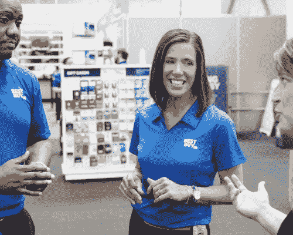
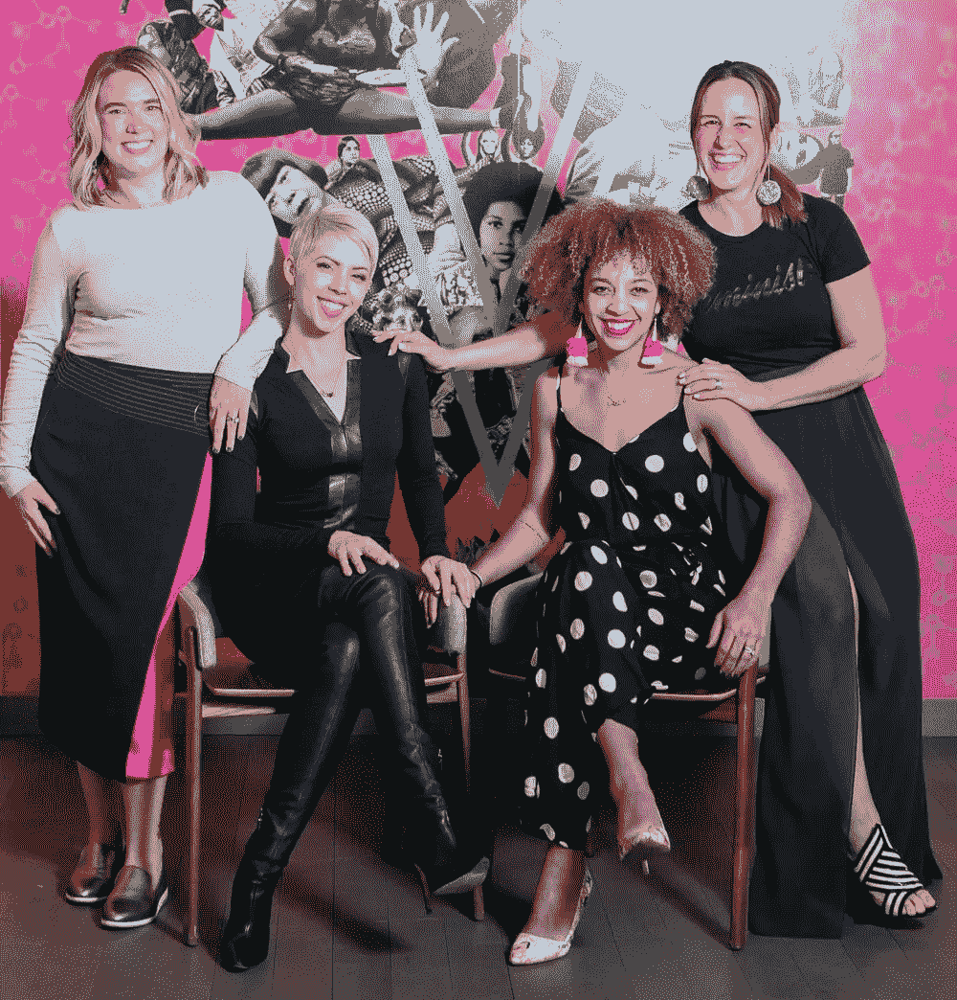
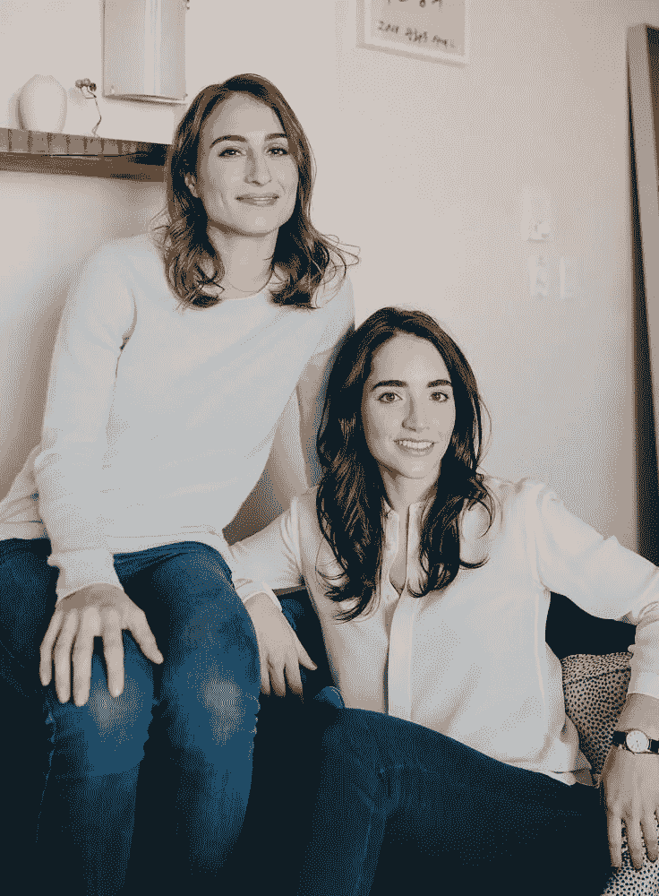
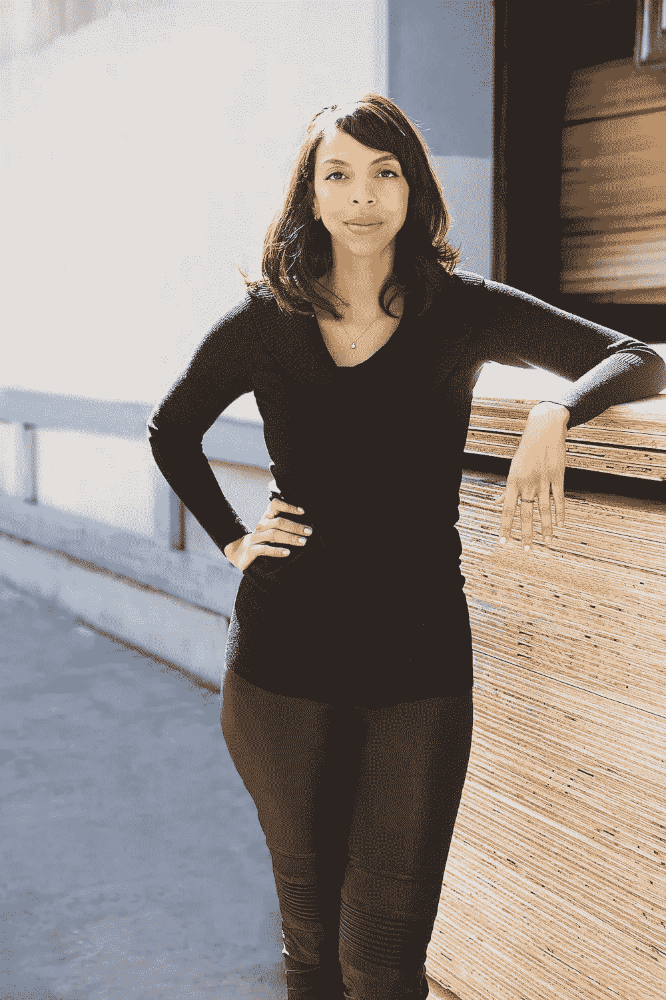
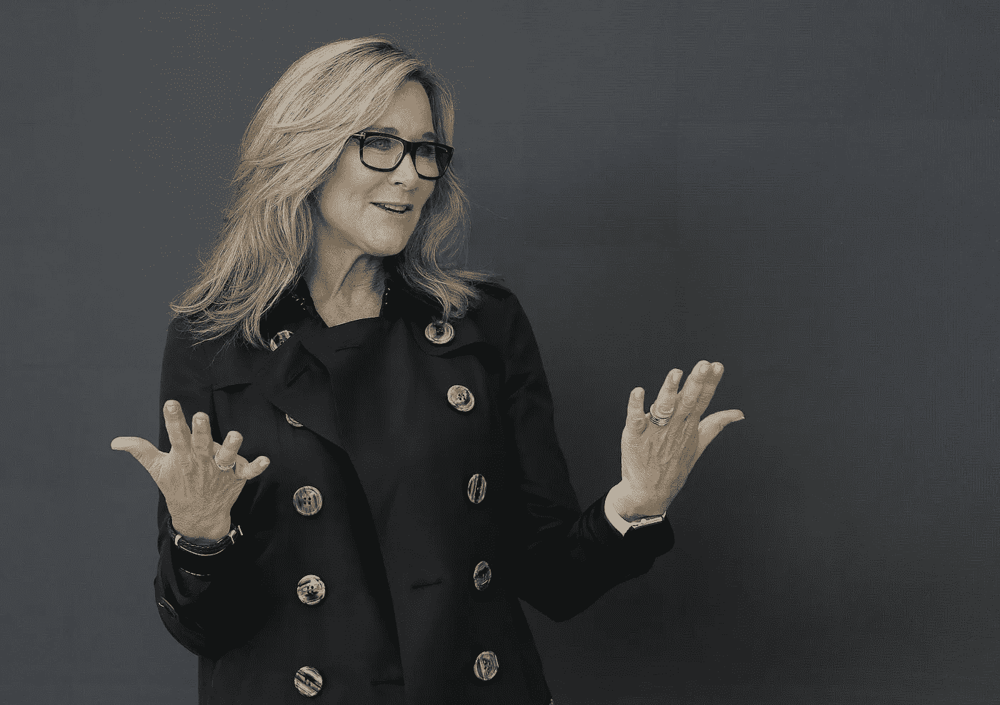

# 2019 年最受欢迎的五大创新者

> 原文：<https://medium.datadriveninvestor.com/5-fave-innovators-of-2019-80f8c153d1e9?source=collection_archive---------20----------------------->

每年的这个时候。

这是我们回顾过去、总结过去、展望未来、计划未来的时候。因此，本着这种精神，我向你提供我完全主观的 2019 年 5 大创新者名单。

以下是列出清单的“标准”:

*   收到媒体报道(包括传统媒体、博客、时事通讯)，但不至于成为“通常的嫌疑人”(如 FAANG 首席执行官)
*   曾经或目前正在做一些不同的创造价值的事情(如创新)
*   举例说明了创新者的特征，包括但不限于勇气、创造力、以客户为中心、毅力、谦逊和幽默。

事不宜迟，以下是我的 5 大创新者:

## 百思买首席执行官科里·巴里

**表彰她在职业生涯中展现的韧性和忠诚**

根据这篇有趣的[《财富》杂志](https://fortune.com/2019/10/23/best-buy-ceo-corie-barry-2/)的文章，在科瑞·巴里职业生涯的早期，她收到了一份绩效评估，称她为“组织的风险”大多数人会认为这是他们时日无多的标志，但巴里寻找的是包含“我需要努力的事情”和“静下心来”的“真相”，甚至创建了她自己的发展计划。

2012 年，当百思买(Best Buy)似乎奄奄一息时，巴里再次下定决心，选择留在这家零售商。

> “如果你的目的是管理，当事情变糟时离开是最大的罪行，”她回忆道。

她的毅力、韧性和忠诚得到了回报，今年 6 月，她被任命为百思买首席执行官，44 岁的她成为财富 500 强中最年轻的女性首席执行官。9 月，她向华尔街提出了一项计划，到 2025 年，将她的新收费收入从 430 亿美元增加到 500 亿美元。

 [## 在创业之旅中，拥抱学习|数据驱动的投资者

### 好像建立一个数百万美元的公司还不够困难，企业家必须额外照顾他们的…

www.datadriveninvestor.com](https://www.datadriveninvestor.com/2018/10/16/on-the-entrepreneurial-trek-embrace-the-learning/) 

考虑到所有关于“零售业末日”的说法，这种增长看起来可能有点遥远，但如果她的过去有任何意义，我不会怀疑她一秒钟

## 亚历克斯·韦斯特·斯泰因曼、贝瑟尼·艾弗森、利兹·盖尔和埃林·法雷尔，[女巫集会](https://thecoven.com/)的联合创始人

**将包容性和多样性带到一个不常见的地方**

我在中西部(具体来说是克利夫兰)长大，虽然我会永远感激这一事实，并将誓死捍卫我的俄亥俄州根基(和运动队)，但我也会第一个承认它并不完美。

中西部的诸多缺陷之一是完全缺乏多样性。这就是亚历克斯·韦斯特·斯泰因曼上榜的原因。

2017 年，亚历克斯与其他三名联合创始人一起在明尼阿波利斯创立了联合工作空间 Coven。但是 Coven 不仅仅是一个地方性的 WeWork，它的使命是“通过为个人和职业转型提供安全、无障碍的空间，在经济上赋予女性权力。”

Coven 的商业模式反映了它的使命——每购买 5 个会员资格，企业就给一个负担不起的社区成员一个会员资格，“优先考虑有色人种、LGBTQ 社区的人、能力不同的人、移民和退伍军人。”

现在拥有 2 个地点，600 多名成员(包括 140 名免费成员)，Coven 在为创新、创业和中西部社区带来多样性和包容性方面取得了重要进展

## 玛塞拉·萨彭和杰西卡·贝克，你好阿尔弗雷德的联合创始人

**因为有勇气逆潮流而动，做正确的事情**

几乎每周我们都不会听说共享经济巨头选择将其劳动力指定为承包商而不是雇员的法律、经济和道德问题。

每个公司除了一个。

当马塞尔·萨彭(Marcel Sappone)和杰西卡·贝克(Jessica Beck)在哈佛商学院(Harvard Business School)获得 MBA 学位时，他们创办了 Hello Alfred，他们是 Alfred 一族——日夜不停地跑腿、打零工、回应请求。当他们有了概念证明，他们开始设计一个可持续和可扩展的商业模式。一个有 W2 员工的。

是的，他们遇到了投资者的抵制，甚至因为他们的选择而被一些人拒绝，但他们仍然坚持他们的模式，因为他们相信他们的企业的成功需要关系，而不仅仅是交易，

> “公司的成功和员工的成功不应该脱节。我们相信，将员工视为我们的主要客户是我们满足最终用户的最佳方式。”

萨彭在这篇 [2015 年石英文章](https://qz.com/448846/the-on-demand-economy-doesnt-have-to-imitate-uber-to-win/)中展示了完整的论点，她坚持不懈的好处是不可否认的。现在，Hello Alfred 在 20 多个城市拥有 200 多名员工，在 2018 年筹集了 4000 万美元的 B 轮融资，使其成为竞争对手中估值最高的公司(如 Task Rabbit 和 Nextdoor)

## 让·布朗希尔，斯威特公司的联合创始人

**用一个方案解决两个问题**

两年来，我们需要重新粉刷我们的房子。我们最初联系的是 2013 年房子建成时粉刷房子的油漆工。一年后，没有进展，但有很多粗略的故事，我们放弃了，并呼吁第二个画家。他看了看这幅画，给我们回了电话，说他不喜欢这样做，因为他是原画家的朋友。他让我们去找第三个油漆工，他也来查看工作范围，只是在试图确定工作的后勤工作时，发了一些荒谬的挑衅性短信。我们在 2019 年夏天与第四位画家进行了交谈，他同意在 2020 年春天完成这项工作。

由于这种经历，以及太多其他类似的经历，让·布朗希尔和她创办的公司[sweet](https://sweeten.com/)在我的 2019 年最爱名单上。

作为一名训练有素的建筑师，布朗希尔在自己与一名承包商的令人沮丧的经历后创立了这家公司。这个概念很简单——sweet 将房屋所有者与翻新项目匹配到经过审查的总承包商，并负责客户服务、文档和营销等所有后台工作。

根据[建筑文摘](https://www.architecturaldigest.com/story/sweeten-founder-jean-brownhill-wants-to-diminish-constructions-gender-gap-heres-how)的一篇文章，在过去的八年里，斯威特的项目已经从平均 2000 美元增长到超过 10 万美元，该公司现在在建筑业务中拥有 15000 名经过审查的承包商。

这一成功导致了妇女甜蜜加速器(SAW)的创建，以及积极招募女性总承包商进入该平台并重新设计匹配算法以允许房屋所有者选择其承包商的性别的倡议。

在一个女性只占劳动力的 3%、工资只有男性的 0.91%的行业中(有趣的是，这是所有行业中性别工资差距最小的行业之一)，这种努力是有意义的。

> “对于总承包商来说，职业模式的转变将意味着女性有更多机会享受企业所有权和更大的财富，并将在重要方面使客户体验多样化。”

## 安吉拉·阿伦茨，苹果公司前 SVP 零售

**追随自己的心**

已经有很多关于安吉拉·阿伦茨的报道——她在印第安纳州的童年，她在鲍尔州立大学的教育，她在纽约的早期时尚生涯，直到她作为博柏利首席执行官的胜利统治，以及她加入苹果时“令人震惊”的科技之旅。

是的，这一切都太神奇了。

她决定辞去在苹果公司的职位也是如此，在苹果公司，她是公司薪酬最高的高管，收入是首席执行官的两倍，也是公司唯一的女性 SVP。她走开了，没有道歉也没有解释。

这证明了这样一个事实，有时，离开一件事和开始一件事一样强大和鼓舞人心。

希望你喜欢我的前 5 名！

谁列了你的名单？我错过了谁？

如果您喜欢这篇文章，请与朋友分享，单击👏很多次，跟着我在媒体上。

如果你想了解我在创新上阅读和喜欢的更多内容，请在 LinkedIn 上关注我。

要了解我如何与企业创新者合作，超越理论和戏剧，创造持久的变化和切实的商业成果，请访问我在 [MileZero](http://www.milezero.io/) 。