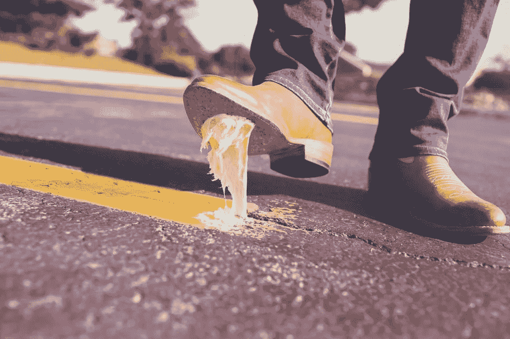

# 20 岁出头要避免的 5 个财务错误

> 原文：<https://medium.datadriveninvestor.com/5-financial-mistakes-to-avoid-in-your-early-20s-6739fde23789?source=collection_archive---------9----------------------->

在我 25 岁的某一天，我决定列出我在 20 岁出头时犯下的财务错误。我惊讶地意识到我犯这样的错误是多么愚蠢。

以下是一些你必须避免的错误:

# 1 -贷款购买机动车辆

车辆的成本价值会随着时间的推移而贬值。当你把你的新车带出展厅时，它的成本价值会下降 25-30%。

没有人会愿意在同一天以同样的价格购买你的新车。

> 机动车辆是一种负担。不要贷款买。这是一笔坏账。

不仅仅是买车的问题。你需要支付税收、保险和燃料，这些累积起来的成本比仅仅买一辆车要多得多。

如果你真的需要一辆汽车，那就存下适当的钱，用现金购买，而不是贷款购买并支付 EMI。

# 2 -先消费后储蓄

我是一个失控的花钱者。由于我的消费习惯，我的工资支票对我来说不够。每到月底，我都会急切地等待我的工资支票花在不必要的事情上。

> 你需要知道你的需要和想要之间的区别。在我们的大部分生活中，我们花了我们没有的钱，买了我们不需要的东西，去打动我们不喜欢的人。

举例？以上观点。用我们没有的钱买一辆机动车，来打动别人。

我在晚年才意识到这一点。亡羊捕牢，未为晚也。

遵循 50/30/20 规则:

> 你薪水支票的 50%用于储蓄。
> 
> 你薪水的 30%用于消费。
> 
> 你薪水的 20%作为应急基金。

# 3 -不明智地使用信用卡

信用卡就像一口井，银行希望我们跳进去。

如果你不知道信用卡是如何工作的，那么请在选择信用卡之前自学一下。

信用卡可以用来买东西，你以后再付钱。所以你买的东西有一段免息期。

但是有一个问题。如果你没有在到期日之前付清所有欠款，利息开始以高利率累积。

银行希望信用卡拥有者为这种罚款买单，而还清信用卡债务需要时间。

> 所以明智地使用你的信用卡。只在你需要的时候买东西。千万不要用信用卡提取现金。全额支付你的信用卡账单。

# 4 -购买负债而不是资产

资产是把钱放进你口袋的东西。责任是相对的。负债从你的口袋里掏钱。

应届毕业生不太清楚如何将事物归类为资产和负债。

如果你想过上财务独立的生活，专注于**增加资产，减少负债**。

购买或创造能让你有钱的东西。

不要买负债。他们有经常性成本。机动车辆是一种负担。为了方便起见，只在需要的时候购买。

# 5 -不跟踪每月支出

因为我是一个挥霍无度的人，我从来没有意识到每个月我的薪水都花在了哪里。

我没有预算。没有跟踪费用。

> 追踪你的支出对于了解你的钱到底去了哪里很重要。这会让你避免不必要的花费。

现在有很多应用程序可以追踪你的开销。用它们来避免购买不必要的东西。

## 感谢阅读。如果你喜欢这篇文章，请随意点击那个按钮👏帮助其他人找到它。

# 然后..

 [## 30 种致富和财务稳定生活的方法

### 1.量入为出

medium.com](https://medium.com/@abhilashgupta8149/30-ways-to-become-rich-and-have-a-financially-stable-life-3230042aaf8b) 

*原载于* [*FinCalC 博客*](http://fincalc-blog.blogspot.com/2018/10/5-financial-mistakes-to-avoid-in-your-early-20s-fincalc.html)