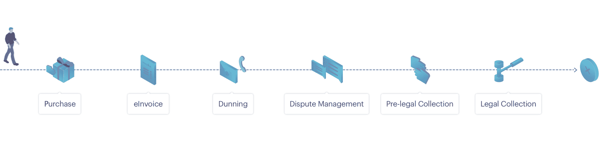

# 将在 2019 年定义应收账款管理的 5 大金融科技趋势

> 原文：<https://medium.datadriveninvestor.com/5-fintech-trends-that-will-define-receivables-management-in-2019-c23e54c8f7ef?source=collection_archive---------2----------------------->

毫无疑问，2018 年是金融科技投资年。根据 CB Insights 的数据，2018 年，全球金融科技行业在 1081 笔交易中筹集了 313.4 亿美元，超过了去年的纪录，该行业旨在彻底重新定义金融业的客户体验。金融科技公司专注于透明度、个性化、效率和高端技术等几个核心要素，通过在支付和结算、财富管理、P2P 贷款和区块链领域提供广泛的金融服务，迅速成为真正的游戏规则改变者。

其中一个领域是应收账款管理，在谈到金融科技时，它并不在前沿，但它包含了所有的组成部分。根据罗伯特·n·安东尼的说法，“应收账款是通常由客户欠企业的金额。”控制这些应收账款的过程被称为应收账款管理，是指公司为确保客户按时支付发票而采取的一系列严格措施。如果处理得当，专业的应收账款管理可以带来稳定而高的收款率，并确保客户保持率。

另一方面，低效的应收账款管理会导致企业与其客户之间的沟通中断，并严重延迟付款。特别是在 B2C 领域，这可能意味着将获得付款的可能性降低到几乎为零，从而将流动性问题转化为更深远的盈利能力问题(冲销)。

随着全球市场竞争的加剧和跨境销售成为标准，理解应收账款管理流程及其作为客户关系管理不可或缺的一部分的价值变得越来越重要。

下图说明了 Oracle receivables management 中客户旅程的各个阶段，并概述了整个收款周期的所有阶段:从初始发票、与客户的发票相关沟通、催款(催单)、争议管理，以及最终的实际收款。每个阶段的优化目标是在案件进入下一步之前解决案件。处理步骤越接近最初开具发票的时间，实际付款的机会就越大。收回应收账款花费的时间和资源越多，企业收回资金的难度就越大。

多达一半的互动应在沟通的第一个月内进行。之后成功率会下降。此外，在每个阶段涉及不同方的工作流程中(如收藏家、银行、PSP 等。)最有可能的是，没有跟踪与最终客户的所有沟通步骤。这阻碍了为特定客户类型定制的一致战略的实施。

这强调了将应收账款管理作为业务-客户关系的重要组成部分进行整合的必要性，以确保在关系的整个持续期间保持畅通的沟通渠道。对该领域新趋势反应更快的公司可以通过降低非支付风险(例如，提高流动性和盈利能力，包括更灵活的支付选项)获得相对于同行的竞争优势。

那么，为了实现这一目标，你应该在 2019 年关注哪些趋势呢？以下是我们的观点:

1.  **流程自动化**

发票开具和交付、客户沟通和支付、债务催收和争议管理的几乎每个方面都可以从自动化中受益。人工智能和机器学习能够在没有人类交互的情况下实现决策过程的额外自动化，这意味着效率和可扩展性的巨大提高。当然，应该对整个工作流程进行监控、跟踪，并在必要时适应快速变化的环境。

**2。客户沟通的个性化**

当谈到应收账款管理中的客户沟通时，标准化是绝对行不通的。尤其是在收取逾期付款时，如果处理不当，这被认为是对私人领域的侵犯。在这个阶段，企业有机会展示他们真的关心他们的客户。完全根据客户偏好定制的个性化解决方案有助于维持长期关系，防止“好客户”流失。

**3。代码驱动的合规性**

确保符合法律和客户特定的参数可能很难掌握，尤其是当跨境应收款管理的规则和法规不断变化时。由于其预先编码的规则，采用自动化程序和智能系统可以完全最大限度地减少处理中的人为错误。代码驱动的合规性确保公平对待客户，并满足每个收款区域的法律要求。

**4。灵活的付款计划**

去年是客户需求不断变化的一年。这也是指需要优化公司提供的支付解决方案。现代基于机器学习的系统会评估客户的支付情况和当前应收账款状况之间的星座，并触发可能适合双方的最佳支付计划。

**5。电子发票的使用增加**

新的欧洲电子发票标准即将生效，该标准要求所有欧洲公共部门订约当局接收和处理电子发票。与普通发票不同，电子发票是机器可读的文档，可以在发行人、合作伙伴和买方之间实现自动交换。2017 年欧洲 B2C 发票金额预计达 230 亿。预计到 2024 年。这一数额的 90%将由电子发票构成。这一趋势强调了从内部业务流程中减少人工处理步骤和应用高效系统的重要性。

**底线**

因此，让我们快速总结一下 2019 年“完美”的应收账款管理应该是什么样子:

*   它应该涵盖从最初的发票到最终付款的整个收款周期。
*   它应该支持流程的自动化，以确保效率和可伸缩性。
*   它应该使用机器学习模型和预测分析，使企业能够根据统计数据做出更好的决策并优化绩效。
*   它应该将发票流程数字化，以消除人为错误并缩短处理时间。
*   它应该尊重地对待每一位顾客。
*   它应该减少不付款的风险，从而使灵活的付款计划适合客户的需求。
*   它应该跨国经营，并遵守所有国家特定的法规。

> 来源:
> 
> Billentis (2018 年):电子发票/电子账单报告
> 
> CB Insights(2018):2018 年 Q1 全球金融科技报告
> 
> CB Insights(2018):2018 年 Q2 全球金融科技报告
> 
> CB Insights(2018):2018 年第三季度全球金融科技报告
> 
> 欧洲央行统计数据(2017 年):支付报告
> 
> 罗伯特·安东尼(1968):管理会计原则

## 来自 DDI 的相关故事:

 [## 为什么数据会改变投资管理

### 有人称之为“新石油”虽然它与黑金没有什么相似之处，但它的不断商品化…

medium.com](https://medium.com/datadriveninvestor/why-data-will-transform-investment-management-4a60966c1c81)  [## 数据科学和软件工程哪个更有前途？

### 大约一个月前，当我坐在咖啡馆里为一个客户开发网站时，我发现了这个女人…

medium.com](https://medium.com/datadriveninvestor/which-is-more-promising-data-science-or-software-engineering-7e425e9ec4f4)