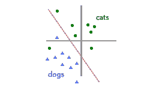
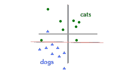
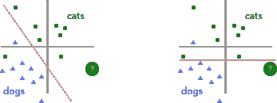
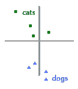
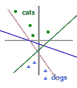
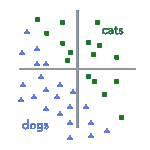
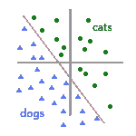
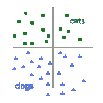
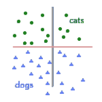

# 5 个基本人工智能原则

> 原文：<https://medium.datadriveninvestor.com/5-fundamental-ai-principles-993528a7d9ed?source=collection_archive---------0----------------------->

Photo by [Andy Kelly](https://unsplash.com/photos/0E_vhMVqL9g?utm_source=unsplash&utm_medium=referral&utm_content=creditCopyText) on [Unsplash](https://unsplash.com/search/photos/ai?utm_source=unsplash&utm_medium=referral&utm_content=creditCopyText)

如果每个人都有时间和愿望去上大学并获得人工智能学位，你很可能不会读这篇博客。人工智能以神秘的方式工作，但这五个人工智能原则应该可以帮助你在处理这项技术时避免错误。

这个帖子是为忙碌的人工智能助手而写的:

1.在看不见的数据上评估人工智能系统
2。更多的数据导致更好的模型
3。一盎司干净的数据抵得上一磅脏数据
4。从愚蠢的基线
5 开始。人工智能不是魔法

简单的警告——如果对机器学习有基本的了解，这篇文章会更有意义。几周前，我们[写了一篇博文](https://blog.eloquent.ai/2018/08/30/machine-learning-for-executives/)解释这些基本知识。理解这篇文章不需要阅读，但肯定会有帮助！

# 1.在看不见的数据上评估人工智能系统

在我们的上一篇文章中，我们介绍了如何构建一个分类器来将图像标记为猫(绿色圆圈)或狗(蓝色三角形)。在将我们的训练数据转换为向量后，我们得到了下图，红线代表我们的“决策边界”(在图像转换为向量后，将图像分为猫和狗的线)。

显然，决策边界错误地将一只绿圈猫贴上了蓝三角狗的标签。它漏掉了一个训练例子。那么，怎样才能阻止训练算法选择以下内容作为决策边界呢？

在这两种情况下，我们以相同的精度对训练集进行分类——两个决策边界都遗漏了一个示例。但是，当我们传入一只新的看不见的猫时，如下图所示，只有一个决策边界会正确地预测猫的位置:

一个分类器可以在它被训练的数据集上看起来很好，但是它可能在它被**而不是**训练的数据上工作得不好。此外，即使分类器在特定类型的输入上工作良好(例如，室内场景中的猫)，它可能在相同任务的不同数据上工作不佳(例如，室外场景中的猫)。

盲目购买人工智能系统，而不对相关的、看不见的信息进行测试，可能会导致代价高昂的错误。一种在看不见的数据上进行测试的实用方法——保留一些你给开发你的人工智能的公司或个人的数据，然后自己通过最终的系统运行保留的数据。或者，至少，坚持让你自己尝试演示。

# 2.更多的数据导致更好的模型

给定下面的训练数据集，你会在哪里画决策边界？

你的答案很可能是正确的——许多决策边界可以准确地分割这些数据。虽然下面的每个假设决策边界都正确地分割了数据，但它们彼此之间都有很大的不同，正如我们在上面看到的，其中一些很可能在看不见的数据(即您关心的数据)上工作得更差:

从这个小数据集，我们不知道这些非常不同的决策边界中的哪一个最准确地代表了现实世界。数据的缺乏导致了不确定性。因此，我们收集更多的数据点，并将其添加到我们的初始图表中，得到下图:

额外的数据有助于我们大幅缩小选择范围。我们能够立即排除绿色和蓝色的决策边界，因此我们知道我们的决策边界必须如下所示:

当一个 ML 模型的行为出乎意料时，潜在的问题往往是模型没有对足够的或正确的数据进行训练。不过，记住这一点也很重要，尽管更多的数据几乎总是有所帮助，但回报却在减少。当我们将第一张图表的数据增加一倍时，精确度的增加是很大的。然而，如果我们拿这个图表，现在数据翻倍，再翻倍*再翻倍*，精确度的增加不会很大。准确性随着训练数据量的增加而大致呈对数增长，因此从 1k 到 10k 的示例对准确性的影响可能比从 10k 到 20k 大得多。

关于人工智能数据的最后一点，也是我个人最讨厌的一点，尤其是在预算紧张的初创企业世界里:你经常给你的 ML 工程师支付数十万美元的薪水；确保您给他们足够的预算来收集数据，并给他们时间来仔细收集数据。

# 3.一盎司干净的数据抵得上一磅脏数据

虽然在上面的例子中，更多的数据显然是有帮助的，但只有在数据准确的情况下才有帮助。在前面的例子中，在我们收集了额外的数据后，我们有了一个图表和一个决策边界，如下所示:

但是，如果这些新数据点中的一些被错误标记，而现实世界看起来更像这样，会怎么样呢？

请注意，尽管变化的点占据了与第一个图形相同的坐标，但它们的含义已经发生了变化。这导致了完全不同的决策界限:

即使只有四分之一的数据集被错误标记，错误的数据对我们如何创建模型的影响也是显而易见的。我们可以在训练期间使用一些技术来减少标记数据时的错误，但最终这些技术只能做这么多，在大多数情况下，清理底层数据会更容易、更可靠。

这里的要点是“干净的数据”至关重要。干净的数据意味着数据被准确地标记；这意味着数据覆盖了感兴趣空间的合理部分；这意味着在训练集中有容易的情况和困难的情况，因此决策边界没有太多回旋的余地，并且只有一个“正确”的答案；诸如此类。

# 4.从愚蠢的事情开始

这并不是说你应该以愚蠢的事情结束。然而，即使你最终采用的方法是现代和复杂的，你也会开发得更快，最终的结果也会更好。

举一个实际的例子，当我还是一年级研究生的时候， [Angel](https://angelxuanchang.github.io/) (我们实验室的一名同学，雄辩公司的研究员)和我各自从事不同的项目，将时间的自然语言描述基础化为机器可读的表示。本质上，我们试图让计算机理解诸如“上周五”或“明天中午”这样的短语。

由于这些项目是我们的拨款所必需的，安吉尔开发了一个实用的、确定的、基于规则的系统。她被一些实际的工作所困扰。另一方面，我是一个小小的轮换生。团队让我选择我想要的任何花哨的方法，我就像一个在糖果店的孩子。我天真地探索了最新、最闪亮的语义解析方法。我全力以赴，玩 EM，共轭先验，一个完整的定制语义解析器…有趣的东西。

近十年后，我很感激留给我一篇[有点受欢迎且被适度引用的论文](https://cs.stanford.edu/~angeli/papers/2012-naacl-temporal.pdf)。然而，安吉尔的项目， [SUTime](https://nlp.stanford.edu/software/sutime.html) ，现在是斯坦福大学流行的 CoreNLP 工具包中使用最多的组件之一。简单的方法打败了闪亮的方法。

你以为我已经吸取教训了。仅仅几年后，现在我是一名大四的研究生，我正着手建立另一个系统并运行另一个资助项目。再一次，我试图得到一个奇特的 ML 模型来正确地训练，只取得了有限的成功。在特别令人沮丧的一天，我厌倦了，开始写模式。模式是简单的确定性规则。例如，如果句子包含“出生于”，假设这是出生地点。模式不会学习，也只能让你到此为止，但是它们很容易编写，也很容易推理。

最终，基于模式的系统不仅仅优于我们最初的系统——它在由 grant 组织的最终 NIST ( [国家标准与技术研究所](https://www.nist.gov/))烘焙比赛中名列前五，并最终严重影响了我们表现最佳的基于 ML 的模型。

结论:先做简单的事情。撇开轶事不谈，这有许多好的理由:

1.它将限制最终模型的性能。你会希望任何聪明的事情都会超过简单的基线。你很少会比基于规则的模型做得更差。知道这一点很好，如果你做得更差，这意味着有些事情非常糟糕，这不仅仅是任务很难。

2.通常，简单的事情需要更少(或者不需要！)训练数据，这让您无需在数据上进行大量投资就能构建原型。

3.它通常会揭示手头的任务有什么困难，这通常会告知正确的 ML 方法来处理这些困难的部分。此外，这将为您收集更多数据密集型方法的数据提供信息。

4.简单的方法更容易推广到看不见的数据(记住:总是对看不见的数据进行评估！).更简单的模型往往更容易解释，这使得它们更容易预测，因此更清楚它们如何推广到看不见的数据。

# 5.人工智能不是魔法

这是我经常说的话。每个人都点头附和，但这种情绪很少深入人心。人工智能就像魔术一样。当谈到雄辩的人工智能的宏伟未来计划时，我为强化这种错误的观念而感到内疚。我从训练 ML 模型的本质中得到的越多，这些模型就越不像是曲线拟合的，它们就越像是我可以随意操纵的魔法黑盒。

人们很容易忘记，作为一个领域，现代 ML 仍然非常年轻——只有 20-30 年的历史。与现代 ML 工具包的成熟和复杂相比，这个领域作为一个整体仍然相当不成熟。快速的进步很容易让人忘记这一点。

最大似然法的部分弊端在于其固有的概率性。从技术上来说,*可以做任何事情，只是不一定要达到你想要的精确度。我怀疑，在许多组织中，随着新闻在组织结构图中传播，围绕“准确性水平”的细微差别被忽略了，只剩下“人工智能可以做任何事情”这一部分。*

你如何区分不可能和可能？我尝试遵循的一些最佳实践:

1.与实际训练模型的人交谈。不是团队领导，不是部门负责人，而是在模型训练代码上推“Go”的人。他们通常能更好地理解模型的工作原理及其局限性。确保他们乐意告诉你这个模型有局限性，在某些事情上表现很差——我向你保证确实如此，不管他们是否告诉你。

2.至少对于 NLP 项目来说，你可以经常用一个快速而肮脏的基于规则的系统来检查任务的可行性。ML 是一种很好的方式，可以生成一个非常大且模糊的规则集，您永远无法手工写下来，但是如果您甚至很难开始写下一组看似合理的规则来完成您的任务，这通常是一个不好的迹象。然后，收集一个小数据集，尝试一个学习过的系统。然后是稍微大一点的，以此类推，同时你还在不断改进。一个重要的经验法则是:随着数据集大小的增加，精确度以对数的形式增长。

3.永远不要相信看起来像魔术一样的准确性:任何高于 95%或 97%的准确性。当然，永远不要相信高于人类水平的准确性，或者高于[内部注释者](https://en.wikipedia.org/wiki/Fleiss%27_kappa)的协议。很有可能，你的数据集或者你的评估被破坏了。这两种情况经常发生，即使是经验丰富的研究人员。

4.你在互联网上读到的关于 ML 的一切(新闻、博客、论文)都是误导性的或虚假的，除非被证明不是这样——包括这篇文章:)。

感谢您的阅读！此外，我只是想做一个简短的说明，感谢大家对我们上一篇帖子的巨大回应。看到整个社区的人们都参与到这些材料中来，这很酷。

一如既往，如果您有任何问题、评论或反驳，请发送到[hello @口才. ai](mailto:hello@eloquent.ai) 给我。注册这个列表，将这些文章直接邮寄到你的收件箱，并访问我们的主网站:雄辩。好了，我说的够多了。很快再和你聊天！

最初发表于[这里。](https://blog.eloquent.ai)