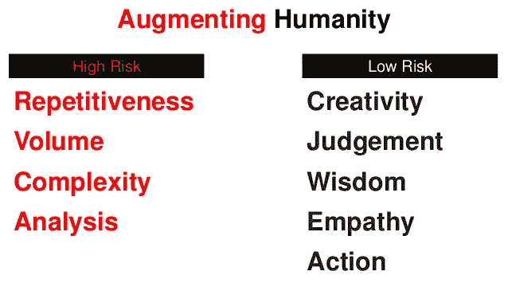
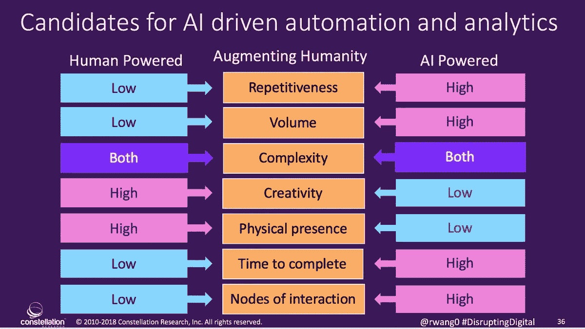
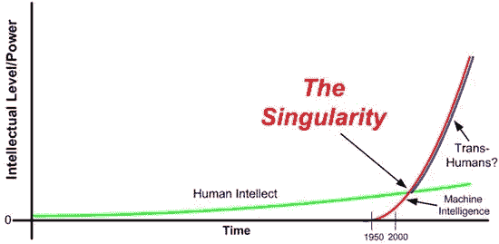
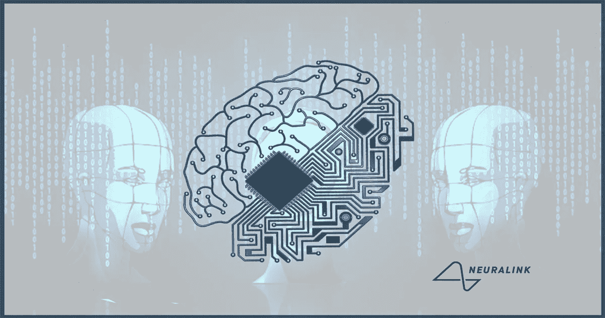

# 5.人工智能的未来——电子人？乔布斯？

> 原文：<https://medium.datadriveninvestor.com/5-future-of-ai-cyborgs-jobs-1b67eeb7400d?source=collection_archive---------5----------------------->

阅读:

[1。AI 是什么？](https://medium.com/datadriveninvestor/1-what-is-ai-6f8aff4e15d)

[2。AI 是如何创造价值的？](https://medium.com/datadriveninvestor/2-how-does-ai-create-value-a0f352167c83)

[3。AI vs 人类进化](https://medium.com/datadriveninvestor/3-ai-vs-human-evolution-a778c49896ac)

[4。人类无法理解的人工智能](https://medium.com/datadriveninvestor/4-ai-beyond-human-comprehension-1ec7125b71b)

**乔布斯的威胁**

涉及计算、平凡重复或缺乏创造力的任务的工作将被人工智能取代。

让我们以自动驾驶汽车为例，我们已经看到了。当一辆汽车检测并学习如何克服障碍时，它可以在不到一秒的时间内通过一个所有汽车都同步的网络轻松传递给所有汽车，而不像人类网络需要数年才能到达并连接。

这一切都可以归结为一个简单的事实，即数据存储和共享对计算机网络来说都比人脑容易。

将受到影响的工作
司机——卡车/送货
放射科医生——乳房 x 光检查
律师——律师助理
金融——贸易

与蓝领工作相比，白领工作有望被取代。已经并将继续引导人工智能超越世俗任务的一个主要因素是跨边界适应的容易程度——从印度到美国，从智利到挪威，或者从纳米比亚到新西兰。保持安全的唯一方法是依靠创造力而不是重复。

与普遍的看法相反，编程不会被 AI 吸收。当被分解时，编程基本上是一种思维方式，并且使用逻辑来定义一系列操作。编程被人工智能取代的那一天，将是 AGI 超越我们的那一天。

人工智能的主要积极方面是，任何个人都有能力借助人工智能承担的重复性任务来释放创造力。自从我们通过发明如此多的东西将自己从农业和后来的工厂工作中解放出来从而释放创造力以来，我们一直在跟随这一趋势。人工智能有可能提高我们更快、更便宜、更好地发明东西的能力。

**超越人类进化的技术进化/人类 AI 整合/Cyborgs**
人类在技术的帮助下推动着社会前进——第一个用于农耕的工具，到计算机的轮子的发现，再到现在的人工智能。科技相关产品的不断增长正常帮助了我们。我们已经是迷你电子人——电话和电脑无时无刻不在我们身边——在世界各地交流，为偏远地区的公司工作，选择娱乐资源。这既有利也有弊，但平均而言，技术帮助我们向更好的方向发展——安全、可靠和可持续发展。

驱动人类的最伟大的工具是创造力。我相信人工智能更快复制的能力结合人类的创造力只会让我们更强大。看待人工智能接管工作或人工智能压倒我们的恐惧的最佳方式是找到一种方法来监管人工智能，并更积极地将人工智能融入我们的生活。从旨在开发高带宽和安全脑机接口的 neuralink 这样的公司到将使我们能够推动双赢局面以适应人类生产力和人工智能服务的教育，这些都是需要我们关注的最佳案例场景。

当然，导致人类在全球范围内关闭技术的奇迹似乎是一种选择，但经济将会崩溃，最终我们的生活将处于危险之中，因为我们对医疗保健、教育和职业技术的高度依赖。

与生物学(自然)相比，技术一直在以令人难以置信的快速发展。随着越来越多的仿生机器的出现，一些人类已经将自己与人造身体部分融为一体。在可预见的遥远未来，仿生学有可能取代我们的生物器官。如果技术进化超越了生物进化，人类将会整合机器成为电子人。尽管如此，这个场景已经预见到了(首先适应的人和不适应的人之间的不平等)和不可预见的挑战。

因此，有必要发展人工智能，但也要控制规则，同时为人类和人工智能的援助创造双赢的局面。

*image credits:*[coding Dojo](https://www.codingdojo.com/blog/dark-side-of-artificial-intelligence-ai)， [SlideShare](https://www.slideshare.net/briansolis/the-new-experts-how-robotics-ai-and-automation-are-shaping-the-future-of-your-work/8-Robotics_EngineerRobot_ServicesRobot_Programmer_and) ，[企业家非正规军](https://www.enterpriseirregulars.com/118697/tip-know-automate-artificial-intelligence/)， [Rebane 的反刍](https://rebaneruminations.typepad.com/rebanes_ruminations/2010/04/singularity-whats-that-wappendix.html)，[技术通知](https://www.technotification.com/2017/06/neuralink.html)