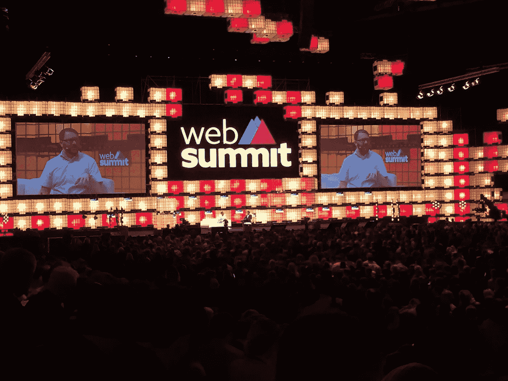
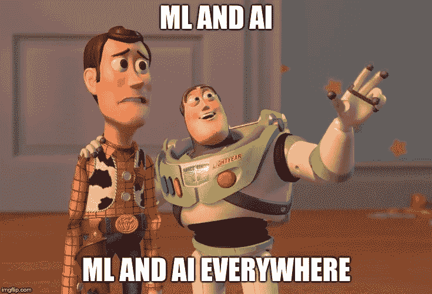
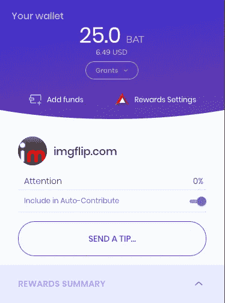

# 里斯本 2018 年网络峰会的 5 个非常有见解的观点

> 原文：<https://medium.datadriveninvestor.com/5-highly-opinionated-takeaways-from-web-summit-2018-in-lisbon-f41d15316655?source=collection_archive---------17----------------------->

我刚刚结束了在里斯本度过的美好的一周，与大约 70，000 人一起参加了网络峰会。

我参加了很多有趣的课程、讲座、讨论等等。我会思考一些引起我注意并且仍然萦绕在我脑海中的话题。

似乎有一种趋势，一些大型创业公司实际上试图开发另一种产品，而他们最终将这种产品推向市场。从 slack 团队开始，他们实际上正在制作一个视频游戏，但意外地创建了 Slack 来解决开发团队之间的沟通挑战。

Twitch 还推出了另一款产品。

因此，如果你开发了一个产品，并在这个过程中意识到你缺少一个产品、功能或服务，那么你可能会偶然发现下一个伟大的东西！是偶然的创业吗？

# **无服务器，流行词还是真货？**

在网络峰会之前，我一直在关注的一个话题是关于无服务器设置的所有模糊问题。
亚马逊有一个小场景，我参加了一些最有趣的会议，包括现场演示、演练、讨论和常规演示。
我无法一一介绍，但他们确实通过云基础架构即服务挑战了传统设置。他们带着能解决一些大公司正在处理的许多问题的产品走向市场。他们不再需要担心操作系统的更新和解决服务器或基础设施问题。

引起我立即注意的事情之一是 amazon lambda 服务，尤其是将一些代码推向生产的选项，但只让大约 10%的用户群可以访问它。这是一种非常有趣的测试新特性的方式。当您随后添加了如果出现太多错误自动回滚功能，**然后**您就可以放心部署了。

另一个成功之处是自动扩展，可用资源随着流量的增加而增加，如果没有流量，资源就会闲置。所以你基本上是为你使用的东西付费。

整个亚马逊生态服务系统似乎值得我在未来投入大量精力。

但是和往常一样，别人做的时候看起来不错。我需要获得实践经验，然后我想把任何更大的项目转移到这个设置。

我的下一个副业项目将是一个无服务器的亚马逊解决方案，我想在亚马逊游乐园玩玩，那里有很棒的功能和服务。

# **AI 和机器学习无处不在**

人工智能和机器学习是热门话题，它们遍布网络峰会。我看了一些不同的会议，但亚马逊再次设法动摇地面一点。

我看了一个演示，Gabe Hollombe 建立并训练了一个图像识别模型。仅用一个非常小的数据集，他就能够在 10-15 分钟内(如果我没记错的话)训练出模型，能够通过他电脑上的摄像头识别一个瓶子、一张卡片和一个人。令人印象深刻，简单明了。当然，一旦我尝试了，就会变得更加困难，但这是另一个话题了。

我对亚马逊上的服务印象深刻，这些服务看起来既紧密相连又相互独立，作为开发人员，你可以直接开始玩模型和算法，而不必浪费宝贵的时间来设置服务器和处理数据。

设置是这样的:
数据存储在 s3 桶上- > Glue 通过爬虫从桶中检索数据- > Sagemaker 提供机器学习，最后 Partions 帮助分析数据。
你可以使用红移作为数据仓库服务等等。可能性似乎是无限的。

# **勇敢的浏览器**

我想建议的另一件事是，无论谁读了这篇文章，都应该看看勇敢的浏览器。
从媒体的角度来看，这是对我们正在处理的整个 cookie、跟踪和广告问题的一个新的引人入胜的看法，同时也是为了改善用户体验和安全性。
Brave 的默认设置是隐私，当你的“护盾”打开时，所有广告、追踪器等都会被屏蔽。然后，您可以将网站列入白名单，并根据需要调整设置。

但是这有什么特别的呢？你可以通过使用 chrome 和广告拦截器来实现这一点。

我喜欢 chrome 浏览器。我一直在用它，它总是占用我机器 95%的内存。brave 的特点是，它看起来像 chrome，工作起来也像 chrome，但似乎更快、更轻便。这可能只是我，但我这些天在测试它。

另一个真正吸引我眼球的功能是内置的奖励系统。你可以在看广告的时候赚到“钱”,然后把钱捐给你经常使用的页面。喜欢中号。这个功能似乎还在开发中，但这是解决出版商、广告商和客户问题的一种有趣方式。

You can download it at [brave.io](http://brave.io)

# **为什么 GDPR 如此重要？**

没有一个星期没有一个好的 GDPR 讨论。这当然也是网络峰会的热门话题。

去年，我密切关注着 GDPR 的诞生，越来越意识到我们未来可能面临的一些潜在问题。

抛开乔治·奥威尔的恐惧和互联网的阴谋论，我相信我们正处于一个重要的互联网时代，一些会议证实了这一点。

如今随处可见的数据驱动的创新解决方案；在你的冰箱、汽车、电话、孩子的婴儿监视器等等，它们存储了大量的数据。有了这些数据，就有可能创建巨大的数据中心，其中存储的信息，如果结合起来，将会在很大程度上改变我们的生活方式。随着所有物联网设备和共享数据的出现，我们很可能会失去对生活中重要部分的控制。

我不认为单个人的数据是我们应该担心的部分，而是每个人的数据、数据量及其用途的组合。GDPR 当然解决了这个问题。我认为，当人工智能“帮助”人们决定看什么和电视、与谁交谈、开车去哪里、在 tinder 上与谁匹配等问题时，这个问题就会得到加强。人工智能不仅会塑造我们的未来，它还会定制我们的现实或我们对现实的感知，让我们接触到根据我们的偏好定制的元素。

想象一下这样一个世界，每个人都只和与他们有共同观点和信仰的人见面，只看为他们选择的内容的电视，阅读他们同意的观点的新闻，当然是基于偏好。
这项服务才是真正的问题。
我们知道，一般来说，人们更喜欢与志趣相投的人交谈，或者至少是与他们有共同观点的人交谈。最好和他们自己没有太大的不同。
如果我们不挑战这一点，下一代可能会由看起来像真人的模型组成。每个人都会被束缚到这样的程度，他们的世界是根据以前的经验定制的，所以我们生产 x 数量的每个人类型，非常类似于工厂或模拟人生游戏。

如果我们的世界是这样剪裁的，那么我们只会经历和我们一样的事情。这将证实我们无论相信什么都是对的，我们对世界的看法是正确的，甚至可能是主流，甚至更糟，是唯一的看法？

正如其中一个圆桌讨论中提到的，我更希望看到 AI 在打击假新闻的战斗中投入使用。当一些人试图篡改选举或发布不正确的声明，影响人们的政治观点或对世界上重要事情的看法时。
或者 AI 可以用于与环境的战斗，医学研究等等。可能性是无穷无尽的，但是拥有巨大的力量…

# **关闭思路**

回到我的青年时代，当你和朋友谈论电视时，你可以直接问；“你昨晚看电视了吗”？如果两个人都看过，那么这将是他们看过的同一个电视节目。那时候很简单。而看《奇人异事》这样的剧集，让我怀念那些日子。

我只触及了网络峰会期间接触到的几个话题。我希望我有更多的时间探索场景之间的领域，并参加更多的创业推介。

总的来说，会谈只是触及表面，速度很快，没有深度。我不介意，但如果是我感兴趣的话题，我更喜欢更深入、更长时间的讨论。话又说回来，我肯定它是基于大量数据和一些良好的算法设计的，所以如果我有另一个偏好，我可能是错的:)

*   编辑**
    我忘了加一个网络峰会 youtube 的链接，你可以在那里观看大部分的会议:[https://www . YouTube . com/channel/ucjtkhqh4qof 97 ts x7 bze 5 IQ/videos](https://www.youtube.com/channel/UCJtkHqH4Qof97TSx7BzE5IQ/videos)

