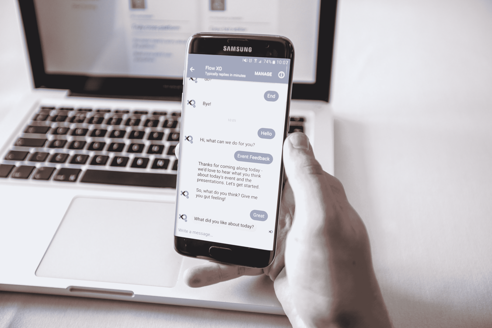
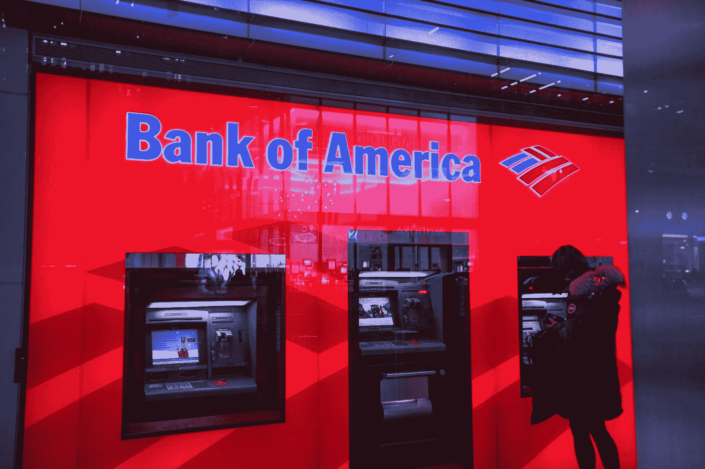

# 聊天机器人可以增强银行客户体验的 5 种令人难以置信的方式

> 原文：<https://medium.datadriveninvestor.com/5-incredible-ways-in-which-chatbots-can-enhance-customer-experience-in-banking-79d3410135fb?source=collection_archive---------44----------------------->

Gartner 估计，到 2020 年，85%的银行和企业将在人工智能聊天机器人的帮助下进行客户互动。

为了更快地提供服务并提高任务的生产率，尝试尽可能地取代人工干预是明智之举。可以帮助银行大规模提高效率的最有效方法之一是人工智能驱动的[聊天机器人](https://chatbotslife.com/)。由[人工智能](https://kore.ai/bots-platform/chatbot-intelligence/)技术驱动的聊天机器人有可能彻底改变银行业。

根据 Gartner 的一份报告，预计到 2020 年，85%的银行和企业将在人工智能聊天机器人的帮助下进行客户互动。此外， [Juniper 的研究](https://www.juniperresearch.com/analystxpress/july-2017/chatbot-conversations-to-deliver-8bn-cost-saving)表明，到 2022 年，通过聊天机器人可以节省近 80 亿美元的成本。

由于自身的担忧，许多银行并不赞成这种数字化转型。他们的利润率预计将下降 35%左右。但是那些更先进的人能够预见到他们的顾客的方便。这有助于他们关注大约 45%的利润。

关系银行业务是一个专注于客户参与的细分市场。人工智能是一个非常强大的工具，可以帮助加强客户关系。结合消息应用的力量，它可以在许多方面彻底改变银行业。有许多任务需要花很多时间来完成。为了简化执行和节省时间，可以使用人工智能聊天机器人。这也将节省人力，可用于其他重要活动。

**聊天机器人改善银行客户服务体验的 5 种方式:**

**1。个人银行业务进展**

大多数客户从银行端面临的最大问题是服务的延迟和缺乏个性化。但随着聊天机器人的引入，个性化银行业务可以在很大程度上得到变革。通过减少等待时间和其他相关的文书工作，银行可以帮助客户获得更快和个性化的服务，同时为双方节省大量宝贵的时间。由于聊天机器人可以有效地提供账户报表，因此客户不必每次需要支出账户时都去银行。

聊天机器人还可以帮助提供与最新的银行计划 KYC 相关的信息，并快速解决查询。最棒的是，在聊天机器人的帮助下，银行可以在极短的时间内解决查询，而无需任何人工干预。此外，客户甚至不会感觉到他们正在与一台机器互动，因为体验将是如此逼真！

**2。强大的自动化客户服务**

除了在提供客户服务方面非常有帮助之外，聊天机器人在数据分析、欺诈检测和数据捕获方面也很有帮助。由于使用了机器人，一切都变得非常自动化，用户会被告知每一笔交易。这有助于通过在最初阶段识别任何可能的差异来防止欺诈。用户总是被更新关于在他们的帐户中发生的活动。这些机器人可以在任何时候为客户提供帮助，因为它们经过训练，可以理解他们的疑问，并提供最佳解决方案，同时让他们感觉像是在与人类互动。

机器人还通过分析客户的不满并提供重要的见解来帮助银行解决任何客户投诉。他们也帮助银行改善他们的服务。这也是改善产品供应的关键。

**3。提供更清晰的客户反馈**

客户反馈是任何银行服务中最重要的因素之一。在基于内部网的聊天机器人的帮助下，银行可以获得更具体的客户反馈，帮助他们改进服务。员工可以获得关于缺点的信息，管理层可以提供有用的解决方案。这表明这种情况对员工、管理层和客户都有利，因为他们都获得了更多的便利。

**4。客户的个性化营销体验**

尽管银行为客户提供了大量的服务，但并不是每项服务都有合适的接受者。因此，为了向客户提供个性化服务，银行可以通过部署聊天机器人来实现这一特定目标。事实上，提供个性化服务可以提高 25%的整体转化率。

**5。提高员工的生产力**

聊天机器人可以为员工提供许多好处，有助于提高他们的工作效率和节省他们的时间。一些活动包括访问个人详细信息以及工资单详细信息、申请休假、更新联系信息、执行时间表的详细审查等等。这使员工能够提高工作时间的生产率，并更有效地利用它们。

全球银行都欢迎人工智能，并很高兴将其作为数字化战略的一部分。

**美国银行**

Erica 源于 America 一词，由美国银行引入，用于提供有关帐户余额的信息，向客户发送各种通知，提供有关信用报告的更新，提供有关如何省钱、付账和帮助客户进行交易的建议。它是一个虚拟助手，帮助客户做出明智的选择。

**摩根大通**

为了改善他们的后台任务，摩根大通使用聊天机器人。这有助于比人类律师更好地分析复杂的合同。人类劳动的 36 万小时。

**富国银行**

它使用脸书信使和人工智能聊天机器人来回复用户的信息。它提供的信息包括最近的银行自动取款机和他们的账户余额。

**美国运通**

美国运通通过让他们意识到信用卡的好处、上下文推荐和关于销售的通知来关注商户关系。为了获得优惠，客户必须连接到美国运通信使聊天机器人。

**英联邦银行(澳大利亚)**

它推出了 Ceba，这是一个聊天机器人，用于完成诸如卡激活、支付、检查账户余额或无卡现金等任务。

**包装完毕**

谈论人工智能聊天机器人，讨论它们的实现已经成为一种趋势。但当详细审视这一想法时，可以有把握地得出结论，人工智能聊天机器人有可能彻底改变银行业，并重新定义银行与消费者，特别是千禧一代的互动。由于技术的进步，新的变化将为客户提供更大的价值。

作者简介:

Anirban Guha 是一名经验丰富的集客营销和沟通专家，目前在企业级聊天机器人平台 Kore.ai 工作。他是最新技术趋势的敏锐观察者，喜欢写关于这些趋势的文章。你可以在[推特](https://twitter.com/anibeg25)和 [LinkedIn](https://www.linkedin.com/in/anibeg25/) 上关注他。

*原载于 2018 年 11 月 21 日*[*chatbotslife.com*](https://chatbotslife.com/5-incredible-ways-in-which-chatbots-can-enhance-customer-experience-in-banking-7a6e19bca531)*。*