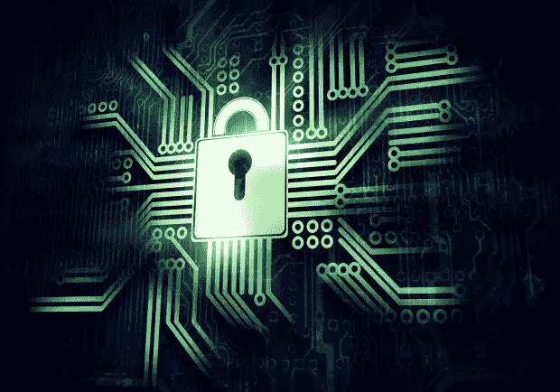
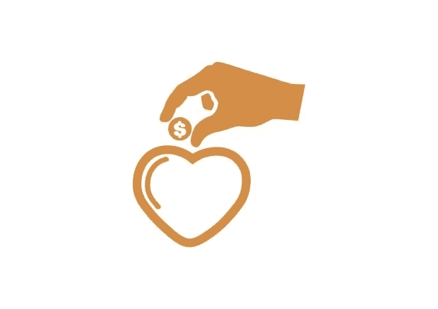

# 区块链正在颠覆的 5 个行业你可能没有想到

> 原文：<https://medium.datadriveninvestor.com/5-industries-the-blockchain-is-disrupting-that-you-probably-didnt-expect-887af0672da1?source=collection_archive---------1----------------------->

人们普遍认为，区块链技术将是世界上有史以来最具颠覆性的技术之一。支撑数字货币比特币的开源技术可以得到扩展，以服务于广泛的用途，并提供一系列对私营和公共部门都有用的不同功能。

区块链技术最常被引用的用例包括支付、金融证券的清算和结算，以及供应链管理流程的数字化。然而，还有更多。

在这篇文章中，你将了解到区块链正在颠覆的五个行业，这可能是你没有预料到的。

**网络安全**

当今世界面临的最紧迫的行业需求之一是强大的网络安全。网络犯罪在过去三年中大幅增加，最近的全球勒索软件攻击，如 [WannaCry](https://www.symantec.com/connect/blogs/what-you-need-know-about-wannacry-ransomware) 和 [Petya](https://www.theverge.com/2017/7/5/15922216/petya-notpetya-ransomware-authors-bitcoin-demand-decrypt) 只是冰山一角。

据估计，每年有近 50%的中小企业成为网络攻击的受害者，到 2019 年，应对网络犯罪的成本预计将超过每年 2 万亿美元。毫不奇怪，世界经济论坛在其 2016 年全球风险报告中把网络犯罪列为企业面临的主要风险之一。

不用说，在这个世界上，企业和公共部门机构都在尽最大努力防止自己成为下一次更先进的网络攻击的受害者，因此对增强网络安全解决方案有着巨大的需求。

区块链可以提供一个大大提高网络安全的解决方案。通过其使用加密技术安全存储数据的能力和分散化，它提供了一个比目前大多数遗留系统更好的网络安全解决方案。

软件安全公司 Guardtime 是首批将区块链技术应用到其网络安全解决方案套件中的公司之一。这家总部位于阿姆斯特丹的公司开发了无钥匙签名基础设施(KSI ),通过运行哈希函数来验证数据的完整性，然后将数据与存储在区块链上的原始数据进行比较。根据 Guardtime 首席技术官 Matthew Johnson 的说法，这放弃了必须依赖个人进行数据认证的问题，因此提供了“对系统中每个组件的来源和完整性的数学确定性”[。](https://techcrunch.com/2016/12/05/how-blockchain-can-help-fight-cyberattacks/)

**投票**

不幸的是，选举并不总是像我们希望的那样民主和“干净”。虽然选举舞弊在发展中国家更为普遍，但就连美国也不能幸免于总统选举中的违规行为和所谓的外部干预。因此，在选举过程中，技术干扰是社会面临的另一个紧迫问题。

由于其固有的以不可改变的方式安全记录、存储和传输数据的能力，区块链技术为选举过程提供了理想的技术解决方案。从合法的选民登记到有效和透明的计票，区块链可以用来使选举达到应有的公平和民主。

一家致力于实现这一目标的初创公司是 [Follow My Vote Inc.](https://followmyvote.com/) ，它正在开发一款总部位于区块链的端到端电子投票软件，允许公民以透明和防篡改的方式直接从他们的电子设备上投票。

**医疗记录**

安全数据存储至关重要的另一个领域是医疗保健行业。不幸的是，医院的网络安全措施非常差，这是一个很大的问题，因为您存储的是机密的医疗记录，网络罪犯可能会利用这些记录牟利。

因此，在区块链上存储医疗记录已经成为一些科技初创公司感兴趣的领域。医疗保健领域最著名的两家区块链初创公司包括 [Gem](https://gem.co/health/) 和 [Tierion](https://tierion.com/) ，前者使用以太坊区块链开发安全的数据共享基础设施，后者为医疗保健行业创建了一个数据存储和验证平台。

**慈善捐赠**

区块链颠覆将给社会带来巨大好处的另一个领域是慈善领域，尤其是对那些最需要帮助的人。不幸的是，慈善捐赠领域滥用资金和其他丑闻的历史导致捐赠减少，因为慈善机构的声誉在英国处于历史最低点，而 T2 2015 年的一项研究发现，35%的美国人对慈善机构缺乏信任。

个人很难相信大型非政府组织会将捐赠的资金真正送到接受者手中，而不会让大部分资金“在途中丢失”。幸运的是，对于非政府组织和捐助者来说，区块链可能提供了完美的解决方案。

通过应用区块链技术以公开可见的方式跟踪捐款支付，可以恢复慈善捐赠部门的信心，因为所有支付都可以实时入账。这将使挪用资金变得更加困难，并将确保捐款的计划接受者实际收到捐款。

总部位于旧金山的 [BitGive Foundation](https://www.bitgivefoundation.org/) 已经在研究这样的解决方案，它正在开发一个名为 GiveTrack 的平台，利用区块链的技术来跟踪慈善捐款。使用 GiveTrack，捐赠者可以在公共平台上实时跟踪他们的资金，查看他们的捐款是如何花费的，并跟踪他们产生的结果。

****

****音乐产业****

**也许面临区块链危机最令人惊讶的行业是音乐行业。目前，音乐产业被集中的中间商所控制，他们从艺人每一步的版税收入中提成。唱片公司、音乐发行商和出版商获得了艺人收入的最大份额。然而，区块链可能会改变这一点。**

**区块链产业的最新发展可能很快会允许艺术家直接获得报酬并完全控制他们的创作内容。这就是总部位于纽约的科技创业公司 [Ujo Music](https://ujomusic.com/) 的设想。Ujo Music 的成立是为了解决音乐行业内的两个紧迫问题；版税支付和许可。Ujo 的目标是建立一个平台，允许艺术家通过使用基于以太坊的智能合同直接分发、许可和接收他们的音乐的直接付款。**

**无论你在哪个行业工作，区块链颠覆都有可能发生。无论是为了提高运营效率、降低成本，还是为了提供更快、更安全的方式来存储和传输数据，区块链正在到来。**