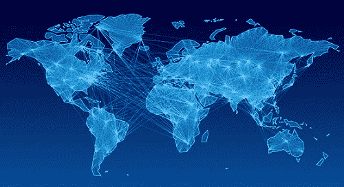
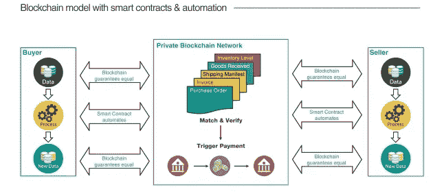
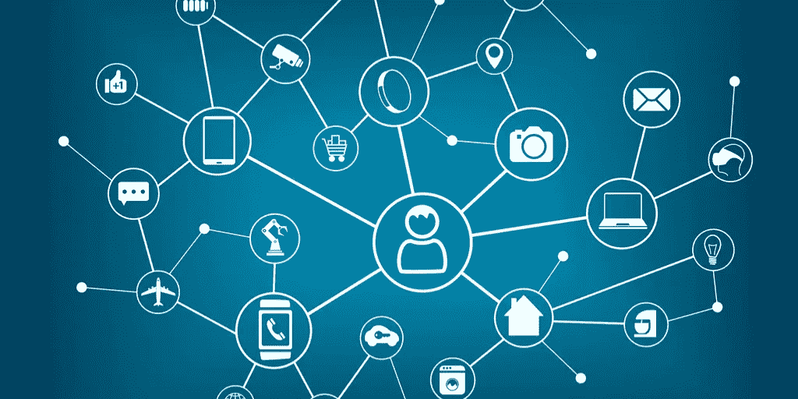
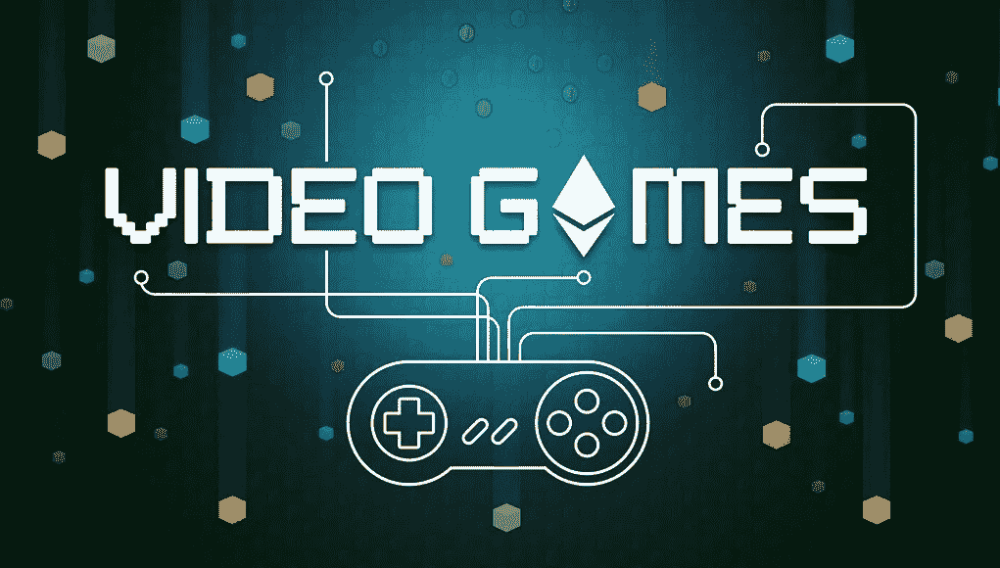
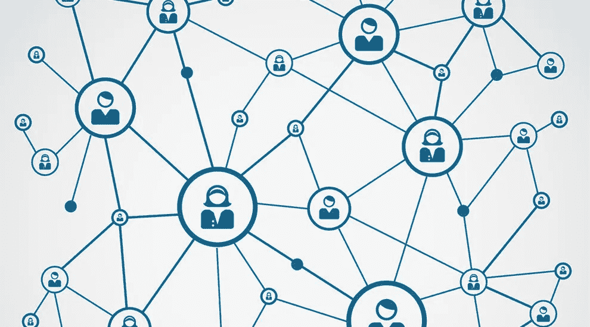

# 区块链技术将彻底改变 5 个行业

> 原文：<https://medium.datadriveninvestor.com/5-industries-which-will-be-revolutionized-through-blockchain-technology-17b379adfcda?source=collection_archive---------1----------------------->

关于区块链技术的现实应用，个人有很多不确定性和模糊性。截至今天，我们正处于即将到来的区块链革命的早期阶段，许多应用将导致日常生活的根本变化。

鉴于该技术尚处于早期阶段，区块链技术的应用仍有很大的增长空间。在这篇文章中，我们将涵盖一些领域，我认为区块链技术具有彻底改变整个行业的巨大潜力。区块链技术在以下领域的应用，将会有指数级的未来增长。

# **1。智能合同支持的供应链**

区块链技术未来最大的应用之一将是在传统的供应链网络上。智能合同的引入将实现买家和供应商之间的自动化订购，从而减少时间并降低交易成本。此外，区块链所有部分的可追溯性和完全透明性将实现更好的订单跟踪，并有助于提高组织的订单管理、存储和库存管理的效率。

# 2.面向物联网的区块链

围绕多种物联网应用(例如，互联家庭、互联汽车、无人驾驶无人机)的最大挑战之一是客户安全和数据保护方面的安全漏洞的潜在影响。实现物联网应用的区块链技术，将增强网络的安全性，这是区块链技术的最大优势之一。因此，物联网的广泛采用将会加快，大量的物联网应用将会开发出来。

# 3.视频游戏产业

对于包括我在内的电脑游戏迷来说:)，一些视频游戏已经被内置到以太坊区块链中，并且这种趋势将会持续下去。区块链的分布式特性将允许利用地理上偏远地区闲置的超级计算机。这将使计算机游戏的图形和互联网服务器容量成倍增加，从而允许开发技术上更复杂的游戏，而个人用户不需要升级他们的计算机到更大的容量来玩这些游戏。

# 4.分散的社交网络

对社交网络最大的批评是，集中式社交网络在没有用户关注的情况下收集和出售个人用户数据是不道德的。利用区块链，将允许创建不受单个组织控制的分散的社会网络。这也将给予个人内容创作者更多的灵活性和权力。

# 5.区块链上的政府数字化

政府可以利用区块链来开发安全存储高度敏感数据的应用程序，或者使用智能合同来创建条约、合作伙伴关系和贸易交易。此外，政府信息和流程的数字化将实现公共部门和公民数据的完全透明和可审计性。由于公共部门的性质，流程传统上非常官僚、繁琐和低效，这可以通过利用区块链技术实现时间和成本效率来改变

尽管加密货币市场迅速崛起，但截至 2018 年，我们仍处于利用区块链技术潜力创造发展的初级阶段。

正如 Pierre Rognion 所说，“西部联盟是柯达，比特币基地是诺基亚，但我们仍在等待 iPhone”