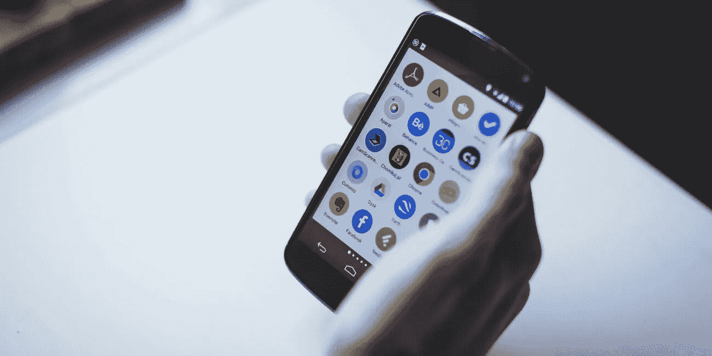
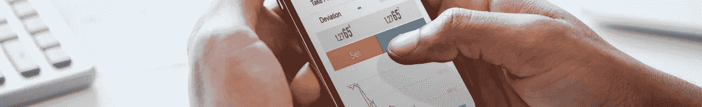

# 2019 年，5 款别出心裁的应用让我们的世界更美好

> 原文：<https://medium.datadriveninvestor.com/5-ingenious-apps-making-our-world-better-in-2019-1939842a5eb0?source=collection_archive---------20----------------------->

## 毫无疑问，技术已经彻底改变了我们生活的世界，而且没有减缓的迹象

*最初发表于*[*【millennialmoderator.com】*](https://millennialmoderator.com/5-ingenious-apps-making-our-world-better)*。*

我记得在 2009 年左右，我在 iPhone 上使用了我的第一个应用程序。这是一个照片编辑应用程序，提供了一些简单的编辑功能，如亮度和添加涂鸦，但它绝对震撼了我的世界。快进到 2019 年，应用程序不仅让我们的生活变得更容易，而且还帮助我们找到全新的生活方式——铺设新的可能性道路，甚至修补那些曾经似乎破碎的道路...

# 1.做我的眼睛

Be My Eyes 是 Hans Jø rgen Wiberg 开发的一款革命性应用，它允许盲人和视障用户通过**视频通话**与来自世界各地的盲人志愿者和公司联系，以解决与视力相关的问题。这款应用程序的众多成功故事之一是一名女性，她在法律上是盲人，但却能够与帮助她升级 iMac 内存的志愿者进行视频聊天。他们简单地在 iPhone 上建立了一个视频电话会议，志愿者指导她整个过程。做我的眼睛是一个极其简单却影响深远的想法。你可以在 [Google Play](https://play.google.com/store/apps/details?id=com.bemyeyes.bemyeyes&hl=en) 和 [Apple Store](https://itunes.apple.com/us/app/be-my-eyes-helping-the-blind/id905177575?mt=8) 上下载应用，也可以在这里观看官方 TedTalk 与汉斯[。](https://www.youtube.com/watch?v=IfeLJxCSLC0)

# 2.Privacy.com

在一个充满数据安全问题的世界里，[privacy.com](https://privacy.com/join/9FZGR)创造了一种使用加密的虚拟卡系统来最小化在线支付欺诈的方法。你不必将你的信用卡信息提交给各种在线服务(这增加了欺诈活动的风险)，你只需将你的信用卡信息上传到 privacy.com 的，然后他们会创建一个你可以在整个网络上使用的**虚拟信用卡**。每笔交易都遵循严格的加密协议，几乎不会留下任何个人卡信息的痕迹。然后，如果一个网站的数据库被黑，攻击者不会有你的个人卡信息，而是虚拟 privacy.com 卡的一次性加密代码。如果你感兴趣，我在这里写了一篇关于这个应用的更深入的文章。

# 3.公平的

引用“年轻人”的原话，我并不热衷于买车。当你把车开出停车场时，会有极度**贬值**的问题，延长**的维护**的寿命，前期/每月**的成本**，再加上如果我四年后想要一辆完全不同的车怎么办？形势对我不利。租车也是一种选择，但你知道我们千禧一代是如何承诺的。如果你正在考虑买车或租车，先看看这篇文章。

[Fair](https://www.fair.com/) 是斯科特·佩因特(Scott Painter)开发的一款应用，允许用户浏览可用车辆列表，获得想要的车辆，支付少量首付+月费即可使用该车，然后随时归还车辆并获得另一辆车！在我看来，这是购买和租赁的完美结合。你的信用评分决定了你有资格获得的优惠，所以请记住，这里涉及到一个**信用检查**。一旦你获得资格，你可以浏览各种车辆类型，包括卡车，汽车，运动，异国情调，豪华和更多。你可以在他们的网站上找到关于这个应用的大量信息。他们也在[招聘](https://www.fair.com/careers/)各种职位！

# 4.英里数

当我们谈到车辆这个话题时，微软的 [MileIQ 应用](https://www.mileiq.com/)是另一个让我们的生活更轻松的伟大工具。该应用程序的功能就像一个全球定位系统，可以跟踪所有的行驶里程，并允许你对旅行的类型进行分类，用于一个非常特殊的目的——帮助你获得最准确的**纳税申报单**！作为一名企业主，我使用这个应用程序准确记录全年的业务里程。如果你想了解更多关于这个应用和你的税收的信息，我写了一篇文章，你应该[在这里](https://millennialmoderator.com/how-to-get-a-bigger-tax-return-gas-mileage)阅读。您还可以在 MileIQ 网站上找到关于该应用的更多信息。

# 5.Ecosia.org 搜索浏览器

这最后一个实际上不是一个应用程序，它是一个网络浏览器，但它绝对值得在这个名单上。Ecosia.org 与谷歌 Chrome 和火狐类似，除了它的独特主张是将 80%的收入用于在世界各地植树。在 Ecosia 浏览器的主页上，有一个活跃的计数器，记录着到目前为止资助的树木数量(他们是这么说的)。该浏览器通过广告产生收入，尽管它确实在其 FAQ 页面上声明[即使你使用广告拦截器或从不点击广告，你仍然通过增加 Ecosia 用户的数量为该运动做出贡献。Ecosia 的月活跃用户越多，它对广告商的相关性就越强。如果这种商业模式真的如其所宣称的那样，那还不错。](https://ecosia.zendesk.com/hc/en-us/articles/201657341)

随着技术的不断发展，我们的生活方式也在不断变化。今天看起来像科幻小说的东西，几乎毫无疑问会在未来 20 年、50 年、100 年里变成科学现实。如果你发现其中一些应用对你的生活或业务有用，请考虑订阅我的私人简讯，在那里我每周分享新兴技术技巧、商业秘密等。也请考虑使用下面的链接分享这篇文章，让我们在 [Twitter](https://twitter.com/alekseyweyman) 上联系吧！

标记为: [TechApps](https://millennialmoderator.com/5-ingenious-apps-making-our-world-better#)

*最初发表于*[*【millennialmoderator.com】*](https://millennialmoderator.com/5-ingenious-apps-making-our-world-better)*。*