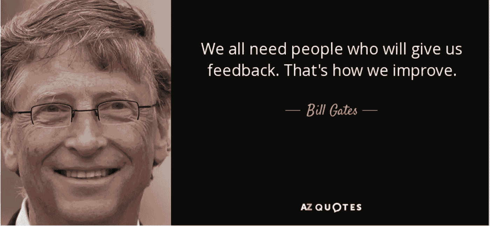
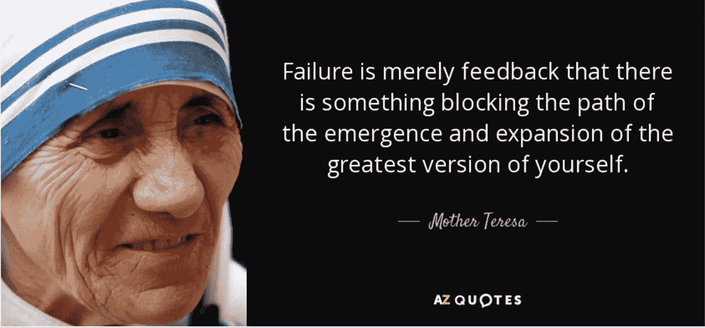

# 构建持续反馈环境的 5 个关键理念！

> 原文：<https://medium.datadriveninvestor.com/5-key-ideas-to-build-a-continuous-feedback-environment-ef04826ab2b7?source=collection_archive---------18----------------------->

## 是什么让人们不断前进！

在组织中，最重要的时间之一是人们接受评估并得到反馈的时候。有些人认为这是一个进步的途径，有些人认为这是另一种形式。为了能够让人们不断前进，组织创造一个持续的反馈环境是至关重要的，而不是让这个重要的方面一年发生一次！！

首先，组织领导必须理解持续反馈的重要性，为了建立这样的环境，他们必须从问**“为什么我们真的应该关心持续反馈环境”**开始

## 为什么—持续反馈环境？

组织领导人必须将人视为一种产品。*组织根据市场反馈不断更新产品的方式，与此类似，组织的人也需要升级到更好的版本。*

这在两个方面帮助了组织:

1.  一个更好的版本，人们会创造出更好的产品。
2.  而且，这将为组织提供对组织内人员素质的洞察。

**现在的问题是我们如何才能打造更好版本的人。答案是通过持续的反馈环境。**

我们都必须明白的一件重要事情是，我们周围的人都会看着我们，并对我们产生一些印象。从不同的人那里获得反馈是关键。我们都需要持续的反馈。

***所以第一个关键是接受这样一个事实:我们都可以得到正反馈、负反馈或中性反馈。重要的是我们如何通过这些持续的反馈来改变自己。***

这是让人们继续前进的动力！

## 应该如何给出反馈？

一个组织必须做的重要活动之一是确保必须给出反馈，以帮助某人实现以下目标:

*   什么是积极的品质
*   有哪些看不到的品质可以帮助一个人成长

这些反馈必须仔细给出，以确保对人们产生积极的影响。为了建立持续的反馈环境， ***关键之二是确保领导者为员工设定具体的、可实现的、可衡量的和相关的目标。领导者必须设定如何实现目标的期望和时间表。***

这将有助于人们接受挑战和被激励。必须不断地衡量目标，并分享结果，以便人们知道他们是否正在变得更好。

这并不容易，因为这需要领导者努力认识到他们对某人的确切期望。领导者必须是不偏不倚的，应该确保每个团队成员都有平等的成长机会。

## 人们应该如何接受反馈并采取行动？

无论反馈是积极的、消极的还是中性的，人们都必须问自己一个问题 ***“那个反馈有任何有效性吗”而不是消极地接受反馈，人们必须接受这个挑战，通过朝着它努力并超出预期来证明他们是错的。***

**对于组织领导者来说，第三个关键是确保每个人都知道反馈的重要性。组织中的人必须理解为什么他们会定期得到反馈，以及这如何有助于带来改进。**

## 最后，什么时候是给出反馈的合适时机？又是怎么做到的？

因此，现在的问题是，作为建立持续反馈环境的一部分，应该多长时间提供一次反馈，以及什么时候是合适的时间。

如果我们注意到 Scrum 产品的开发，每 2 周我们就会在产品中建立新的增强/特性来创建一个改进的版本。

与此类似，团队中的人必须每两周接受一次反馈。组织必须促进这种文化。

***关键 4 是当每个人都向其他团队成员提供服务时，要有 360 度的视角。对于如何给出反馈，他们都必须得到适当的指导。同时，团队成员必须从领导者那里得到反馈，领导者必须从团队中的每个人那里得到反馈。***

***关键 5 是保持整个反馈过程的匿名性，这样人们就可以专注于提高自己，而不是对给出负面反馈的人产生怨恨。***

## 结论——反馈带来更好的你！

> “不管你认为自己作为一个领导者有多好，天哪，你周围的人会对你如何变得更好有各种各样的想法。所以对我来说，领导力最基本的一点是保持谦逊，不断获得反馈，努力变得更好——因为你的工作就是努力帮助其他人变得更好。”
> **–金永吉**

给予和接受反馈是一门艺术，必须学习并与他人分享。努力寻求反馈是看待事物最积极的方式。

***我们都想明白需要添加什么属性，如何让自己成为更好的版本！！***

> “我认为有一个反馈环非常重要，在这个反馈环中，你会不断思考你已经做了什么，以及如何才能做得更好。”
> **——埃隆马斯克**