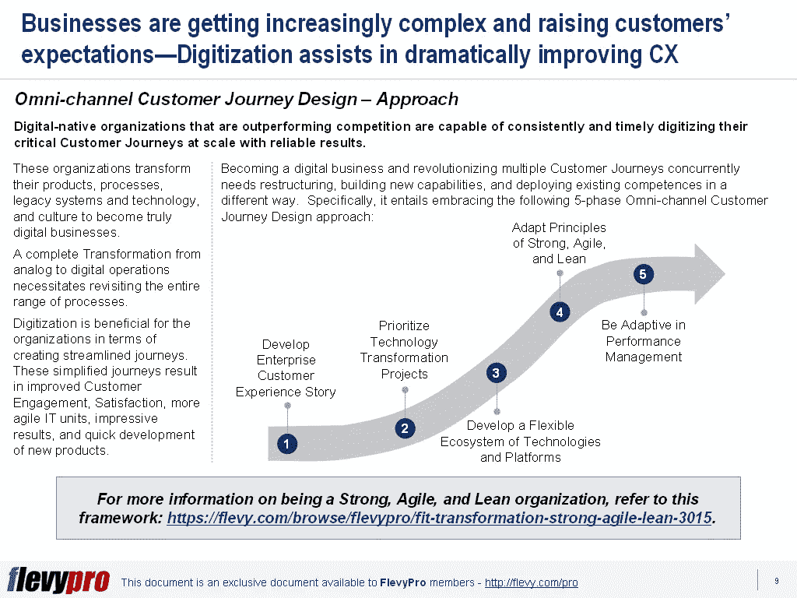

# 强大的全渠道客户旅程设计方法的 5 个关键要素

> 原文：<https://medium.datadriveninvestor.com/5-key-ingredients-of-a-robust-omni-channel-customer-journey-design-approach-57785820315b?source=collection_archive---------6----------------------->

业务变得越来越复杂，客户的期望也越来越多。数字组织正在大规模数字化其关键的[客户旅程](https://flevy.com/business-toolkit/customer-journey)，以超越竞争对手。这些组织正在使用数字化来创建简化的旅程，从而实现更敏捷的 IT 部门、新产品的快速交付以及改进的客户体验和参与。

但在开始数字化和简化客户旅程之前，组织需要转变其产品、流程、遗留系统和技术以及文化，以成为真正的数字化企业。

同时简化多个客户的旅程需要整合现有的系统，构建新的功能，并以不同的方式部署现有的能力。具体来说，它需要采用以下五阶段 [**全渠道客户旅程设计**](https://flevy.com/browse/flevypro/omni-channel-customer-journey-design-3984) 方法，这对于改善[客户体验](https://flevy.com/business-toolkit/customer-experience)和实现更高的客户参与度至关重要:

1.  **开发企业客户体验案例**
2.  **优先考虑技术改造项目**
3.  **开发灵活的技术和平台生态系统**
4.  **适应强大、敏捷和精益的原则**
5.  **适应绩效管理**

现在，让我们谈谈全渠道客户之旅设计方法的前 3 个阶段。

# 阶段 1 —开发企业客户体验案例

创造客户体验故事需要建立客户体验团队。客户体验团队首先确定客户关系中的关键因素和主要关注点。然后，围绕这些主题，他们以故事的形式仔细概述客户在与公司的每次互动中可能遇到的体验。企业客户体验故事对每家公司来说都是独一无二的，它用可行的术语总结了战略、品牌和定位。

接下来，该团队确定能够有效传递对利用数字化的客户至关重要的因素和特征的旅程。应对每个旅程进行批判性分析，以评估其重要性、与扩展它相关的成本优势、治理和技术障碍，以及管理它的充足财务和领导资源的可用性。对客户旅程的全面分析产生了一个行动计划，有助于创建优先的旅程。

# 第 2 阶段—确定技术改造项目的优先级

在其他变革计划中，IT 转型通常是最具挑战性和最需要资源的。例如，设计一个移动应用程序很简单，然而，将该应用程序链接到客户使用的所有渠道，并将其与[后端系统](https://www.webopedia.com/TERM/B/back_end_system.html)集成才是复杂的。

为了进行数字化，公司应该避免单独数字化每个旅程——因为这助长了内部孤岛——并在互联网或移动渠道信息技术上进行大量投资。对于组织来说，更好的方法是优先考虑 IT 计划，以实现 IT 架构的平稳转型，增加更多的客户旅程。标准的 IT 组件可以在不同的旅程中重用。

# 第 3 阶段—开发灵活的技术和平台生态系统

数字化核心旅程和扩展数字化的一个重要考虑因素是将您的 IT 系统与公司外部的技术和平台相连接。这些外部系统为组织提供了几个优势，包括快速访问新客户、数据池和功能。

下一代集成架构的设计应该支持开放标准、动态交互模型，并减少安全威胁。云计算和技术基础设施的进步使得快速、轻松地访问、管理和操作基础设施资源成为可能，包括网络、服务器、数据库、程序和服务。管理这些[技术生态系统](https://flevy.com/browse/flevypro/digital-transformation-technology-ecosystem-3447)所需的技能包括 [DevOps](https://en.wikipedia.org/wiki/DevOps) 专家监督开发和运营的整合、企业架构师、云工程师管理软件和云计算、数据科学家和自动化工程师。

有兴趣进一步了解[客户旅程设计方法](https://flevy.com/browse/flevypro/omni-channel-customer-journey-design-3984)的其他关键阶段吗？你可以在[Flevy documents market place](https://flevy.com/browse)的**全渠道客户之旅**这里下载[一个可编辑的 PowerPoint。](https://flevy.com/browse/flevypro/omni-channel-customer-journey-design-3984)

## 你在这个框架中找到价值了吗？

您可以从 [FlevyPro 库](https://flevy.com/pro/library)下载关于这个和数百个类似业务框架的深入介绍。 [FlevyPro](https://flevy.com/pro) 受到 1000 名管理顾问和企业高管的信任和使用。有些人不得不说:

> “我的 FlevyPro 订阅为我提供了当今市场上最受欢迎的框架和平台。它们不仅增加了我现有的咨询和辅导产品和服务，还让我跟上了最新的趋势，为我的实践激发了新产品和服务，并以其他解决方案的一小部分时间和金钱教育了我。我强烈推荐 FlevyPro 给任何认真对待成功的顾问。”

–战略商业建筑师事务所创始人比尔·布兰森

> “作为一家利基战略咨询公司，Flevy 和 FlevyPro 框架和文件是一个持续的参考，有助于我们为客户构建我们的调查结果和建议，并提高他们的清晰度、力度和视觉效果。对我们来说，这是增加我们影响力和价值的宝贵资源。”

–Cynertia Consulting 的咨询区域经理 David Coloma

> “作为一个小企业主，FlevyPro 提供的资源材料已被证明是非常宝贵的。根据我们的项目事件和客户要求按需搜索材料的能力对我来说很棒，并证明对我的客户非常有益。重要的是，能够针对特定目的轻松编辑和定制材料有助于我们进行演示、知识共享和工具包开发，这是整个计划宣传材料的一部分。虽然 FlevyPro 包含任何咨询、项目或交付公司都必须拥有的资源材料，但它是小公司或独立顾问工具箱中必不可少的一部分。”

–变革战略(英国)董事总经理迈克尔·达夫

> “作为一名独立的成长顾问，FlevyPro 对我来说是一个很好的资源，可以访问大量的演示知识库来支持我与客户的合作。就投资回报而言，我从下载的第一个演示文稿中获得的价值是我订阅费用的好几倍！这些资料的质量让我能够打出超出自己体重的水平，这就像是用很小一部分开销就能获得四大咨询公司的资源一样。”

–Roderick Cameron，SGFE 有限公司的创始合伙人

> “我每个月都会浏览几次 FlevyPro，寻找与我面临的工作挑战相关的演示文稿(我是一名顾问)。当主题需要时，我会进一步探索，并从 Flevy 市场购买。在所有场合，我都阅读它们，分析它们。我采纳与我的工作最相关和最适用的想法；当然，所有这些都转化为我和我的客户的利益。"

量子 SFE 公司首席执行官奥马尔·埃尔南·蒙特斯·帕拉

在 [**管理和企业咨询**](https://app.ddichat.com/category/management-and-corporate-consulting) **:** 中安排一个 DDIChat 会话

 [## 专家-管理和企业咨询- DDIChat

### DDIChat 允许个人和企业直接与主题专家交流。它使咨询变得快速…

app.ddichat.com](https://app.ddichat.com/category/management-and-corporate-consulting) 

在这里申请成为 DDIChat 专家[。
与 DDI 合作:](https://app.ddichat.com/expertsignup)[https://datadriveninvestor.com/collaborate](https://datadriveninvestor.com/collaborate)
点击此处订阅 DDIntel [。](https://ddintel.datadriveninvestor.com/)