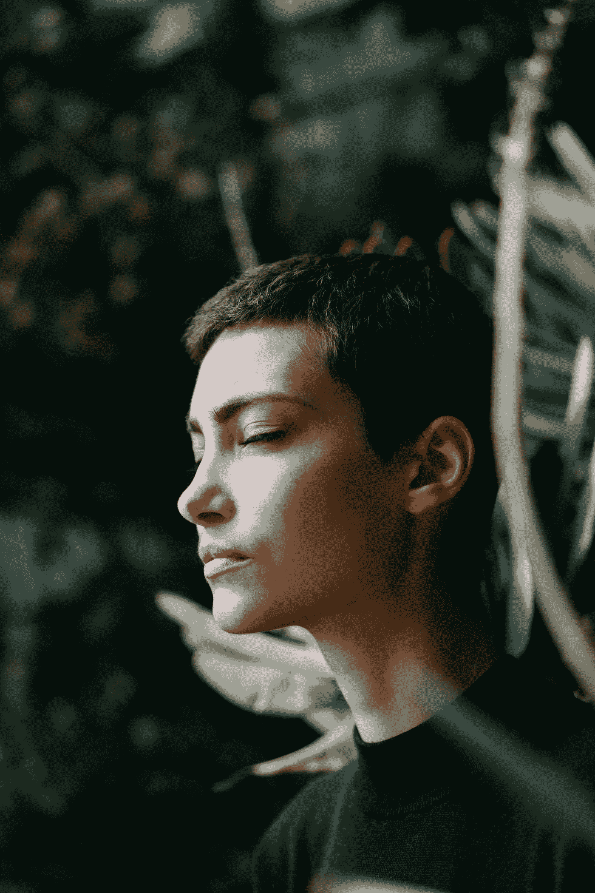

# 正念的 5 个关键

> 原文：<https://medium.datadriveninvestor.com/5-keys-to-mindfulness-bb396755938b?source=collection_archive---------5----------------------->

## 在体育、创业和生活中——我的职业运动员布莱恩·约翰逊和瑞安·霍利迪的笔记

Photo by [Motoki Tonn](https://unsplash.com/@motoki?utm_source=medium&utm_medium=referral) on [Unsplash](https://unsplash.com?utm_source=medium&utm_medium=referral)

# 1.开始写日志

我一直喜欢写日志。关于我作为职业运动员在生活中所学到的东西。关于我的冒险[游记](https://medium.com/@Trevor_Huffman/i-do-love-to-really-travel-5be224f94185)。关于我对自己人生方向的感觉，我的下一个目标和梦想是什么…我想创建什么样的创业公司。如果我不把一些东西写在纸上，每天看到它，它就失去了价值。

> 写日记帮助我跨越情感、感觉、想法、思想、恐惧、怀疑和障碍，成为勇敢行动的一小步。

打开脑波音乐，比如[这首](https://www.youtube.com/watch?v=dJoXVILGeKQ)，试着写日记。开始写吧，等等，等等，看看当你每天花 10 分钟写这些东西时会发生什么。

畅销书作家瑞安·哈乐黛在他的书《静止是关键》中谈到了安妮·弗兰克的日记习惯:

> 安妮用她的日记反思道:“如果在一天结束的时候，他们能检讨自己的行为，权衡是非，那么每个人都会变得多么高尚和善良。”。在新的一天开始时，他们会自动尝试做得更好，过一段时间后，肯定会完成很多事情。"

布莱恩·约翰逊写道，“有一个滑稽的长长的名单，上面列着各种各样的人，他们都曾实践过写日记的艺术——包括马库斯·奥勒留、拉尔夫·沃尔多·爱默生、anaïs·宁和本·富兰克林。”

 [## 成功人生的 25 种自我提升方式|数据驱动的投资者

### “我活得越久，学到的就越多。学的越多，体会的越多，知道的越少。”―米切尔·莱格兰德时间到…

www.datadriveninvestor.com](https://www.datadriveninvestor.com/2019/03/12/25-self-improvement-ways-for-a-successful-life/) 

如果这份高成就者的名单被记录下来，我也要尝试一下！

# 2.练习每日静止

像写日记一样，静心和正念需要纪律和日常练习。

职业体育和大学体育教会我，在一贯的实践中，纪律是成为丛林之王的唯一规则*。如果在我们希望改善的事情上没有纪律，我们就是骗子。假货。骗子。黑客。崇拜者。在[我的体育世界](https://medium.com/@Trevor_Huffman/what-it-feels-like-to-guard-stephon-marbury-f78e137e640d)里，有一个基本的需要，那就是在你的游戏的基础上保持纪律。当你通过冥想、散步、瑜伽或每天花十分钟保持安静来训练自己时，你正在提高正念。*

*这种平静和专注会延续到任何关系、创业、工作或婚姻中。和平与存在感就像一颗扔进平静池塘的鹅卵石一样荡漾开来。*

> *“正是在这种静止中，我们才能在场并最终看到真理。正是在这种寂静中，我们才能听到自己内心的声音。”—瑞安·霍利迪*

# *3.限制你的输入*

**

*Photo by [Yannic Läderach](https://unsplash.com/@yl_photography?utm_source=medium&utm_medium=referral) on [Unsplash](https://unsplash.com?utm_source=medium&utm_medium=referral)*

*赫伯特·本森告诉我们: ***“丰富的信息造成了注意力的匮乏。”****

> *我感觉到我内心最深处的声音在等待被倾听，被重视，然而还有无数其他的输入试图分散我真实的自我。*

*这些干扰是 99%的快速发展的数字世界所鼓励的。*

## *战胜分心和投入的最好方法是什么？*

*我听到尼克·萨班，阿拉巴马著名的足球教练说:*

> *“纪律就是每天执行和做你知道自己应该做和不应该做的事情。”*

*限制输入是关于执行你不应该做的事情。*

*关掉电视。*

*放下或限制 iPhone 的使用。*

*下班后停止查看邮件。*

*把电子产品带出你的卧室。*

*纪律是知道你需要日复一日地关掉这个世界，即使你不想做也要去做。*

**

*Photo by [Iqx Azmi](https://unsplash.com/@iqxazmi?utm_source=medium&utm_medium=referral) on [Unsplash](https://unsplash.com?utm_source=medium&utm_medium=referral)*

# *4.实践美德*

> *"伟大的本质是认为美德已经足够."——拉尔夫·瓦尔多·爱默生*

## *什么是美德？*

*美德是表现出高道德标准的行为。你练习耐心吗？纪律？幽默？善良？同情心？真实性？*

*许多斯多葛派说，以持续的美德生活是我们一生中唯一应该关心的事情——作为父母、教练、首席执行官、运动员、雇员或作家。布莱恩·约翰逊说，“我们必须记住，美德是通过我们的行动实现的。当我们努力以我们珍视的美德生活在越来越深的完整性中时，我们培养了一种“灵魂力量”，当我们面临不可避免的挑战时，我们可以利用它。”*

*这就是我们如何实时练习静止和正念。保持冷静，准备行动。深呼吸，然后投篮。*

# *5.恢复——倾听你的思想、身体和精神*

*静心和正念的练习和训练需要知道何时恢复。你不能在三个层面上推动成长:思想+身体+精神，然后不给自己恢复的空间。在体育运动中，如果你最大限度地训练你的身体，你也必须努力恢复。瑞安·霍利迪谈到了温斯顿·丘吉尔，一个创作了数百万字和数千幅画的人，碰巧他还领导英国推翻了纳粹政权，但他也知道如何静坐。*

> *温斯顿·丘奇希尔以长时间的午睡、数小时的绘画、阅读和独处而闻名，他知道休息和恢复与他所做的任何工作一样重要。*

*什么有助于恢复？*

****静止不动*。***

*安静。*

*写日记。*

*睡觉。*

*祈祷。*

*冥想。*

*瑜伽。*

*做更多能带给你平静和快乐的事情。*

*在佛教中。禁欲主义。享乐主义。基督教。印度教。几乎不可能找到一个哲学流派或宗教不推崇这种内心的平静——这种*静止*——作为最高的善。*

*这是体育运动中精英表现的关键，是头脑、身体和精神之间的联系。*

> *“当古代世界的所有智慧基本上都同意某件事时，只有傻瓜才会拒绝倾听。”— [赖安·霍利从静止状态是关键](https://amzn.to/2qQ4hx6)*

## *感谢您的阅读。*

## *更多超棒的斯多葛主义运动、旅行、个人成长故事在[特雷弗·霍夫曼](https://medium.com/u/5e7157084b29?source=post_page-----bb396755938b--------------------------------)*

*PS。所有亚马逊联盟的佣金都归我的写作基金。*