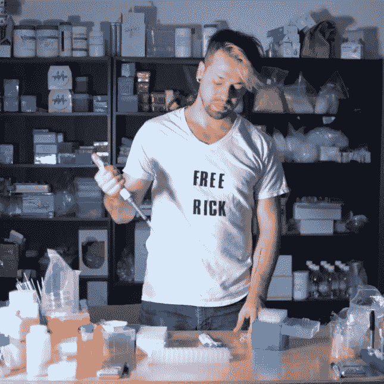
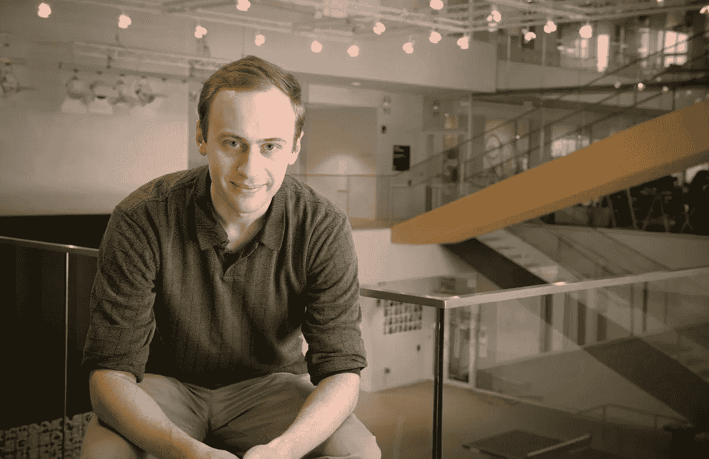
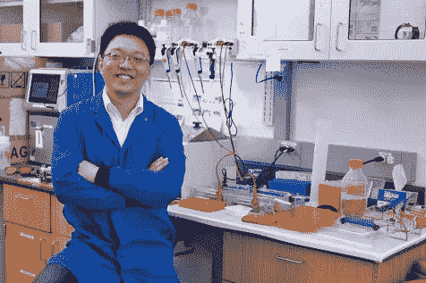
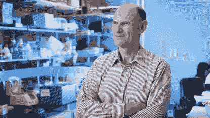
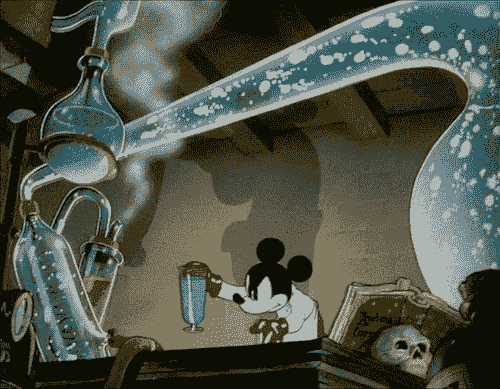

# 5 个“疯狂”的科学家值得关注👀

> 原文：<https://medium.datadriveninvestor.com/5-mad-scientists-to-watch-11b7df660e0e?source=collection_archive---------3----------------------->

## Zayner，Esvelt 和其他从事酷项目的基因工程师。

# 我从小就认为疯狂的科学家只是出现在电影里。

(Credit: Disney’s Flubber)

像布雷纳德教授和他的粗口，约翰哈蒙德和侏罗纪公园，博士埃米特“博士”布朗从回到未来，博士 Doofenshmirtz 从菲尼亚斯+ Ferb，和 Yzma +克朗克从皇帝的新凹槽和他们的涂料过山车入口到他们的秘密巢穴。😎

Iconic. 😍This is how I want to enter my future lair one day!

我觉得这些科学家很酷，我想成为他们那样的人。

我想从事很酷的实验来解决问题，但有一段时间，我认为成为“疯狂科学家”只是电影里的职业。

直到我开始了解技术+创新公司和致力于利用现有和开拓性新技术的人的力量，我才意识到:

## “疯狂的科学家”就在我们身边。🤯

他们是*创新者、创造者、*和*远见者*，敢于跳出框框思考，挑战传统的做事方式。

疯狂科学家是从事看似疯狂的项目和空想的技术人员。

Moonshot 想法是被认为是“不可能实现”的挑战解决方案的想法。

例如，登上月球是一次登月计划。😉

我非常兴奋的一项技术是使用像 **CRISPR Cas-9** 和 **Prime Editing 这样的工具的基因工程。** 🧬

虚构的疯狂科学家约翰·哈蒙德利用基因工程为《侏罗纪公园》创造了恐龙🦕，但是我要给你介绍**五个现实生活中的遗传学疯子科学家来看。**

 [## 幸福的算法？数据驱动的投资者

### 从一开始，我们就认为技术正在使我们的生活变得更好、更快、更容易和更实用。社交媒体…

www.datadriveninvestor.com](https://www.datadriveninvestor.com/2019/03/08/an-algorithm-for-happiness/) 

所有这些遗传学家/工程师/疯狂的科学家正在利用遗传学+遗传工程的力量来解决一些世界上最大的问题！

让我们来看看:

# 1)乔赛亚·扎伊纳——生物黑客

(Credit: Stat)

遇见约西亚👋

奥丁基因编辑工具背后的疯狂科学家/生物黑客。

我两周前刚刚收到我的工具包，这太不可思议了！

Josiah 用 CRISPR Cas-9 做过一些疯狂的项目，包括给自己注射过几次。🤯其中一个项目是在他身上进行微生物群移植，看看他是否能治疗他的肠道健康和其他问题。

他以前是美国国家航空航天局的研究员，研究火星殖民地的栖息地设计。👽

离开美国国家航空航天局后，他变得对基因编辑充满热情，并使其更容易为公众实验所用。那时他创造了 ODIN，这使得基因编辑对公众来说更便宜更容易。

# 2)凯文·埃斯韦尔特——进化生物学🦖

(Credit: Harvard Magazine)

凯文是麻省理工学院媒体实验室雕塑进化小组的生物学家。

他在基因驱动和工程生态系统方面做了很多工作。

基因驱动是一种基因工程技术。

它通过*改变特定等位基因传递给后代的概率，在群体中传播一套基因。*

他参与的一个项目是通过基因工程改造白足鼠来对抗莱姆病。给一点背景，白足鼠在*获得+传播蜱传疾病方面很厉害。*

围绕工程生态系统及其对我们环境的影响，有很多伦理上的争论。

看看凯文做的这个关于开放工程生态系统的 Ted 演讲，了解更多。

# 3)Joanne Chory——植物遗传学🌱

乔安妮是我最喜欢的基因工程师之一！

她是索尔克研究所的植物遗传学家+生物学家。

在过去的 30 年里，乔安妮一直在研究植物，并利用她的**“超级植物”致力于解决气候变化的碳排放问题**

她在植物遗传学方面的工作令人难以置信，可以帮助抑制我们大气中的碳含量，减缓气候变化的影响！🤯

受 Joanne Chory 的[“理想植物项目”的启发，我写了这篇关于在被子植物(一种植物分类，专门针对开花植物)中吸收更多碳的文章](https://www.salk.edu/science/power-of-plants/)。

还可以看看乔安妮的关于增压发电厂的 TED 演讲。

# 4)斯坦利·齐——重塑克里斯普·🧬

Stanley Qi 是一名生物工程师兼生物技术专家，他正在重新发明我们如何使用 CRISPR Cas-9(一种基因编辑工具)。

他使 CRISPR Cas-9 中的 Cas-9 的 DNA 切割酶失效，创造出死亡的 Cas9，也就是 d Cas9。

将不同的分子(例如，荧光标签或酶)捆绑到 dCas9 上，产生了许多新的 DNA 操纵器。

在斯坦利重新设想之前，CRISPR Cas-9 只能改变基因内的 DNA 碱基。

dCas9 赋予基因工程师开启和关闭基因的能力。

要了解更多信息，请查看关于 dCas9 基因调控的视频。

# 5)胡安·卡洛斯·伊兹皮苏阿·贝尔蒙特——基因表达

胡安是索尔克研究所的基因表达教授，乔安妮也在那里工作😉).

他建立了索尔克再生医学中心，并在利用基因表达进行组织再生方面做出了惊人的研究。

## 贝尔蒙特团队的几个研究项目。😍

*   **开发了第一个将人类干细胞整合到动物胚胎中的可靠方法。**
*   **发现被称为异染色质的紧密包装的 DNA 束的退化与衰老有关。**这将带来治疗和预防衰老相关疾病的新方法。
*   **开发一种技术来消除胚胎或卵子中的线粒体突变。他的团队在老鼠身上开发了这项技术。🐭**

Yzma + Kronk would be proud! 👏

# 最重要的信息。😉

*   “疯狂的科学家”是那些疯狂到足以实现他们的登月想法的人。
*   **基因工程师使用 CRISPR Cas-9、Prime Editing 等工具，对生物体进行基因工程+解决大问题。**
*   **Josiah Zayner 正在向公众提供 CRISPR Cas-9。**
*   Kevin Esvelt 是生态系统工程师。
*   Joanne Chory 正在创造超级工厂来帮助减缓气候变化的影响。
*   **斯坦利·齐重新构想了 CRISPR Cas-9，发明了 dCas-9。**
*   Juan Carlos Izpisua Belmonte 致力于组织再生+衰老相关疾病的研究。

疯狂的科学家不再只是电影里的东西。

他们都是那些疯狂到认为自己可以改变世界，并坚持不懈地让它发生的人！

基因工程师和其他疯狂地致力于未来技术的技术专家是今天的疯狂科学家。

要开始学习基因工程，请查看以下资源:

*   [基础知识](https://learn.genetics.utah.edu/)
*   [基因编辑工具包](https://www.the-odin.com/)来自奥丁
*   [CRISPR 课程简介](https://info.abmgood.com/crispr-crash-course)

如果你有一个你非常热爱的想法，坚持下去，花更多的时间去实现它。🚀

谁知道，你可能是下一个改变世界的“疯狂科学家”？

> “你疯了，精神错乱，完全失去了理智。但我要告诉你一个秘密。最好的人都是。”—爱丽丝梦游仙境

(Credit: Disney)

👋嘿！非常感谢您阅读这篇文章！

我叫阿达拉，十六岁，是一名活动家、作家、有抱负的遗传学家、遗传工程师、海洋生物学家和宇航员。我也是一个疯狂的科学家。😉

我非常热衷于利用基因工程等新兴技术来帮助解决一些世界上最大的问题。

坐过山车🎢这是我作为一名年轻的疯狂科学家的旅程，请在 Linkedin 和 T2 Twitter 上与我联系！

更多关于遗传学、技术和其他我感兴趣的话题的文章，请关注我的[媒体博客](https://medium.com/@astronautadara)。如果你喜欢这篇文章，给我一些👏所以我知道要写类似的。

现在我该回到我的老巢，也就是我家的实验室，做一些遗传学项目了。🧬

下次见！

✌️Dara