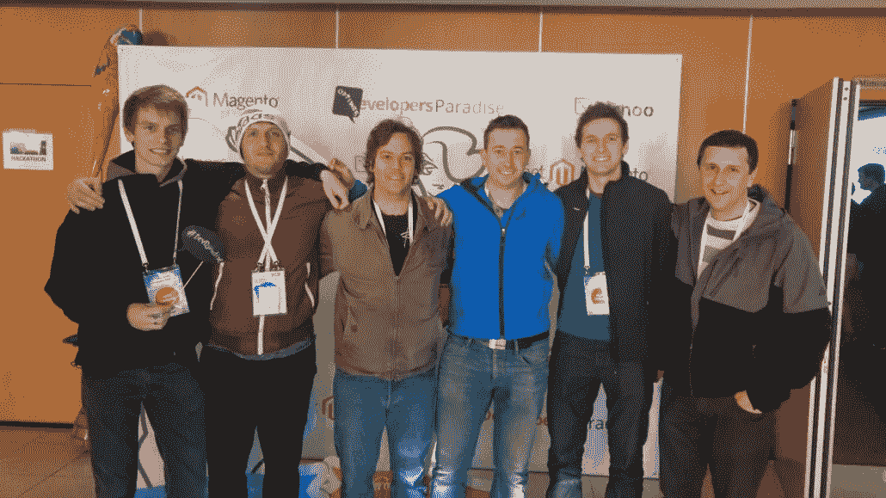
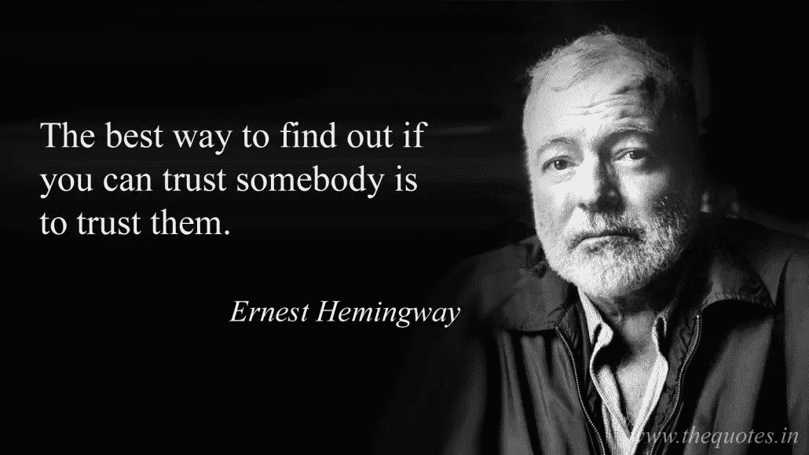

# 5 个里程碑:我的 40 名员工之路

> 原文：<https://medium.datadriveninvestor.com/5-milestones-my-road-to-40-employees-54d3242b5ff2?source=collection_archive---------21----------------------->

如果没有一个愿景，一个创造附加值的愿望，尤其是没有不断进步的愿望，我永远不会在 19 岁时踏上创业之路。

从一开始，我的最终目标就是拥有一个氛围愉快的公司，在那里我的员工会很开心——我很快发现良好的条件也会带来一流的结果，从而让客户满意。

## 尽管如此，我们上山的起点并不容易。

我们从错误和测试不同的实践中学到了很多。然而，在我们成长的最初阶段，我不得不采取的最艰难的步骤是那些从外表看不到的步骤:我的内在变化。也就是说，所有产生增长的里程碑都是建立在对同事的高度信任和责任转移的基础上的——这两个术语在我刚开始的时候看起来像科幻小说，但现在对我来说是不可或缺的。

## 那么我们在谈论什么变化呢？为什么？什么时候？怎么会？

我们一个一个来。:)作为一名企业家，如果说我学到了什么，那就是耐心。没有值得拥有的东西是一夜之间得来的。

# 创业就像坐过山车或者养孩子

公司的成长就像过山车。

首先，你需要鼓起勇气去骑行。接下来是费力的——尤其是缓慢的——攀爬，这时你似乎真的没有任何进展。当你到达某个高度时，你就踏上了前进的道路，充满了起伏，夏日的阳光和风吹拂着你的头发。一直以来，你需要相信你会活着回来(尽管我不得不承认我有过怀疑)，带着新的经历和过山车上的全体工作人员**。**

**这趟旅程的最终目的地是哪里？一家成功、独立的公司知道自己的潜力，同时也知道自己的弱点，这些弱点不再是负担，而是继续发展的动力和理由。**

**这个过程也可以比作抚养一个孩子；你需要慢慢地给他们更多的自由，相信他们知道什么对他们最好。与此同时，你需要相信一切都会有好的结局——即使是在他们第一次参加聚会的时候。**

# **在开始的时候，你需要支付你的会费**

**在这里，用婴儿来比喻再恰当不过了。如果你想让你的孩子成长为一个坚强、独立的人，你需要在他们小的时候给予他们所有需要的关注。孩子需要你胜过你需要一个假期；毕竟，这是他们最脆弱和敏感的时期。**

**公司也是如此。大多数公司一开始就失败了，因为许多人没有意识到这项任务有多么严肃和具有挑战性。由你来负责公司正常运转所必需的所有重要事情:销售、预约、项目实施、会计、财务、招聘等等。**

> **一个很大的创业优势是当你“被迫”自己照顾所有重要的功能。这就是你如何计算出完成某项工作需要多少时间和精力，然后你再把它交给其他人。**

**当工作堆积如山，时间越来越紧迫时，你会到达第一个里程碑:我是应该继续像现在这样，还是应该走上真正的创业之路**？**
这时你意识到一天只有 24 小时，你终于承认自己需要帮助。很多帮助。:)**

**在这个阶段，“孩子”应该很快被引入独立和负责任的生活，**这样他们就不再依赖你了**。**

**怎么会？尽快地，你应该划分责任，把你的任务交给在他们领域里是专家的同事。这样，公司就可以自己运转和繁荣，而不依赖于你。**

# **引入新角色**

## **2012 年:移交执行部分**

**我的第一个更大的里程碑是移交操作部分，成为项目经理。这一部分是最容易的，因为我觉得一切都在我的掌控之中。我只是需要擅长执行任务的人。这就是大卫·伯根特介入并接手我大部分工作的地方——他也是第一批在这里工作的人之一。大卫，谢谢你！**

**随着时间的推移，我也把管理项目的工作移交给了我的同事，他们都接受过这方面的培训，所以我完全脱离了表演的世界。**

**在这一点上，我想强调的是，如果你“被迫”自己处理所有重要的功能，包括操作部分，这是一个很大的创业优势。这就是你如何计算出**完成某项工作需要**多少时间和精力，然后你再把它交给其他人。**

## **2015 年:移交行政和会计**

****开发票**每个月都要花费我相当多的时间(尤其是紧张)，因为那时我们已经开了 100 多张发票，每张都要检查几次。在这里，我们还可以找到各种未支付的索赔，遗憾的是，它们是待办事项列表中的最后一项。**

**我工作的这一部分非常不舒服。我一直在拖延，所以很多次讨债都不成功，结果，公司因此陷入财务困境。**

**这就是我需要被踢屁股的地方，幸运的是，[韩国](https://www.optiweb.com/employee/rok-meglic/)非常乐意这么做。:)**

**我们一起意识到，我们缺少一个人来承担建立整个行政和会计系统的挑战。**

**当我的同事[tjaa Rupar](https://www.optiweb.com/employee/tjasa-rupar/)成功完成这项任务时，我开始慢慢意识到我可能不是我们所有工作的最佳人选。慢慢地，我也开始相信自己，我走的路是正确的。所有其他职位都慢慢被那些只需要处理自己工作的人接管，所以**他们可以成为各自领域的专家**而我可以专注于首席执行官的职位。**

****

**Yup, it was a lot of work organizing everything at the very beginning … :)**

## **2016–2017:建立个人团队并任命团队领导**

**我认为这个阶段是最自然的阶段。这不是一夜之间发生的，但原因非常清楚。**

**所有员工在两个办公室一起工作。但是由于每个团队都有自己的工作线，我们很快就陷入了一片混乱。首先，我们将 WordPress 团队**和 Magento 团队**分开——在那个时候，这是我们工作的仅有的两个平台。**

**这种分离的原因也是我们最优秀的 Magento 开发者在 2016 年 4 月奥西耶克 Magento Paradise 大会上的访问。
参观会议期间，这些家伙**形成了强大的纽带**——无论是在职业层面还是个人层面。他们谈到了仍在他们面前的工作，他们确定了进步和发展的无限可能性。ane Harej 接下了这个任务，并要求自己带领整个 Magento 团队更上一层楼，因此他自然而然地成为了团队的领导者，这是不必要的。**

****

**The green dragon expedition: Aleš Cankar, Rok Meglič, Anže Harej, Janez Alič, Tilen Habjan, Aleš Sušnik**

**我发现这非常有趣，从那以后，我总是鼓励团队一起参加会议。这种团队建设真的可以创造奇迹。:)**

**随着 Magento 团队的形成，唯一合乎逻辑的步骤是组建其他团队，因为内部目标规划具有非常积极的影响。不久之后，我们有了自己的团队，成为团队领导者的挑战落在了[安热·斯沃利萨克](https://www.optiweb.com/employee/anze-svoljsak/)身上(他是团队中最有经验的)。**营销团队**最初由[帕特丽夏](https://www.optiweb.com/employee/patricia-rupar/)领导，后来她的职位由[纳塔莎](https://www.optiweb.com/employee/natasa-ravnikar/)接替。随着公司的进一步发展，我们在 2016 年底和 2017 年底组建了一个**销售**团队(团队负责人 [David](https://www.optiweb.com/employee/david-bozic/) )和一个**设计**团队(团队负责人 [Darko](https://www.optiweb.com/employee/darko-atanasov/) )。**

**我真的想感谢你们所有人，ane s、ane h、Nataš a、Darko、David 以及 Patricia，感谢你们自己承担起了这一重任——你们的工作令人惊叹。**

# **2016:交出销售**

**2016 年，我们面临另一个重大考验:我的同事们是否有信心保持我们设定的收入水平。放弃销售对我来说是最艰难的一步；尽管如此，公司还是依赖于它。但是当我第一次见到大卫时，我被说服了——我的希望得到了回报。这些数字只会上升，这要感谢整个团队，但特别要感谢大卫把我们的极限推得更高。**

> **如果你发现某个客户与你完全不合，如果你是首席执行官，就很难解雇他们。但是当销售在别人手里的时候，就变得容易多了。**

**这也为我打开了新的可能性。以前，我有太多的工作要做，无法将我对销售方法的想法付诸实践，但现在我有了更多的时间，我终于可以将我的一些想法付诸实践了。我们最终引入了 CRM (Pipedrive)，将其与网站连接起来，专业地建立了工作流程。**

**还有一件事:**作为 CEO，有时候很难说不**。例如，如果你发现一个客户和你不合适，你很难拒绝他们。但是当销售在别人手里时，事情会变得容易得多，因为你不会显得太苛刻。**

****

**Good results also brought David a couple of gifts. :)**

# **2017:移交招聘**

**我的成功基于独创性和努力工作，但这主要归功于我在识别人才和管理人才方面的良好直觉。我总是知道如何找到合适的人，谢天谢地，我能够留住他们。**

**但是，我慢慢意识到，在招聘方面，我也需要帮助，因为公司的快速增长，我淹没在工作中。我特别想找一个有着更加**微妙方式**的人，因为当我与女性交流时，我的直接方式有时会适得其反。:)**

**在这种情况下，我也可以说我“运气好”，因为我甚至在开始寻找他们之前就找到了这个人。也就是说，关于想要实施首席快乐官这一新角色的消息幸运地传到了[乌尔斯卡](https://www.optiweb.com/employee/urska-stanovnik/)。**

****

**You can brighten your coworkers’ day with a lot of things, no matter how small.**

****老实说:**在这里，我中了头奖。我从未想象过她会带来多少好处。她不仅仅是一个人力资源或 CHO——我们一起组成了一个了不起的团队，确保所有流程顺利运行，所有员工都满意。**

**更多关于我们如何设法建立成功的结构和文化的文章，请注册我们的电子新闻。**

# **我们一路走来学到了什么**

**即使在 2018 年，我仍然在思考我们如何继续发展，我仍然在回忆我一路上学到的一切。如果 9 年前我可以给自己一些建议，我一定会提到以下几点:**

## **1.相信你的人**

**你能给同事的最昂贵的东西是你的信任。
当然，直接给也不容易，怕自己被骗。我也注意到有些人一开始就不想要信任，因为信任会带来很多责任。**

****

**It may sound like a cliché, but the photo says it all. Source: thequotes.in**

**我很少检查我的同事，即使我这样做，也是因为我们的优化过程。我不检查他们的工作，因为太费时间了。然而，他们都知道信任需要结果。这样，自然选择很快就会起作用，而且，这(在我看来)是实现进步和增长的唯一途径。**

## **2.坚持你擅长的**

**一开始，我认为我是我所拥有的职能的合适人选——所以这就是所有的职能。:)**

**当一个企业家不能把公司从“生产阶段”发展成一个真正的公司时，这种天真的想法在大多数情况下都会受到指责。
幸运的是，当我移交第一批职能时，我意识到我根本就不是做某些事情的料，我不喜欢做这些事情，因此我也不擅长做这些事情。**

**如果你**让其他有能力的人来处理这些职能，而**让自己专注于可以增加价值的事情，效率会高得多——这样，你已经离胜利更近了一步。听起来很简单，是吧？:)**

## **3.正确的时间是当你把它做对的时候**

**新事物真的有合适的时机吗？如果我们所做的只是等待我们的生活走上正确的道路，答案可能是“不”。**

**一开始，我有很多工作要做，所以我不断说服自己和其他人，我首先需要把所有的**时事整理好**，然后才能找到并训练新的人来做这件事。但是那会花很多很多时间。**

**随着时间的推移，工作量不会减少，只会变得更糟。在某些时候，你只需要结束这种情况，并找到一个额外的员工，这样他们就可以帮助你摆脱困境。**

**这从来都不容易，但这是一个很好的测试，可以显示新人是否具备所需的条件。**

## **4.系统化**

**人们不会永远占据同一个工作岗位，你也不会找到一个人来记住所有的工作任务和流程。这就是为什么为个人工作描述写一份详细的**手册**更加重要。**

**它类似于一个食谱。我们都喜欢奶奶做的千层面；我们知道它的样子和味道。但通常只有奶奶才能做出我们想象中的样子。**

**当一个团队有了一个新成员，当你需要**介绍他们的工作**和工作内容时，这本手册就派上了用场。更不用说当一个团队失去了某个领域的负责人！那时候手册是纯金的。**

**然而，这本手册不应该完全是你或“首席执行官”的——你需要和你的同事一起写。没有比在最重要的时候给员工发言权更大的动力了。**

## **5.找到合适的人，通过找到适合他们的道路来帮助他们成长**

**对我来说，整个成功故事所依赖的最重要的东西是人。你需要找到准备好接受挑战和团队合作的勇敢的人。**

**“勇敢”这个词站在这里是有原因的——很多人会用“有经验的”,但不幸的是，情况并非总是如此。**

**开始的时候，我在寻找适合我的薪水的人。开始时，你根本没有资金聘请有经验的人，所以你需要发挥创造力。我们诉诸于建立强大的文化和员工品牌，但你当然也可以使用其他有效的措施。**

**当你找到合适的员工时，你不应该把钱花在他们的培训上，因为这能让他们在职业和个人方面都有所成长。你也应该清楚，有时后退一步意味着前进三步。**

**那些希望朝着最适合自己的方向成长的人，有时会把自己的角色交给别人。而且我们有不少很棒的例子，不是吗，[雅奈兹](https://www.optiweb.com/employee/janez-alic/)，[阿莱什](https://www.optiweb.com/employee/ales-susnik/)，[蒂伦](https://www.optiweb.com/employee/tilen-habjan/)和[帕特丽夏](https://www.optiweb.com/employee/patricia-rupar/)？:)**

**我很清楚在建立一家公司时，你需要一个强大的基础；不仅仅是必要的基础。其中一个基础是芭芭拉，她几乎从一开始就和我在一起。从那以后，我们都在各自的领域取得了巨大的进步，所以谢谢你，芭芭拉，谢谢你为我们所经历的一切。:)**

# **一些最后的想法**

**找到合适的结构和合适的人绝非易事，但我发现这是创业的一部分，非常有趣，有教育意义，很多时候甚至很有趣。
移交职责的过程真的教会了我很多，如果我必须从头再来一遍，**我会更快地移交工作**。**

**我会改变什么？我肯定不会像以前那样紧握着我的接力棒——第一轮过后，我会把它传给别人。对我来说，这是唯一真正的胜利秘诀。**

**嗯，我的接力还没有结束:由于我一直喜欢为斯洛文尼亚企业家精神的发展做出贡献，我决定在你们公司发展壮大的时候帮你们一把。**

**如果你现在正面临着我多年前面临的同样的情况，我非常乐意和你一起坐上过山车，帮你把它驶向正确的方向。**

**然而，这条路一点也不容易；有时候，你会觉得自己无法继续下去，停滞不前——但我确信，最终，你会在风吹着头发的情况下疯狂地骑行。(很明显，我骑行时风刮得太猛了，我不得不相应地换了发型……；))**

**你希望我帮助你发展公司吗？把你的电子邮件发给我，这样我们就可以互相了解了！**

**这篇文章最初发布在 Optiweb 博客上:[https://www . Optiweb . com/5-milestones-my-road-to-40-employees/](https://www.optiweb.com/5-milestones-my-road-to-40-employees/)**