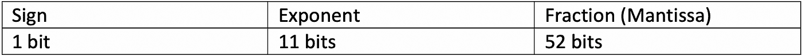

# 关于 Javascript-Numbers & & big integer . js 库的 5 分钟

> 原文：<https://medium.datadriveninvestor.com/5-minutes-about-javascript-numbers-biginteger-js-library-e664037510a9?source=collection_archive---------7----------------------->


> 本文是关于 Javascript 特性的系列文章的一部分——该系列文章的目的是简要解释(最多 5 分钟阅读)某个特性/库/概念或任何其他与 JavaScript 相关的内容，以便让您兴奋起来并探索它。

JavaScript 成为动态类型语言的一种方式是对所有数字使用“Number”类型，而不是声明 int、float、double 或任何其他数字类型。这样，我们可以简单地声明一个变量，并给它赋一个浮点数、整数或任何我们喜欢的数字。

如何实现这一点？因为 JavaScript 中所有的数字其实都是浮点。

# IEEE-754 标准

JavaScript 遵循 [IEEE-754](https://en.wikipedia.org/wiki/IEEE_754) 标准，使用二进制 64 表示和十进制浮点数据按照算术格式存储浮点。

JS 中的每个数字使用以下分配用 64 位表示:前 52 位分配给分数，接下来的 11 位分配给指数，最后一位分配给符号(正或负)。



让我们只是给出一个高度的概述，因为详细的描述将花费超过 5 分钟的时间；)我会在这个解释后面留一个链接供进一步阅读。

正如我提到的，数字表示有三个部分:分数、指数和符号。

因为所有的 JS 数都是浮点数，所以我们总是有一个分数。因此所有的数字都是 1.f 的格式，其中 f 是分数的 52 位(为什么 1 总是前导位？因为我们可以使用指数实现 0 前导位，更多细节在下面的链接中)。

指数决定了我们应该将该点移动多少位(对于整数是向右移动，对于浮点是向左移动)。

最后，符号决定了数字是正数(位 0)还是负数(位 1)。

使用这种格式有许多有趣的事情要考虑，例如这就是为什么在 JS 0.1 + 0.2 中！== 0.3 或者为什么 9007199254740992+1 = = 9007199254740992 但是 9007199254740992+2 = = 9007199254740994。

正如我向[承诺的，这里有一个链接](http://2ality.com/2012/04/number-encoding.html)，可以更深入地解释 JS 中的这种格式及其局限性。

# 最大整数

我只想提一个限制。

在 JavaScript 中，我们可以在不损失精度的情况下给出的最大整数是 9007199254740992 = 2⁵。为什么是这个数字？让我们来看看浮点格式的演示文稿。


我们有 52 位分配给小数部分，那么为什么我们可以代表 2⁵而不是 2⁵呢？因为指数总是在值为 1 (1.f)的小数部分的周期之前分配位，因此我们实际上有 53 位来表示整数。但是 111111…(53 次)在二进制中实际上是 2⁵-1，那么为什么最大的整数是 2⁵呢？这也是由于指数部分可以将周期向右移动 53 次！(我们有 11 位！10000110100 == 53)用分数 1.0 我们得到 1000000000000000000000000000000000000000000000000，这就是真正的 2⁵:)

但是等等，我们仍然可以增加指数，那么为什么我们不能表示大于 2⁵的整数呢？嗯，实际上我们可以，但不是所有的，因为我们在设置分数时受到限制。分数只有 52 位，所以我们不能操作最后一位(当指数超过 53 位时)，这意味着最后一位必须为零，因此我们要表示的大于 2⁵的数必须是偶数。

还有更多的东西——代表无限、NaN(不是一个数字)和更多的情况，但让我们保持在这个水平，因为我想讨论一个克服这些限制的解决方案。

你可以使用[这个很酷的工具](https://babbage.cs.qc.cuny.edu/IEEE-754/)来分析使用 IEEE-754 标准的数字表示格式。

# BigInteger.js 拯救世界

我最近开始使用的一个库是 [BigInteger.js](https://github.com/peterolson/BigInteger.js) 。

使用这个库，我们可以在不损失精度的情况下表示大于 2⁵的数字。怎么会这样该库使用字符串保存这些整数，允许我们传递几乎任何我们喜欢的数字。

然后，如果我们想要进行任何运算，比如乘法、除法、大数字的加减，该库会公开一个方法列表(在该库的 README 文件中列出)。

我们也可以使用库来表示不同基数的数字。以下是从他们文件中摘录的一些例子。

```
var zero = bigInt();
var ninetyThree = bigInt(93);
var largeNumber = bigInt("75643564363473453456342378564387956906736546456235345");
var googol = bigInt("1e100");
var bigNumber = bigInt(largeNumber);

var maximumByte = bigInt("FF", 16);
var fiftyFiveGoogol = bigInt("<55>0", googol);
```

记住不要传递大于 2⁵(或小于-2⁵)的数字，因为这样可能会失去精度，在这种情况下，您需要传递一个字符串。

这涵盖了关于 JavaScript 数字的 5 分钟，你可以在 w3schools.com 的或我之前提供的链接的[中阅读更多并查看示例。我鼓励你建立自己的“BigInteger”库(有一定数量的方法)来完全理解它，并从中获得乐趣:)](http://2ality.com/2012/04/number-encoding.html)

下次见！
不断学习，不断探索。