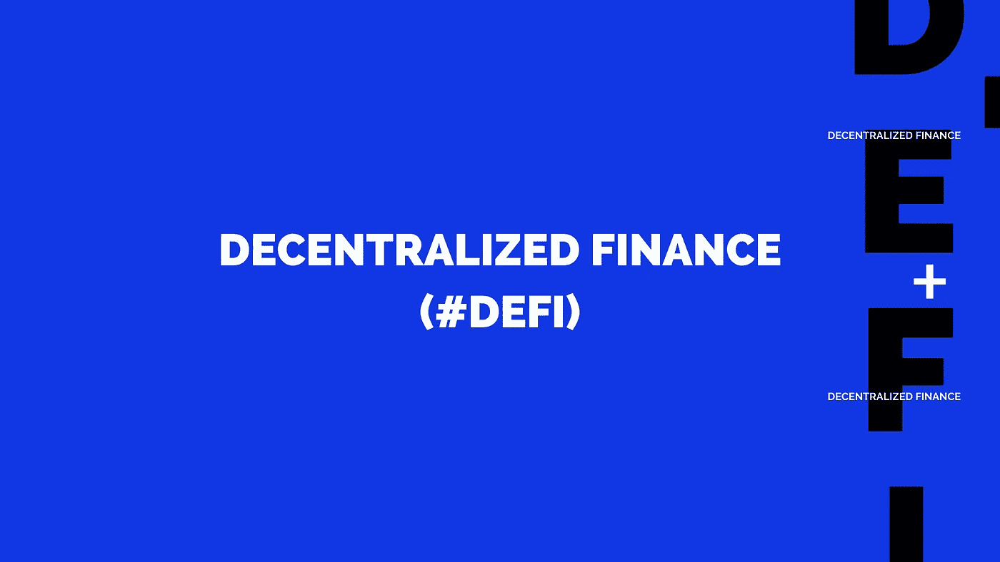
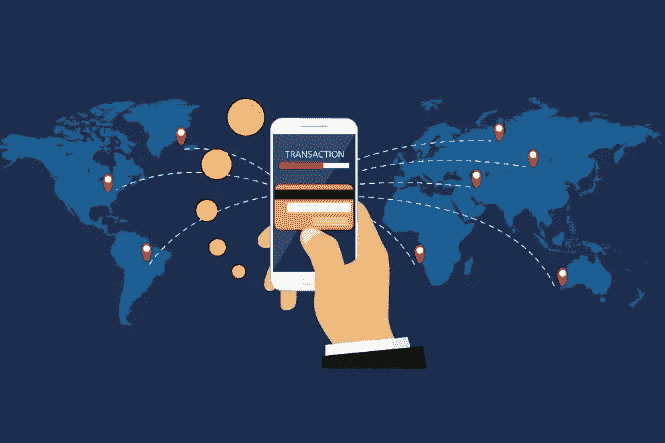
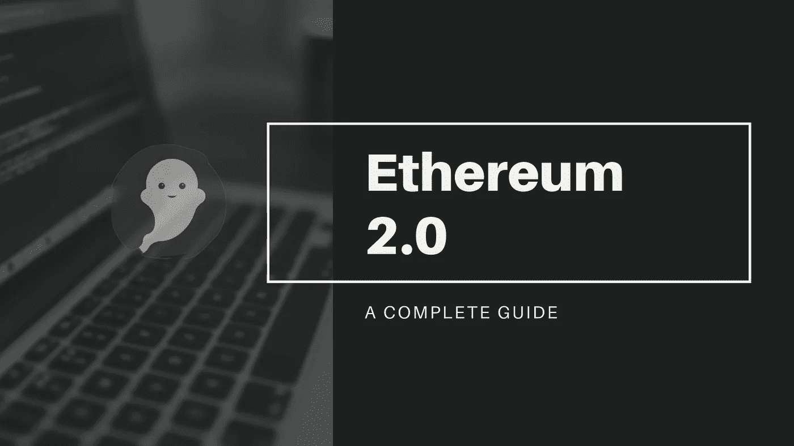
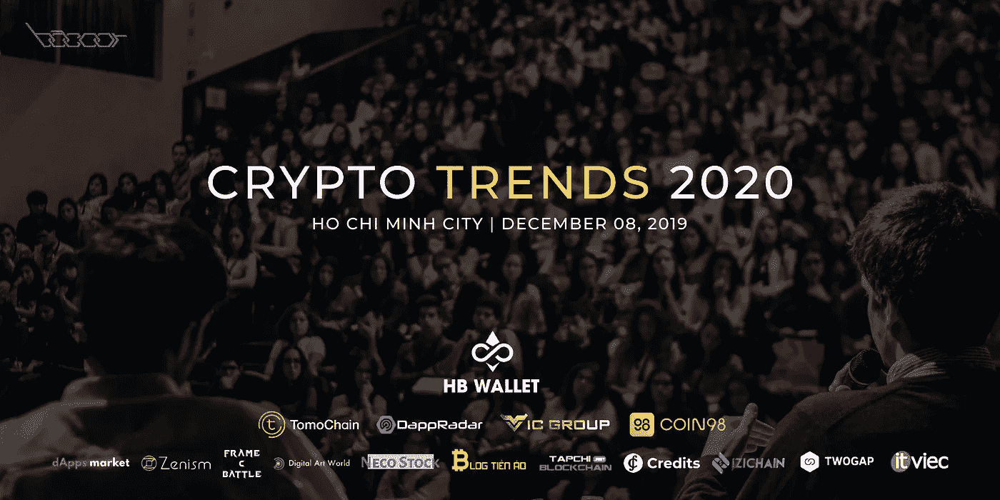

# 关于分散融资的 5 个最常见问题(#DeFi)

> 原文：<https://medium.datadriveninvestor.com/5-most-asked-questions-about-decentralized-finance-defi-cdf708cb67ce?source=collection_archive---------2----------------------->

***通过这 5 个常见问题了解分散金融(DeFi)及其运作方式。***

5 most asked questions about Decentralized Finance (#DeFi)

分散金融旨在提供与传统银行相同的金融服务，没有任何中央权力机构或中介机构。在没有中央权威的情况下，DeFi 允许每个人以高度的自主性和较少的障碍参与金融服务，如支付、贷款、借款或投资。

在这样的金融系统中，个人将可以访问使用公共区块链参与新的开放全球市场的应用程序。问题是，这将如何让全球金融体系变得更好？

这篇文章试图为你解答关于分散金融的问题，以及这个快速发展的领域的基本问题。

# 什么是 DeFi？

去中心化金融，或 DeFi，指的是一种新的去中心化金融系统，它建立在[公共区块链](https://www.hb-wallet.com/post/a-beginner-guide-to-blockchain)上，比如比特币和[以太坊](https://www.hb-wallet.com/post/what-is-ethereum)。

公共区块链与由政府和传统金融机构管理的私有网络有六个主要区别:

*   无权限:世界上任何人都可以连接到网络并创建应用程序，而不用考虑中央机构。
*   分散式:记录同时保存在分布在网络上的数千台计算机上。
*   透明:所有交易在区块链上总是可验证的。
*   无信任:在 DeFi 产品中不需要中心方。
*   抗审查:中央党不能改变和无效令牌保管，转移和交换。
*   可编程:开发者可以将应用编程到低成本的金融服务中。在产品上处理的资产具有分散网络上传统令牌的所有固有属性。

# 如何应用分散财务？

DeFi 使更广泛的全球金融服务成为可能。如上所述，只要有互联网连接和智能手机，任何人都可以在分散金融中获得金融服务。相反，在传统体系中，有很多障碍阻止人们进入，主要围绕着地位、位置和财富。

在 DeFi，跨境支付变得负担得起。让我们看看汇款市场，海外工人每年跨境汇款数十亿美元来支持他们的家庭。想想他们为此要面对多少交易费用。事实上，他们的工资过高，这消耗了他们微薄的收入，更不用说这是一个耗时的过程。通过减少中介，DeFi 服务有可能将这些成本削减 50%以上。这不仅能让员工存更多的钱，提高工作效率，还能帮助支持世界另一端的小企业和经济。

In DeFi, cross-border payments become affordable.

多亏了 DeFi，贷款是另一个可以解决的问题。目前，没有银行账户的人几乎不可能借到钱，通常是因为他们缺乏银行机构的信用记录和历史记录。DeFi 平台直接连接借款人和贷款人，消除信用检查，并支持数字资产抵押。

分散金融的结构包括 [stablecoins](https://www.hb-wallet.com/post/how-dai-stablecoin-works) ，这是一种数字货币，通过与美元或黄金等另一种资产挂钩，保护消费者免受加密波动的影响。

在上面给出的分散金融定义的约束下，不需要中央银行实体的稳定存款是唯一真正“分散”的代币。如果一个稳定代币的发行者，如 Tether (USDC)可以规定美元兑换的条件，那么说它是分散的是不准确的。虽然由法定货币支持的 [ERC-20 代币](https://www.hb-wallet.com/post/2018/12/06/what-everybody-needs-to-know-about-tokens)可以用于创建 DeFi 应用程序，但支持这些货币的资产的集中托管性质使其具有很高的风险。在 [Basis](https://www.basis.io/) 因监管机构对其非抵押模式的担忧而突然倒闭的情况下， [MakerDAO](https://makerdao.com/) 的 [Dai](https://www.hb-wallet.com/post/how-dai-stablecoin-works) 已经能够抓住大部分市场并解决问题。

在以太的支持下，[戴](https://www.hb-wallet.com/post/how-dai-stablecoin-works)利用博弈论和均衡的经济激励来维持其 1 美元的价值，允许随时跨境转移任何金额的美元，没有任何费用，没有任何干扰。现在市场上的大部分[分散交易所](https://medium.com/@hannguyen94/everything-you-should-know-about-decentralized-exchange-dex-20ed6f098fe0?source=---------9------------------)和 DeFi 导向的产品都是建立在戴之上的。

# 在 DeFi 空间能赚到什么？

在过去的两年中，DeFi 的数量一直在快速增长。根据 [DApp 道达尔](https://dapptotal.com/)的数据，截至 2019 年 9 月 30 日，该领域的总价值为 9.97 亿美元，高于一年前的 2.19 亿美元。即使不承担加密货币新领域的市场风险，这个新市场的收益率也可以达到每月 5%的水平。

MakerDAO 是最大的 DeFi 平台之一。该平台允许用户锁定[智能合约](https://www.hb-wallet.com/post/smart-contracts-how-smart-are-they)作为抵押，以便在戴获得贷款。由于戴与美元挂钩，投资者可以防范市场风险。(详见[戴及其激励机制](https://www.hb-wallet.com/post/how-dai-stablecoin-works))

The DAI stablecoin

有几个平台如 [Compound](https://compound.finance/) 增加了对戴的支持。像 Compound 这样的平台的工作方式是，用户锁定一部分数字资产作为抵押品，以便以不同的加密货币形式获得贷款。尽管这种实践与 MakerDAO 有一些相似之处，但一个关键的区别是，在 MakerDAO 上创建 CDP 会创建新的令牌，而复合用户会借用现有的令牌。复合协议目前有 39，504，817 美元的戴赚取 6.19%的利息。

另一个收入来源可能包括区块链的采矿活动。矿工的角色是保护网络和处理交易。例如，在比特币区块链上，购买比特大陆蚂蚁金服 S17e(第 64 名)每月产生 4.87%的投资资本。

此外，个人可以通过参与 Uniswap 等分散交易所的资金池或参与 [Setprotocol](https://www.setprotocol.com/) 等衍生品或资产平台的拍卖，在 DeFi 领域创造价值。

# 有风险吗？

DeFi 的扩散将面临一些挑战。

尽管 DeFi 解决方案可以改变数百万人的生活，但不可避免的事实是，他们还没有获得应有的公众意识。至少可以说，加密世界的采用是适度的。

同样值得考虑的是，即使 DeFi 应用程序设法欢迎数亿人使用其平台，他们所依赖的公共区块链可能缺乏满足他们需求的能力。对可扩展性的担忧也是以太坊的一个长期困扰，其联合创始人 Vitalik Buterin 最近承认区块链几乎已经满了，这导致了以太坊 2.0 的诞生。

The creation of [Ethereum 2.0](https://www.hb-wallet.com/post/ethereum-2-0-a-complete-guide).

波动性是加密货币领域的另一个问题。尽管 stablecoins 一直在寻求补救措施，但监管合规性的障碍仍然很大。

# DeFi 的未来怎么样？

由于 DeFi 组织彼此独立工作，造成市场分散，这可以被视为达成共识的一大障碍。总的来说，问题在于某些政府对 crypto 和区块链的态度和批评仍然相互矛盾。[一些国家已经完全禁止了数字货币](https://medium.com/@hannguyen94/7-questions-to-consider-before-joining-an-ieo-932b2d2a2110?source=---------2------------------)，像印度这样的国家威胁要将那些被发现从事加密交易的人送进监狱 10 年。

如果 crypto 和区块链要成为当前状态的令人信服的替代方案，在 DeFi 平台之间建立新的合作伙伴关系，并与决策者进行对话是至关重要的。除非政府和中央银行突然不复存在，否则分散金融不可能完全取代这些集中模式。但是如果它们可以共存呢？我们会允许吗？答案只是时间问题。

# 明年会发生什么？参加这次活动，与来自各知名公司的顶级专家一起找出答案！今天就获得一张免费票！

[**CRYPTO TRENDS 2020 HOSTED BY HB WALLET**](https://www.hb-wallet.com/cryptotrends2020)