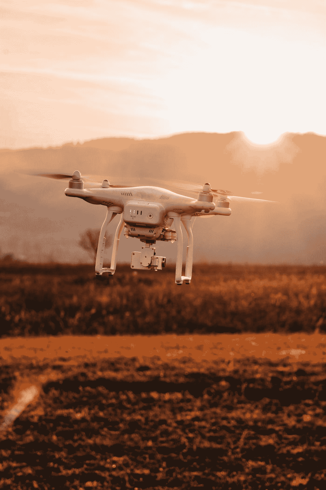

# 撒哈拉以南非洲的 5 个国家可以在卫生系统中使用无人机

> 原文：<https://medium.datadriveninvestor.com/5-nations-in-sub-saharan-africa-that-could-use-drones-in-health-systems-bbe42a7147e8?source=collection_archive---------7----------------------->

Photo by [Val Vesa](https://unsplash.com/@adspedia?utm_source=medium&utm_medium=referral) on [Unsplash](https://unsplash.com?utm_source=medium&utm_medium=referral)

无人机融入撒哈拉以南非洲卫生系统的市场潜力显而易见。整个地区正在经历技术变革，这对个人生活产生了积极影响。由于该地区幅员辽阔，不同的情况带来了各种机会。在这篇文章中，我提出了五个我认为有机会将无人机纳入其卫生系统和电子商务业务的国家。

我的选择将基于不同的标准:人口(城市和农村之间的关系，以及人口中心的地理位置)、地形、互联网覆盖范围、基础设施发展和地理。没有一个国家可以仅仅根据这些因素进行评级，所以我还将包括每个国家的主要优势和劣势以及任何其他主要特征。不过，在列举之前，我将简要讨论一下为什么非洲大陆有如此广泛的机会。

 [## 2019 年需要关注的 20 个数字营销趋势和技术——数据驱动的投资者

### Faisal 在加拿大工作，拥有金融/经济和计算机方面的背景。他一直积极从事外汇交易…

www.datadriveninvestor.com](https://www.datadriveninvestor.com/2019/02/04/20-digital-marketing-trends-techniques-to-watch-out-for-in-2019/) 

尽管挑战持续存在，但撒哈拉以南非洲的许多国家经济持续增长。在杰克·布莱特(Jake Bright)和奥布里·赫鲁比(Aubrey Hruby)的《下一个非洲》(The Next Africa)中，他们引用了麦肯锡全球研究所(McKinsey Global Institute)的一份报告，该报告估计，到 2020 年，消费者支出将达到 1.4 万亿美元，这只是许多国家中产阶级不断壮大的众多信号之一。随着这一趋势的继续，新的企业将有机会进入市场。仍然存在障碍，最明显的是互联网覆盖。虽然互联网接入仍然是大多数撒哈拉以南国家的一个关键问题，但多个实体正在寻求创新的解决方案。在卫生部门，许多国家的政府已经开始研究如何提高其卫生系统的效率和效力。

一个潜在的解决方案是使用无人机来运输医疗用品。具体来说，无人机有能力影响数百万人的日常医疗护理。无人机的影响在性质上可能与手机在该地区的影响相似。在整个非洲大陆，超过 6 亿人现在拥有手机，这表明非洲有能力“跨越”某些技术的使用。这些因素、举措和努力都有助于为解决整个非洲大陆的局部问题提供创新机会。

在研究了撒哈拉以南国家的人口统计、地理和经济之后，下面我列出了五个我认为有机会将无人机集成到其医疗供应链中的国家。

**莱索托**

比马里兰州略小的莱索托完全被南非包围。艾滋病毒/艾滋病的流行、地形地貌和地理面积是无人驾驶飞机能够被利用的主要原因。不幸的是，莱索托超过 25%的人口患有艾滋病毒/艾滋病。加上 72.7%的人口生活在农村地区，当他们需要血液时，诊所往往得不到血液供应。此外，该国 80%以上的地区海拔在 1800 米以上，并且是山区，这带来了额外的挑战。通过使用无人机，可以最大限度地减少维护该国 75 家医疗中心和 8 家医院供应链的一些障碍。由于该国如此之小，从一个发射地点就可以为大多数卫生设施提供服务。

埃斯瓦蒂尼

埃斯瓦蒂尼，也被称为斯威士兰，由于许多与莱索托相同的原因，具有无人机集成的潜力。像莱索托一样，埃斯瓦蒂尼超过 25%的人口患有艾滋病毒/艾滋病，它也是一个小国(略小于新泽西州)。它也是一个多山的国家，在及时运送医疗用品方面面临许多自然挑战。埃斯瓦蒂尼也有很高比例的未铺路面的道路。从一个发射地点，可以到达该国的大多数诊所，为农村社区提供更多的保健服务。尽管 Eswatini 提供的市场机会可能不如以下三个国家，但可以建立一个纯粹的补充医疗供应链。

**科特迪瓦**

科特迪瓦 2017 年国内生产总值增长率为 7.7%，是非洲增长最快的经济体之一。UAV 融入国家卫生系统的优势与莱索托和埃斯瓦蒂尼不同。科特迪瓦是一个更大的国家(大约相当于新墨西哥州的大小)，大约有 2370 万人口。它有 92.07%的道路没有铺设，并且有多个城市位于潜在战略无人机发射地点的区域，以向农村地区运送物品。此外，拥有近 2400 万人口、快速增长的经济以及 Jumia(一家被称为非洲亚马逊的电子商务“独角兽”)的存在，可能有机会将非处方药直接交付给人们，并辅之以到公立和私立医院的运输。与名单上的其他国家相比，科特迪瓦提供了一个独特的机会，并可能在未来提供更多的商业机会。

**乌干达**

东非国家乌干达在撒哈拉以南非洲最容易做生意的地方中排名第 12，坎帕拉位于该国的地理中心，这提供了一些优势。最值得注意的是，在这个短名单上的国家中，乌干达为公司提供了最好的机会，在他们将被使用的相同环境中测试他们的无人机。例如，在该国航空监管机构和地方当局的同意下，该国东部地区的无人机测试机会是可用的。然而，由于乌干达幅员辽阔，需要建立一个独特的无人机送货业务。鉴于坎帕拉的商业场景、地理位置和乌干达 3800 万人口，医疗用品无人机送货业务可能会证明是有益的，并最终过渡到其他行业。

**肯尼亚**

尽管肯尼亚是非洲大陆上最大的国家之一，但无人机运送医疗用品仍然有利于其国家卫生系统。然而，其规模将使肯尼亚的无人机集成模式不同于该地区的大多数国家。全国有许多农村社区，但由于城市数量众多(多个发射地点)，可以覆盖全国所有地区。这不同于莱索托和埃斯瓦蒂尼模型，后者只有一个发射地点。多个地点构成了物流方面的挑战，但也为电子商务交付的发展带来了巨大的机遇。此外，肯尼亚在内罗毕培养了一个创新技术和工程社区，适合支持这种努力的可持续性。

**该地区**

Photo by [Code💻 Ninja⚡](https://unsplash.com/@ogelamar?utm_source=medium&utm_medium=referral) on [Unsplash](https://unsplash.com?utm_source=medium&utm_medium=referral)

发现无人机运送医疗用品的五个潜在用例包含许多因素。总的来说，非洲大陆有大量的商业机会。技术中心开始在非洲大陆涌现，非洲可能很快就会成为创新技术影响社会经济发展的典范。无人机有可能成为许多经济部门的工具，但对于寻求提高公民生活水平的发展中国家来说，使用无人机补充医疗供应链是一个充满希望的机会。