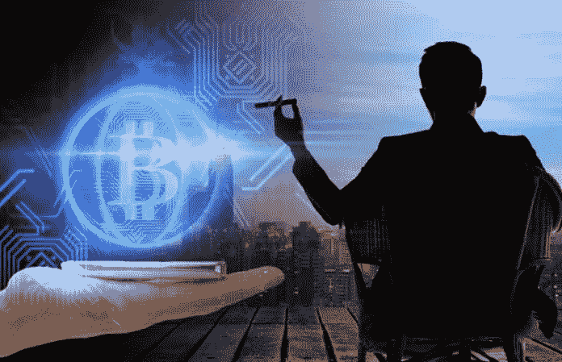

# 5 个因为比特币而致富的人，以及他们的故事。

> 原文：<https://medium.datadriveninvestor.com/5-people-who-became-because-of-bitcoin-and-their-stories-1925ef6934fe?source=collection_archive---------0----------------------->

埃里克·芬曼:

当 2011 年每个比特币价值 12 美元时，埃里克·芬曼从他的祖母那里借了 1000 美元，在他 11 岁的哥哥的帮助下，他投资了比特币，在 2013 年底比特币的价值变成 1200 美元时，他发了大财。

到 2015 年 1 月，Fineman 有了自己的教育公司，他卖掉了自己的教育公司，并被给予接受 10 万美元或 300 个比特币的选择。他拿走了比特币。Fineman 也实现了他的目标，成为一个 18 岁的百万富翁，不会去上大学。他说他很高兴从现实世界的经历中学习。然而，Fineman 一直忙于许多项目，包括参与美国国家航空航天局。这些活动——以及精明的商业意识——切实帮助他取得了今天的成就。

**文克莱沃斯兄弟:**

文克莱沃斯双胞胎是最早的比特币投资者之一，他们对这一新的开创性技术的最初投资、信任和耐心获得了回报，他们成功成为了有史以来第一批比特币百万富翁。

**彼得·萨丁顿:**

亚特兰大的彼得·萨丁顿在 2011 年第一次听说比特币，并以每枚不到 3 美元的价格买了一些。当比特币的价格达到 7500 美元左右时，这些早期投资的利润约为 250000%。“我从来没有见过这样的事情，”35 岁的企业家彼得·萨丁顿说，他拥有计算机科学学士学位和三个硕士学位。“让我坚信这是值得投资的是，代码是以数学为基础的。关不掉。

**杰瑞德·肯纳**

年轻的百万富翁贾里德·肯纳(Jared Kenna)以每枚 0.20 美元的低价买入比特币，开始了他的比特币投资。几年后，当每枚比特币的价值达到 258 美元时，他卖掉了自己的比特币，赚了一大笔钱。这名男子承认，当他格式化一个闪存盘时，他损失了近 20 万美元。因此，如果不是因为他的错误，这位年轻的百万富翁本可以赚得比他令人印象深刻的 3000 万美元多得多。

查理·史瑞姆:

作为最年轻的比特币百万富翁之一，查理·施雷姆是作为曼哈顿一家受欢迎的胃俱乐部 Evr 的共同所有者起家的。顺便说一下，这个地方是最早接受比特币支付的地方之一。最初，Shrem 以 3-4 美元的价格购买比特币。最终，当价格涨到 20 美元时，他又买了几千只。后来，他组织了 bit instant——一家人们可以购买比特币的实体店。目前，Bitinstant 是一个交换平台。

*如果你想了解更多，请访问 BIDITEX 页面并提出你的问题，关注我们的* [*推特*](https://twitter.com/biditex_com) *，* [*脸书*](https://www.facebook.com/biditex/) *，* [*中型*](https://medium.com/@biditex) *，* [*电报*](https://t.me/biditex%20%28edited%29) *，*[*LinkedIn*](https://www.linkedin.com/company/biditex)*。投标变更用* [*投标变更用*](https://medium.com/@biditex/biditex.com) *。*

