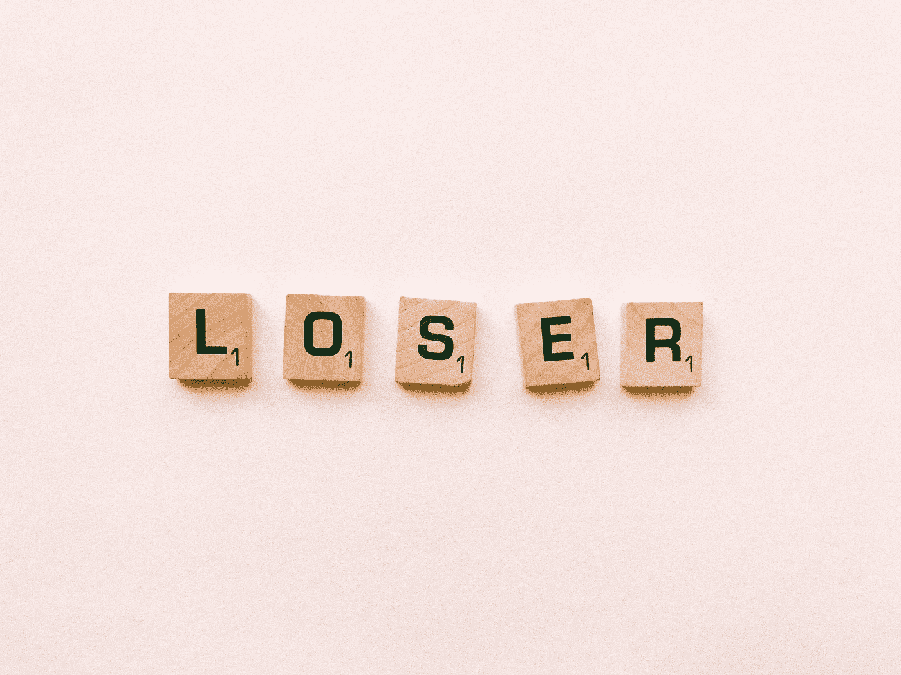

# 失败可以教会你 5 个重要的教训

> 原文：<https://medium.datadriveninvestor.com/5-powerful-lessons-losing-can-teach-you-1dc94833978c?source=collection_archive---------4----------------------->

我一直在看一部关于网飞的纪录片，名为《T2 失败者》。它展示了那些极具天赋，多年来在自己的领域努力工作，并在一定程度上保持成功的个人，他们错过了赢得本可以让他们达到梦想巅峰的东西。

我们经常关注赢家，但我们不会关注这些人一路上经历的亏损，而且往往是重大的亏损。我的一个朋友经常对我说，在你得到一个“是”之前，你会得到 1000 个“不”，虽然这个数字是极端的，*我认为这个比喻有一定的道理，不管你试图完成什么。*

 [## 幸福的算法？-数据驱动型投资者

### 从一开始，我们就认为技术正在使我们的生活变得更好、更快、更容易和更实用。社交媒体…

www.datadriveninvestor.com](https://www.datadriveninvestor.com/2019/03/08/an-algorithm-for-happiness/) 

所以你可以松一口气，知道成功不是一条笔直的路，我认为分享失败可以教会你的 5 个重要教训是很重要的:

**1。弄清楚你想要什么需要时间，你从做你不喜欢的事情中学习。随着你的成长，你被反复问到的最大问题之一是你将选择做什么。这通常被认为是你将做出的最困难的决定之一。**

你经常会觉得，如果你没有做出正确的决定，你的未来就注定要失败。这就是为什么许多人花了几十年或几年的时间从事特定的职业，但这些职业并没有给他们带来回报或满足感。

这也是为什么当其他人不得不学习新东西或进行职业改变或过渡时，他们会因恐惧而瘫痪。但问题是，只有在这些集体经历中，你才能了解你是谁，了解你擅长做的事情，以及你绝对不想做的事情。

**2。只有在失败中，你才能学会胜利。如果你看看那些在自己专业领域取得成功的人，不管他们有多成功，他们都会告诉你他们曾多次被拒绝。**

他们经常在这个过程中失败很多次，说“不”的人比说“是”的人多得多。我喜欢传记片，但如果你不相信我说的话，当你研究你崇拜的人时，请密切关注。

成功没有捷径。如果你想要进一步的证据，去看看那些你可能钦佩的人的传记，包括奥普拉、林·曼努尔·米兰达、狄巴克·乔布拉、艾伦、米丝蒂·科普兰和无数其他人。

并不是说他们没有输。事实上，他们失去了很多。但是，他们坚持了数年，以弄清楚他们的旅程。他们不允许损失使他们偏离或偏离前进的方向。即使你没有像他们一样大获成功，也有无数的例子表明，其他人可能没有达到可能被视为成功的顶峰，但他们通过学习使用他们喜欢做的事情来教育、启发和激励他人，找到了产生或大或小影响的方法。

**3。失败会带来坏名声**长期成功和短期成功的区别在于韧性。这是一种失败的能力，抓住机会，并从失败中吸取教训，在你走向成功的过程中加以利用。我很喜欢 **FAIL 的首字母缩写，“学习中的第一次尝试。**))

如果你将失败视为学习，你会发现你所有的集体经历都是为你需要做的事情做准备，以使你擅长你应该做的事情。过早退出，永远达不到这个觉悟。失败是我通向下一个重要课程的途径。

**4。)你的道路是独一无二的。很难记住这一点，因为有无数的干扰告诉你你的生活应该是什么样子，你应该或不应该和谁结婚，你需要几个孩子才能幸福，什么样的房子，船，你需要什么样的外表等等。这一切都是为了符合其他人对你梦想生活的定义。**

然而，我们一次又一次地看到，这些东西并不一定会让人们快乐，拥有更好的关系或按照他们的目标生活。只有一个人知道什么会让你开心。是你。

你和你的才能、抱负等更加一致。比任何人都要多。快乐在很大程度上是指在做让你感到充实和有目标的事情时创造体验。这是做对你来说重要的事情的独特之处。

**5。)输不一定是输的命题。我知道这是自相矛盾的说法，但这是真的。*失去，如果以正确的方式看待，可以恰到好处地让你知道什么时候该放下一些东西，改变你的道路，或者重新校准。***

令我印象深刻的是，人们正在采取更加积极主动的方法，以符合他们的目标和激情的方式塑造他们的道路，即使这可能意味着他们要牺牲一些他们被告知应该做的事情。我坚信这是一条正确的道路。

在我观察真正快乐的人时，我反复观察了以下几点。他们专注于做那些让他们感觉良好的事情，这些事情会让他们觉得自己活在当下，有所贡献，有目标。

*有时候，你可能需要很多年才能达到做对你有益的事情，而不是做别人告诉你的实用的事情。*这也可以。因为你很可能会学到失败最重要的一课。*只有经历了那些损失，没有被放在你认为你注定要走的道路上，被你认为是你机会的事情拒绝，等等。你将能够准确地到达你需要去的地方。*

如果你正在哀叹过去的一些失败，不断地回顾过去，因为让我们面对它，每个人都有这样的时刻，试着从不同的角度看待它。

从失败中振作起来，抬起你的下巴，继续前进。你活下来了。你还在这里。并且意识到，如果你愿意在前进的道路上保持坚定和积极的学习，就会有令人惊奇的事情等着你。