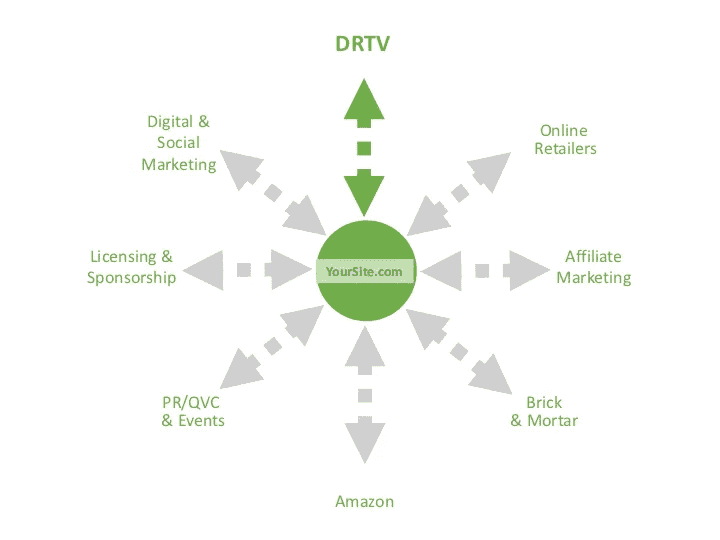

# 制作畅销视频内容的 5 大技巧

> 原文：<https://medium.datadriveninvestor.com/5-powerful-tips-for-creating-video-content-that-sells-29720a185367?source=collection_archive---------20----------------------->

根据 2018 年《福布斯》的一份报告，30 天内上传的视频内容比美国主要电视网络 30 年来创造的还要多。在当今社会，随着对快速定制答案的需求不断增长，视频营销是接触人们的最大方式，也是销售产品和服务的最佳方式。但是 YouTube 上每天有 50 亿的视频被观看，你如何让你的视频脱颖而出呢？

自从 30 多年前我开始直接面向消费者进行营销以来，技术已经发生了难以想象的变化，而人们的行为却依然如故。我们都在寻找改善生活方式的方法，我们也在不断地为自己的日常问题寻找答案。无论你是为 15 秒钟的视频还是 30 分钟的产品演示制作内容，**正面解决问题的真实内容**每次都会胜过制作过度、过于华而不实的视频。

 [## 视频推动营销|数据驱动投资者

### 当话题转到创意视频时，没有人会把安德鲁和皮特这对营销组合逼到墙角。他们的悠闲…

www.datadriveninvestor.com](https://www.datadriveninvestor.com/2019/01/23/video-sets-marketing-in-motion/) 

在你计划下一个视频时，这里有一些**的建议，可以让你获得竞争优势，同时** **通过培养信任和忠诚度来打造你的品牌**。

**提示 1:变得有条理**

制作视频的最佳方式是**从头到尾了解整个过程**。制作视频有三个不同的步骤:前期制作(计划阶段)、制作(执行阶段)和后期制作(编辑阶段)。我认为前期制作是最关键的阶段，因为当它正确完成时，最后两个阶段会很容易——并且你通常会按时并在预算内获得你想要的结果。另一个提示？无论是在组织制作阶段还是在决定将视频放在哪里时，都要从你的最终目标开始，以确保内容、长度、语气和风格适合你发布视频的平台。直到最近，视频制作还是一个昂贵的过程。数字时代的一个额外好处是创造了许多在线服务，让你可以使用模板快速、廉价地制作视频。

以下是一些建议:

*   路标，[https://waymark.com](https://waymark.com/)
*   流明 5、[https://lumen5.com](https://lumen5.com/)
*   Movavi，[https://www.movavi.com](https://www.movavi.com/)
*   内容武士，[https://www.contentsamurai.com](https://www.contentsamurai.com/)

**提示 2:钩住观众**

从一开始就用吸引观众的信息抓住他们的注意力。没有得到你想要的回应？试着改变介绍。一个很好的例子是我在第一次乔治·福尔曼电视广告中犯的一个错误。我认为以乔治击败 46 岁的迈克尔·穆勒赢得重量级冠军——有史以来最老的冠军——的拳击镜头开始视频是个好主意。我们测试了这个节目，但并不成功——一点也不成功。因为这是一个新产品，我犯了一个基本的错误，那就是不了解我们的目标受众，当时是不喜欢拳击的全职妈妈。一旦我们把那段视频拿出来，并向观众介绍了速度、方便和健康饮食的好处，这个节目就开始了，并成为有史以来制作的最成功的电视购物节目之一。如果你想让观众继续看下去，提前吸引他们是至关重要的。以下是一些从一开始就能抓住观众注意力的建议:

1 —从一个问题开始—你想在未来 30 天内减掉 10 磅吗？你感到疼痛并想要缓解吗？你睡眠充足吗？

2-从一个事实开始——“科学家在西兰花中发现了一种叫做吲哚-3 甲醇的元素，它被证明有助于减少癌症”(Juiceman)

3 —以故事开始—人们喜欢故事，如果他们对故事感兴趣，他们会继续观看你的视频。

**提示 3:总是添加证明**

我总是惊讶于很少有企业主主动接触他们的客户群。使用你的产品或服务的人是你最好的资源。他们可以提供反馈，帮助你改进你提供的产品或服务；*和*他们可以向潜在客户证明,“和他们一样”的人正从你的销售中获益。推荐在每种类型的广告中都有效地运作了几代人，原因如下:

*   推荐有助于克服异议
*   证明建立可信度
*   证明书提供社会证明

他们也很容易找到。你的顾客或客户是对你的产品或服务诚实反馈的最佳来源。首先要看的是你自己的数据库。刚刚起步？考虑赠送一些你的产品。让人们使用它 30-60 天，然后回去用视频捕捉他们的体验。一有机会，就收集反馈。最终，你将拥有一个完整的推荐书库。

**技巧 4:寻求回应**

直接回应广告有一个“行动号召”(CTA)，它利用一个有价值的包装，迫使观众做一些特定的事情。有时候，目的不一定是从最初的 CTA 中卖出任何东西，而是让读者采取下一步行动，比如要求免费的电子书，以此作为留下联系信息的回报。大多数人都试图在视频的最后几秒隐藏报价。以我的经验来看，如果你让你的提议清晰、突出，并且容易让浏览者回应，你会取得更大的成功。我建议你花时间集思广益，为你的产品或服务提供最好的可能。以下是我最喜欢的两种直接回应方式:

**省钱！**这种优惠在一年中的任何时候都适用于几乎所有产品类别。它可以以多种不同的方式呈现:

1 —现在付一半，以后不付

2-5 折

3 —以 1 英镑的价格买 2 英镑

4 —买一送一

**自由了！**“免费”是直复营销中最有力的一个词。免费送货、免费礼品、免费奖金、免费试用——凡是你能想到的，提供免费的东西在各个层面都行得通。此外，“免费”是搜索引擎优化(SEO)和内容营销的重要关键词。

**提示 5:考虑共享性**

如今，视频最吸引人的一个方面是其固有的可分享性。视频让你可以访问像 YouTube 这样的大型平台，每天为超过 10 亿的独立访问者提供服务。如果你做了有趣的东西，人们会分享它。一个很好的例子来自 GoPro camera。他们制作了数千个用户生成的视频，并发布在他们的网站上。我在每个视频的开头和结尾都打上了 GoPro 的标志，从而帮助微调了这个过程。然后，我通过举办一场捐赠竞赛，利用 30 秒钟的品牌回应电视节目吸引人们访问他们的网站，从而帮助他们创造流量。这种全视频营销活动帮助该公司在短短 8 年内销售额超过 10 亿美元！为了让你的视频内容更吸引人和更有效，找出你的客户群喜欢看什么，然后给他们那种类型的内容。根据 Hubspot 的统计，以下是观看次数最多的三种在线视频内容:

1 —客户评价

2 —教程视频

3 —演示视频

**视频炼金术**

我使用视频说服技术来制作电视和网络广告，这些广告带来了数百万美元的销售额，并从头开始建立了许多品牌。幸运的是，即使交付机制发生了巨大的变化，我今天使用的技术仍然保持不变。创作内容，利用直接回应广告的科学，以及为观众注入更深刻意义的视频项目所带来的艺术性。通过说出你的真相，你可以更好地影响你的观众以你想要的方式回应，因为他们可以与你的故事或信息产生共鸣。真实性是关键！

我不断调整我制作每一个视频的方法。我着迷于优秀视频制作的元素可以以令人惊讶的方式组合在一起，形成一个成功的信息。我并不总是做对，但我会不断学习，并接受新的更好的方法来建立有意义的、持久的联系。

最初发表于[瑞克·切萨里](https://rickcesari.com/5-powerful-tips-for-creating-video-content-that-sells/)

Rick Cesari 自 1994 年以来一直从事直接回应和视频营销行业，自 1999 年以来一直从事咨询工作。他的热情是继续这项工作，并与组织分享这方面的知识。你可以在 RickCesari.com 的[上关注他的最新消息。](https://rickcesari.com/)