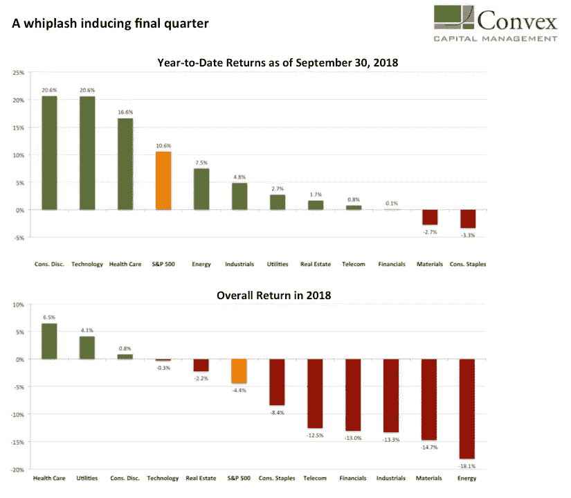
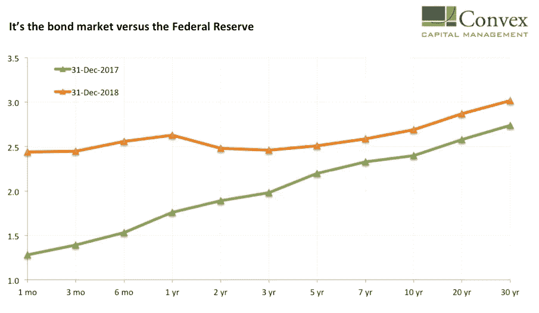
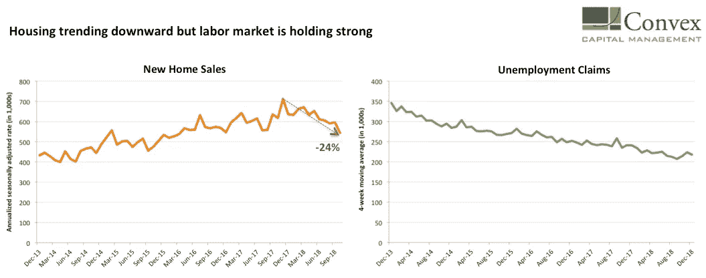
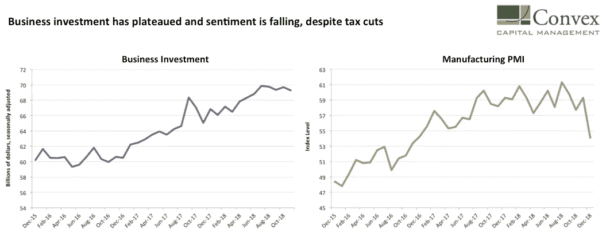
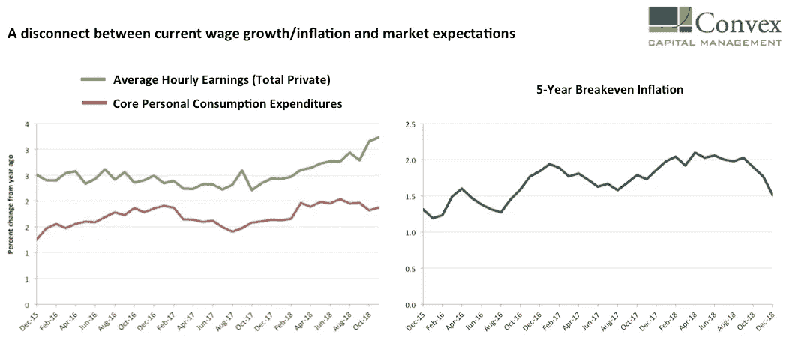

# 2019 年美国经济的 5 个问题

> 原文：<https://medium.datadriveninvestor.com/5-questions-for-the-us-economy-in-2019-3812863b13a8?source=collection_archive---------5----------------------->

在 2018 年前三个季度飙升至新高后，股市暴跌，并公布了十年来最糟糕的一年。标准普尔 500 指数下跌了 4.4%(包括股息)，较 9 月份的高点下跌了 14.5%。在去年 12 月底的最低水平，该指数刚刚错过了下跌 20%的“技术性熊市”。在混乱中，CBOE 的波动指数在平安夜比季度初上涨了近 200%。

由于先前的趋势突然转变，波动性在构成标准普尔 500 的各行业中表现得相当剧烈。技术等以前高速增长的行业在本季度下跌超过-17%，而公用事业等防御性行业排名上升。

避险情绪让投资者纷纷回到那种久经考验的安全资产——美国国债。然而，对美国 10 年期国债收益率到 2018 年底突破 3.0 关口的预测(包括 3.50 的预测)再次被混淆。美国 10 年期国债收益率确实上升了，但年底时为 2.69，仅比 2018 年初高出 29 个基点。

如果有什么不同的话，被吹捧为市场动荡原因的一些原因——包括随着财政刺激措施的消退，美联储在经济放缓之际加息——预计只会在 2019 年加剧。尽管像往常一样，我们回避做预测和预言，相信沃伦巴菲特的格言:预测告诉你很多关于预测者的事情，但对未来一无所知。我们更倾向于关注明年可能至关重要的几件重要事情，把它们框定为问题。最明显的是从美联储(美联储)开始。

美联储会放弃他们的加息计划吗？

市场混乱令人困惑的是，似乎没有引发抛售的新信息。这是因为在华盛顿 DC 立法者的刺激(减税)下，经济以 2015 年以来的最高速度飙升。以至于美联储在 2018 年四次加息，以防止经济“过热”，认为 3%的 GDP 增长远高于他们 1.9%的长期估计。这很可能是股价暴跌背后的近因，因为市场认为中国经济没有过热的危险。

美联储加息与市场预期不一致的最终结果是，收益率曲线最终出现反转。正如我们在[过去的](http://www.convexcm.com/the-yield-curve-inverted-now-what/)中所写的，收益率曲线在最近九次衰退之前出现了反转，只有一次是假阳性。

*Nominal US Treasury yield curve. Source:* [*Treasury.gov*](https://www.treasury.gov/resource-center/data-chart-center/interest-rates/Pages/TextView.aspx?data=yield)

虽然我们尚未看到“完全反转”——通常专注于 10 年期收益率和 3 个月/1 年期收益率之间的利差——但我们确实注意到，2018 年结束时，10 年期收益率仅比 1 年期收益率高 6 个基点。

通常情况下(至少在之前的几个周期中)，随着收益率曲线接近反转，美联储倾向于放弃将收益率曲线作为衰退指标。回到 2018 年 6 月，美联储工作人员[引入了一个优于收益率曲线的新指标](https://www.federalreserve.gov/econres/notes/feds-notes/dont-fear-the-yield-curve-20180628.htm)——一个跟踪市场对近期货币政策预期的“近期远期利差模型”。当时，该指标远未达到零，即没有显示出衰退的威胁。然而，这一利差[在 2019 年的第一个交易中跌入负值区域](https://www.bloomberg.com/news/articles/2019-01-02/key-fed-yield-gauge-points-to-rate-cuts-for-first-time-since-08?srnd=premium)，这是自 2008 年以来的首次。简而言之，市场预计美联储将在 2020 年初降息，以应对经济衰退。

在撰写本文时，联邦基金期货市场[预计美联储在 2019 年完全不加息的概率为 100%](https://www.cmegroup.com/trading/interest-rates/countdown-to-fomc.html),到 2020 年 1 月实际降息的概率为 50%以上。然而，美联储成员在最近 12 月会议上的预测表明，2019 年至少会有两次加息。

目前，经济数据看起来相当强劲，尤其是在劳动力市场。但如果它开始走弱，问题是美联储是否会以此为借口，立即放松油门，或者坚持其计划。这就引出了我们接下来的两个问题——美国消费者和美国企业。

消费者支出会继续保持稳定，还是房地产会导致消费下降？

目前这里的数据显然是混杂的。房地产市场明显处于下滑趋势，而汽车销售则停滞不前。然而[消费者信心接近周期高点](http://www.sca.isr.umich.edu/)因为消费者仍然看好他们的收入和就业前景。劳动力市场数据与首次失业申请数据一致，是自 20 世纪 60 年代末以来的最低水平。更不用说 3.7%的失业率了。

*Left panel: New home sales (in 1,000s), annualized seasonally adjusted rate. Right panel: Unemployment claims (in 1,000s), 4-week moving average. Source:* [*FRED*](https://research.stlouisfed.org/)*.*

房产价格下跌并不奇怪。去年夏天[我们写了](http://www.convexcm.com/how-monetary-policy-works/)关于美联储加息通常如何通过住宅投资对经济产生影响。在前四个紧缩周期中，房地产价格下跌，拖累了经济。

然而，正如我们在文章中所讨论的，当前的扩张与之前的扩张有一个关键的区别:与前四次扩张相比，住宅投资在今天的经济中所占的比例要小得多。住宅投资对本轮经济增长的贡献较小(因此复苏缓慢)，目前仅占 GDP 的 3.9%，明显低于前一轮紧缩周期开始时的水平。

截至本文撰写之时，12 月份的最新新房销售数据尚不可用，但我们引用了在线房地产经纪公司 Redfin Corporation 的首席执行官格伦·凯尔曼的一句[话。这是在最近的 2018 年第三季度财报电话会议上做出的，以回答分析师关于逆风是在减弱还是变得更糟的问题。](https://www.npr.org/templates/transcript/transcript.php?storyId=680247087)

> 10 月份的市场明显好于 11 月和 12 月份。你知道，我们不会在市场范围内轰轰烈烈地结束这一年，而是低声啜泣。

问题是房地产放缓对经济的威胁有多大。以及另一个行业是否会挺身而出进行补偿，这是我们的下一个问题。

***商业支出会崩溃还是恢复上升趋势？***

自 2016 年年中油价回升、美国能源公司进行再投资以来，商业支出一直处于大幅上升趋势。2017 年底减税法案的通过进一步推动了这一趋势。大多数减税措施实际上都是针对企业的，包括降低利润税率、加快资本投资贬值进度，以及为跨国公司将海外收入汇回国内提供新的激励措施。

然而，我们还没有看到行为上的显著变化。正如 Mathew Klein [在 Barron 最近的一篇文章](https://www.barrons.com/articles/last-years-corporate-tax-overhaul-hasnt-made-much-of-a-difference-1544226832)中指出的，大部分保留在海外的利润并没有汇回国内，而并购活动甚至还没有恢复到 2016 年的水平。

截至 2017 年底，商业投资同比增长超过 10%，但自 2018 年年中以来一直处于平稳状态。同样令人担忧的是商业信心的下降——12 月 ISM 制造业 PMI [下跌 5.2 个百分点，至 54.1%。](https://www.instituteforsupplymanagement.org/ismreport/mfgrob.cfm?SSO=1)

*Left panel: Business spending proxied by Manufacturers’ new orders — nondefense capital goods excluding aircraft. Right panel: ISM manufacturing PMI. Source:* [*FRED*](https://research.stlouisfed.org/)*,* [*Institute of Supply Management*](https://www.instituteforsupplymanagement.org/ismreport/mfgrob.cfm?SSO=1)*.*

企业实力目前仍在扩张，但需求明显疲软。公司最近在股票回购上花费了创纪录的金额——2018 年前九个月接近[6000 亿美元](https://www.yardeni.com/pub/buybackdiv.pdf)。回购本身并不是一个坏主意，但它告诉我们，企业更喜欢将钱返还给股东，而不是投资于未来的增长。

另一个不利因素是，油价在 2018 年最后一个季度下跌了近 40%，如果 2015-2016 年的先例成立，这对于资本支出来说不是一个好兆头。尽管这种放缓的一个积极结果是，它迫使美国能源公司提高生产率，因此盈利的门槛油价已经下降。

无论如何，最近商业投资的停滞/下降趋势是暂时的，还是更深层次的开始，还有待观察。

**通货膨胀会上升，给美联储制造难题吗？**

理论上，紧张的劳动力市场应该导致工资上涨，这最终应该会推高通胀。这一传统框架是美联储在失业率触及历史低点时倾向于加息的原因。

经过几年的错误开始，工资增长终于在 2018 年大幅回升。10 月份，工资以 3.2%的年增长率增长，这是自大金融危机结束以来首次越过 3%的关口。与此同时，核心通胀率(使用美联储首选的核心个人消费支出指标)在 2018 年 7 月达到 2%的峰值，此后略有回落。

有趣的是，市场对未来通胀的预期在 2018 年最后一个季度崩溃了。5 年期盈亏平衡通胀率从 9 月底的 2.03 降至年底的 1.51。盈亏平衡通胀率是一种衡量通胀预期的指标，计算方法是 5 年期美国国债名义收益率与 5 年期通胀挂钩债券收益率之差。

*Left panel: Average hourly earnings — total private (green line) and Core personal consumption expenditures (red line), year-over-year percent change. Right panel: 5-Year breakeven inflation. Source:* [*FRED*](https://research.stlouisfed.org/)*.*

避险情绪是通胀预期下降的原因，但硬经济数据和市场预期之间的脱节令人瞩目。正如我们之前讨论的那样，这也转化为市场和美联储之间的脱节(美联储目前或多或少在让数据引导政策)。

The question is whether the market will snap back or if the data will revert downward as recessionary winds blow. Of course, if wage growth continues to pick up and inflation creeps up again, we will see the Fed caught between a rock (market expectations) and a hard place (economic data). Though with fading fiscal stimulus and slowing global growth it seems unlikely that the economy will continue to power ahead at anywhere close to the 3 percent mark in 2019 and beyond. Not to mention uncertainty surrounding US trade policy, which we discuss next.

***Will the uncertainty around US trade policy continue?***

The US-China trade war seemed to get a reprieve in the aftermath of President Trump’s meeting with Chinese President Xi Jinping in Argentina in early December. This was short-lived as conflicting reports came out about what exactly was agreed. One big thing was the postponement of US tariffs on an additional $200 billion of Chinese goods on Jan 1st. Yet this is only temporary and by March, the US will decide if China has done enough in key areas like intellectual property beyond recycling old promises.

In any case, the existing sanctions imposed in early 2018 and threats of more to come are clearly having an impact in China, and the blowback is now hitting US multinationals. Case in point: Apple. For the first time in 20 years, Apple cuts its revenue outlook citing weaker demand in China amid rising trade tensions. Directly quoting Apple CEO, Tim Cook, from his [January 3rd investor letter](https://www.apple.com/newsroom/2019/01/letter-from-tim-cook-to-apple-investors/):

> China’s economy began to slow in the second half of 2018\. The government-reported GDP growth during the September quarter was the second lowest in the last 25 years. We believe the economic environment in China has been further impacted by rising trade tensions with the United States. As the climate of mounting uncertainty weighed on financial markets, the effects appeared to reach consumers as well, with traffic to our retail stores and our channel partners in China declining as the quarter progressed. And market data has shown that the contraction in Greater China’s smartphone market has been particularly sharp.

The letter shocked Wall Street and led Apple shares to fall 9% the next day. Interestingly, it’s not really a secret that China’s economy has been slowing but the news was a massive surprise, especially the degree and speed of impact. Clearly, even Apple was surprised, as they provided better guidance as recently as October. Once again from the letter:

> While we anticipated some challenges in key emerging markets, we did not foresee the magnitude of the economic deceleration, particularly in Greater China.

请注意，即使中国政府正在提供财政刺激(尽管没有达到 2008 年的程度)，这种情况仍在发生。还要记住，标准普尔 500 指数成份股公司近 40%的收入来自美国以外，其中科技公司的收入接近 60%。因此，对于全球增长放缓和贸易紧张对公司利润的影响，将会有很多重新评估。

如果在贸易不确定性的背景下，数据继续走软(市场仍不稳定)，我们可能会看到美国和中国达成某种协议/休战的更大决心，无论这是否会产生长期影响。

与此同时，除了与中国的争斗之外，还有另外两个与贸易相关的担忧。一个是特朗普总统是否会兑现他对汽车进口征收 20%以上关税的威胁，这将特别打击欧盟和日本等盟友。

第二个问题是，新一届国会是否会支持川普与加拿大和墨西哥的新协议——T2、美国管理认证协会，因为如果不支持，川普已经威胁要完全退出北美自由贸易协定(川普过去也差点这么做)。这是一个外部风险，但肯定是一个风险。

当然，在所有这些方面还有更多的事情要做，我们将密切关注。

***披露*** *:*

*本帖仅供参考，不得视为买卖证券或服务的建议。*所表达的意见反映了 Convex Capital Management 在编制本报告时的最佳判断，并否认因新信息、未来事件或其他原因而更新或更改前瞻性陈述的任何义务。不能保证 Convex Capital 在博文发表后没有改变其研究观点。

*凸资本是注册投资顾问。注册并不意味着一定水平的技能或培训。有关 Convex Capital 的咨询服务和费用的更多信息，可以在其 ADV 表格中找到，该表格可应要求提供。不保证此处讨论的任何证券、部门或行业曾经或将被包括在或排除在账户的投资组合之外。*