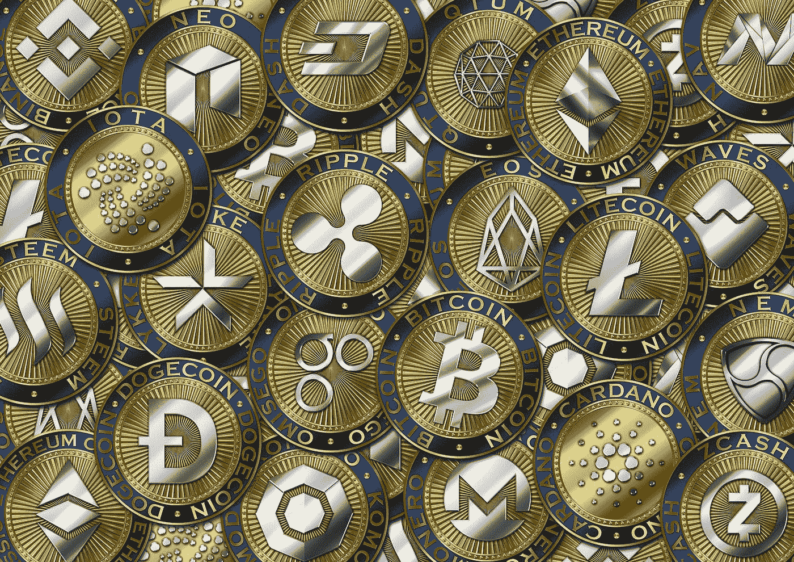

# 投资加密货币项目前要问自己的 5 个问题

> 原文：<https://medium.datadriveninvestor.com/5-questions-to-ask-yourself-before-investing-in-a-cryptocurrency-project-9f37be8ec15?source=collection_archive---------3----------------------->

根据 CoinMarketCap 的数据，目前至少有 1514 种加密货币在流通。虽然我们大多数人都知道比特币和以太坊等大型项目的基本知识，但试图对一些较小的项目做出明智的投资决定往往看起来令人困惑。

具体来说，关于一个项目的哪些信息是有用的，哪些是无用的？

鉴于区块链是一项如此新的技术，以及它对广大公众开放的事实(因此未经认证、通常不太老练的投资者也能接触到)，大量误导性或完全虚假的信息往往会让在线资源成为名副其实的雷区。更不用说有些项目简直就是纯粹的骗局。

那么，在决定是否扣动扳机之前，你怎么知道要寻找什么呢？在这里，我们确定了**在对潜在的加密货币投资进行研究时，你应该问自己的五个重要问题。**

## 1)项目实际上解决了现实世界的问题吗？

如此多的硬币只是简单的价值转移协议，提供了比特币或莱特币所没有的东西。还有一些公司只是试图利用区块链热，却没有明确的理由首先采用这项技术。

值得提醒自己的是，区块链实际上旨在解决什么问题，然后验证一个特定的项目是否能在现实世界中提供解决方案。如果这个项目能够使用分布式账本技术解决一个以前无法解决的问题，那么很明显，这样一个项目一旦启动并运行，很可能会有很高的需求。这使得它成为一个有吸引力的投资前景。

## 2)已经有工作产品了吗？

对于大多数区块链项目，尤其是那些为投资者提供可交易令牌以换取未来发展的金融资本的阶段性 ico 项目，工作产品或服务仍然需要几个月甚至几年的时间。在此期间会发生很多事情，有好有坏——这意味着在此之前会有很多不确定性——因此也有风险。

很明显，如果项目已经有了一个工作产品，或者至少已经完成了开发的 alpha 和/或 beta 阶段，那么它应该对其当前的合法性以及未来的成功提供更多的保证。有证据表明，该平台实际上正按照创始人的意图得到利用，这显然很有帮助。

## 3)谁是项目的团队成员？

是否有证据表明团队中包含有能力、有经验的技术专家？具有区块链开发经验的人员至少应该是可以观察到的。证明项目对建立长期业务和形成伙伴关系是认真的营销凭证也应该是可见的。

团队应该有一个可靠的社交媒体存在——LinkedIn 个人资料，详细说明与当前项目相关的可论证的先前经验，以及脸书/Twitter 个人资料，应该容易获得和验证。高级团队成员以前是否在蓝筹股公司任职？他们在各自的行业内知名度高吗？

当然，这也延伸到了团队本身。如果他们活跃在 Telegram、BitcoinTalk 和脸书等平台上，这有助于强调项目的透明度。如果他们也提供关于项目发展和正在形成的伙伴关系的定期更新，那么这对社区是一个额外的积极因素；这也有助于提升团队的声誉和职业精神。

此外，还值得检查一下该项目在 Telegram、Reddit 和 Twitter 等平台上聚集的关注者数量。

## 4)伙伴关系是否已经形成？

如果一个新项目认真对待它的发展，它总是会寻求与更成熟的公司建立合作伙伴关系。或许这种合作关系将会与区块链平台的未来用户建立。或者双方都在寻求对该技术的某一特定方面进行研究。

无论如何，能够向投资者表明大型机构对该项目感兴趣，无疑有助于提升其未来潜力。相反，一个经过几个月甚至几年的开发却没有合作伙伴的项目是很难给人留下深刻印象的。

## 5)资产的令牌供应是什么

为什么比特币的价格达到了数万美元，而 Ripple 的价格最多只有区区几美元？答案取决于每个项目发行的代币数量——目前约有 1690 万比特币在流通，而有 390 亿枚波动代币！

因此，在确定代币的相对稀缺性时，该项目的当前流通代币供应量和将存在的总供应量都很重要。反过来，这将决定价格实际上可以升值多少。

*原载于 2018 年 4 月 5 日*[*【www.datadriveninvestor.com】*](http://www.datadriveninvestor.com/2018/04/05/5-questions-to-ask-yourself-before-investing-in-a-cryptocurrency-project/)*。*